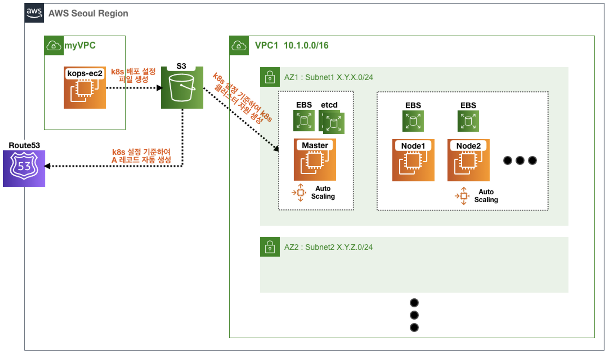

[PKOS 1주차 - 회고(4L)](../pkos_w1_4l)

[PKOS - Production Kubernetes Online Study 포스팅을 시작하며](../pkos_intro)

[PKOS 1주차 - AWS kOps 설치 및 기본 사용](../pkos_w1_hands-on)

[PKOS 2주차 - 회고(4L)](../pkos_w2_4l)

[PKOS 2주차 - 쿠버네티스 네트워크](../pkos_w2_hands-on)

[PKOS 3주차 - 회고(4L)](../pkos_w3_4l)

[PKOS 3주차 - Ingress & Storage](../pkos_w3_hands-on)

---

# PKOS
## 들어가기 전에
본 내용은 `CloudNet@` 팀에서 진행하는 `쿠버네티스 실무 실습` 스터디를 기반으로 작성된 내용입니다. 

그리고 추후 작성될 글의 제목이 `PKOS ··· `로 시작한다면 본 내용과 같이 `CloudNet@` 팀에서 진행하는 `쿠버네티스 실무 실습` 스터디를 기반으로 작성된 내용임을 알려드립니다.


## 스터디 참여 과정
우연한 기회에 쿠버네티스 실무 실습 스터디를 접하게 되었습니다. 
- 스터디 모집 전문 - https://m.facebook.com/story.php?story_fbid=pfbid025muoKmgG61KTaag8a9NukPmT8QtBK6rZRarzJWoupi8a8z5dado8KagKVJdbRLXBl&id=100044259413109
	- 상세모집내용 - [(’23) 쿠버네티스 실무 실습 스터디](https://www.notion.so/23-7635cc4f02c04954a3260b317588113e)
```
저희 CloudNet@ 팀에서 '쿠버네티스 실무 실습' 온라인 스터디 모집합니다.
강의 형태로 진행되며, 매주 실습 과제를 직접 제출하는 형태로 진행됩니다.
목적 : 직접 실습을 통해, 쿠버네티스 실무 환경을 직접 배포해보고, 학습 내용을 전파 및 공유
대상 : 현업 경력자, 인간관계에 있어 예의 있으신분
신청 : 12월 12(월) ~ 12월 18일(일)
상세한 모집 내용은 아래 링크에서 확인 부탁드립니다.  
https://gasidaseo.notion.site/23-7635cc4f02c04954a3260b317588113e
많은 관심과 지원 부탁드립니다.
감사합니다.
```

참여 대상이 '`현업 경력자, 인간관계에 있어 예의 있으신분`'이라고 하여 부담없이 신청하려고 했는 상세 모집 내용을 보니 고민이 많이 됐습니다. 회사 업무도 바쁘지만, 도커에 대한 개념만 알고 있을뿐 현업에서 쿠버네티스 사용하고 있지 않기 때문입니다. 

스터디 모집시 인터뷰 과정이 있기에 우선 지원서부터 제출했습니다.
제가 판단했을 땐 실력이 다소 부족하지만 인터뷰간 다른 요건들로 합격이 될 수도 있다고 생각 했기 때문입니다. (물론 인터뷰에서 떨어지면 아쉽겠지만 다음을 기약하고 말이죠...)

지원서를 제출하고 인터뷰 소식이 없기에 모집에서 탈락했나보다 생각하고 있을 무렵 모임장 가시다(김종호)님에게 안내 문자가 왔습니다. 

요약하면 업무가 바빠서 전화 인터뷰는 생략했으니 참여 의사만 전달해주시라는 내용이었습니다. 스터디 참여를 아쉬워하던 저에겐 오히려 좋은 기회로 다가와 주었기에 기쁜 마음으로 참여 의사를 전달드렸습니다.


## 스터디 사전 준비 사항
스터디 진행관련 툴은 다음과 같이 사용했습니다.
- [Zoom](https://zoom.us/) - 스터디 진행
- [Slack](https://slack.com/) - 스터디 공지, 스터디 관련 질문과 답변, 자료 공유
- [Notion](https://www.notion.so/) - 스터디 관련 내용, 멤버들만 공유하는 내용

스터디 실습관련 준비는 다음과 같습니다.
- AWS FreeTier 계정 생성
	- 계정 생성 후 IAM 에서 Administrator Access 정책 부여
- AWS Route53 퍼블릭 호스팅 영역(도메인) 구입


## 스터디 실습 환경
스터디 진행간 약 4만원 가량의 비용이 지출될것을 안내 받았으며, 대략적인 AWS 실습 구성도는 다음과 같습니다.


출처 : [PKOS 사전 공지](https://www.notion.so/gasidaseo/PKOS-ae8f917fb8b340bfb874b3b6424578fc)


## 스터디 실습 환경 사전 준비
우선 쿠버네티스 관련 지식이 부족하다고 느꼈기 때문에 유튜브에서 관련 강의 들었습니다.
- 생활코딩 Docker 입구 수업
	- Youtube: https://www.youtube.com/playlist?list=PLuHgQVnccGMDeMJsGq2O-55Ymtx0IdKWf
- 초보를 위한 쿠버네티스 안내서
	- Youtube: https://www.youtube.com/playlist?list=PLIUCBpK1dpsNf1m-2kiosmfn2nXfljQgb
- 이게 돼요? 도커 없이 컨테이너 만들기 / if(kakao)2022
	- Youtube: https://www.youtube.com/watch?v=mSD88FuST80
	- 발표자료: https://speakerdeck.com/kakao/ige-dwaeyo-dokeo-eobsi-keonteineo-mandeulgi
	- 카카오-Tech&: [# 서비스 개발자를 위한 컨테이너 뽀개기 (a.k.a 컨테이너 인터널)](https://tech.kakaoenterprise.com/150)

그리고 AWS 계정생성과 Route53에서 퍼블릭 도메인을 구입했습니다.
제가 실습을 진행할 리전은 서울(ap-northeast-2)이 아닌 `오하이오(us-east-2)`에서 진행할 예정입니다.


## 마치며
참여하지 못할거라 생각했던 스터디에 운 좋게 참여하게 됐습니다.
부족하지만 스터디 중간에 낙오하지 않도록 하겠습니다.

끝.