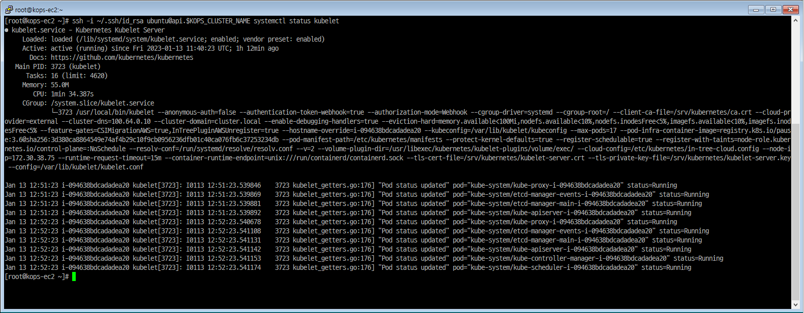

[PKOS 1주차 - 회고(4L)](../pkos_w1_4l)

[PKOS - Production Kubernetes Online Study 포스팅을 시작하며](../pkos_intro)

[PKOS 1주차 - AWS kOps 설치 및 기본 사용](../pkos_w1_hands-on)

[PKOS 2주차 - 회고(4L)](../pkos_w2_4l)

[PKOS 2주차 - 쿠버네티스 네트워크](../pkos_w2_hands-on)

[PKOS 3주차 - 회고(4L)](../pkos_w3_4l)

[PKOS 3주차 - Ingress & Storage](../pkos_w3_hands-on)

---

왜 그런지 모르겠는데 이미지 위아래로 여백이 생깁니다. 

에디터에서는 안그러는데 왜 그런지 좀 찾아봐야겠습니다.

본 글은 초안이기에 다듬는 과정에서 내용이 수정될 수 있습니다. 

---

# PKOS 1주차
## 들어가기전에
본 내용은 `CloudNet@` 팀에서 진행하는 `쿠버네티스 실무 실습` 스터디를 기반으로 작성된 내용입니다.

1주차에는 Kubernetes Operations(이하 kOps), Helm을 설치하고 간단 실습을 진행했습니다.

kOps 실습 마지막에는 CLB(Classic Load Balancer)를 이용해 마리오 게임을 배포했습니다.
- CLB는 2022년 08월 15일에 사용 중지될 예정입니다.<sub>[1](#footnote_1)</sub>
	- EC2-Classic 서비스 중단 예정 및 대비 방법 공지 - https://aws.amazon.com/ko/blogs/korea/ec2-classic-is-retiring-heres-how-to-prepare/
	- Classic Load Balancer 마이그레이션 - https://docs.aws.amazon.com/ko_kr/elasticloadbalancing/latest/userguide/migrate-classic-load-balancer.html

Helm 실습 마지막에는 Wordpress를 배포하고 게시글을 작성해 보았습니다.


### 과제

#### 과제 1 - 설치한 AWS kOps 클러스터의 정보

```bash
kops get cluster
kops get instances
```


#### 과제 2 - Helm 으로 워드프레스를 배포하고 관리페이지에 접속해서 글 1개 작성


#### 과제 3 - AWS kOps 활용 > 워커 노드 증가(ASG = Auto Scaling Group 활용)

##### 인스턴스 그룹 정보 확인

```bash
kops get ig
```


```bash
kubectl get node
```


##### 워커 노드 변경

```bash
kops edit ig nodes-us-east-2a
```

- maxSize: 0 -> 3
- minSize: 0 -> 2


##### 워커 노드 변경 적용

```bash
kops update cluster --yes
```


```bash
kops rolling-update cluster
```


##### 워커 노드 변경 확인

```bash
kubectl get node
```


## 1. kOps 실습

### AWS kOps 설치

#### AWS CloudFormation을 이용한 kOps 기본 인프라 배포

AWS CloudFormation 접속 후 안내에 따라 4단계를 거쳐 스택을 생성합니다.

- [AWS CloudFormation#stack 오하이오(us-east-2)](https://us-east-2.console.aws.amazon.com/cloudformation/home?region=us-east-2#/stacks)
- 

1. 스택 생성
   - 사전 조건 - 템플릿 준비
     - 준비된 템플릿
   - 템플릿 지정
     - 템플릿 소스
       - Amazon S3 URL
     - Amazon S3 URL
       - https://s3.ap-northeast-2.amazonaws.com/cloudformation.cloudneta.net/K8S/kops-new-ec2.yaml
   - 
2. 스택 세부 정보 지정
   - 스택 이름
     - 스택이름 : _사용자임의지정_
   - 파라미터
     - keyName : _사용자임의지정; 사용자가 사용할 keypair 선택_
     - LatestAmild : _수정하지말것_
     - SgIngressSshCidr :  : _사용자임의지정; SSH 접속시 사용할 IP 허용대역 입력_
   - 
3. 스택 옵션 구성
   - 기본 항목 그대로 `다음` 진행
   - 
4. 검토
   - 기본 항목 그대로 `전송` 진행
   - 
5. 생성완료 및 EC2 접속 IP 확인 후 접속
   - EC2 접속 IP 확인
     - 출력
       - 값 : 18.119.28.86
         - Public IP 로 되도록 외부 노출에 주의합니다.
       - 
   - EC2 접속
     - 


##### 기본 인프라 배포시 사용한 스택 분석(kops-new-ec2.yaml)


```yaml
Parameters:
  KeyName:
    Description: Name of an existing EC2 KeyPair to enable SSH access to the instances. Linked to AWS Parameter
    Type: AWS::EC2::KeyPair::KeyName
    ConstraintDescription: must be the name of an existing EC2 KeyPair.
  SgIngressSshCidr:
    Description: The IP address range that can be used to communicate to the EC2 instances
    Type: String
    MinLength: '9'
    MaxLength: '18'
    Default: 0.0.0.0/0
    AllowedPattern: (\d{1,3})\.(\d{1,3})\.(\d{1,3})\.(\d{1,3})/(\d{1,2})
    ConstraintDescription: must be a valid IP CIDR range of the form x.x.x.x/x.
  LatestAmiId:
    Description: (DO NOT CHANGE)
    Type: 'AWS::SSM::Parameter::Value<AWS::EC2::Image::Id>'
    Default: '/aws/service/ami-amazon-linux-latest/amzn2-ami-hvm-x86_64-gp2'
    AllowedValues:
      - /aws/service/ami-amazon-linux-latest/amzn2-ami-hvm-x86_64-gp2

Resources:
  MyVPC:
    Type: AWS::EC2::VPC
    Properties:
     EnableDnsSupport: true
     EnableDnsHostnames: true
     CidrBlock: 10.0.0.0/16
     Tags:
        - Key: Name
          Value: My-VPC

  MyIGW:
    Type: AWS::EC2::InternetGateway
    Properties:
      Tags:
        - Key: Name
          Value: My-IGW

  MyIGWAttachment:
    Type: AWS::EC2::VPCGatewayAttachment
    Properties:
      InternetGatewayId: !Ref MyIGW
      VpcId: !Ref MyVPC

  MyPublicRT:
    Type: AWS::EC2::RouteTable
    Properties:
      VpcId: !Ref MyVPC
      Tags:
        - Key: Name
          Value: My-Public-RT

  DefaultPublicRoute:
    Type: AWS::EC2::Route
    DependsOn: MyIGWAttachment
    Properties:
      RouteTableId: !Ref MyPublicRT
      DestinationCidrBlock: 0.0.0.0/0
      GatewayId: !Ref MyIGW

  MyPublicSN:
    Type: AWS::EC2::Subnet
    Properties:
      VpcId: !Ref MyVPC
      AvailabilityZone: !Select [ 0, !GetAZs '' ]
      CidrBlock: 10.0.0.0/24
      Tags:
        - Key: Name
          Value: My-Public-SN

  MyPublicSNRouteTableAssociation:
    Type: AWS::EC2::SubnetRouteTableAssociation
    Properties:
      RouteTableId: !Ref MyPublicRT
      SubnetId: !Ref MyPublicSN

  KOPSEC2SG:
    Type: AWS::EC2::SecurityGroup
    Properties:
      GroupDescription: kops ec2 Security Group
      VpcId: !Ref MyVPC
      Tags:
        - Key: Name
          Value: KOPS-EC2-SG
      SecurityGroupIngress:
      - IpProtocol: tcp
        FromPort: '22'
        ToPort: '22'
        CidrIp: !Ref SgIngressSshCidr

  KOPSEC2:
    Type: AWS::EC2::Instance
    Properties:
      InstanceType: t2.micro
      ImageId: !Ref LatestAmiId
      KeyName: !Ref KeyName
      Tags:
        - Key: Name
          Value: kops-ec2
      NetworkInterfaces:
        - DeviceIndex: 0
          SubnetId: !Ref MyPublicSN
          GroupSet:
          - !Ref KOPSEC2SG
          AssociatePublicIpAddress: true
          PrivateIpAddress: 10.0.0.10
      UserData:
        Fn::Base64:
          !Sub |
            #!/bin/bash
            hostnamectl --static set-hostname kops-ec2
            yum -y install tree tmux jq git
            curl -LO "https://dl.k8s.io/release/$(curl -L -s https://dl.k8s.io/release/stable.txt)/bin/linux/amd64/kubectl"
            install -o root -g root -m 0755 kubectl /usr/local/bin/kubectl
            curl -Lo kops https://github.com/kubernetes/kops/releases/download/$(curl -s https://api.github.com/repos/kubernetes/kops/releases/latest | grep tag_name | cut -d '"' -f 4)/kops-linux-amd64
            chmod +x kops
            mv kops /usr/local/bin/kops
            curl "https://awscli.amazonaws.com/awscli-exe-linux-x86_64.zip" -o "awscliv2.zip"
            unzip awscliv2.zip
            sudo ./aws/install
            export PATH=/usr/local/bin:$PATH
            source ~/.bash_profile
            complete -C '/usr/local/bin/aws_completer' aws
            ssh-keygen -t rsa -N "" -f /root/.ssh/id_rsa
            echo 'alias vi=vim' >> /etc/profile
            echo 'sudo su -' >> /home/ec2-user/.bashrc
            curl -s https://raw.githubusercontent.com/helm/helm/master/scripts/get-helm-3 | bash
            wget https://github.com/andreazorzetto/yh/releases/download/v0.4.0/yh-linux-amd64.zip
            unzip yh-linux-amd64.zip
            mv yh /usr/local/bin/

Outputs:
  KopsEC2IP:
    Value: !GetAtt KOPSEC2.PublicIp
```


#### kOps 클러스터 배포 및 확인

##### EC2에 설치 종료 확인 및 root 권한 획득

###### 설치 확인

```bash
sudo tail -f /var/log/cloud-init-output.log
```


###### root 권한 획득

```bash
sudo su -
```


##### 기본 툴 및 SSH 키 설치 등 확인

```bash
kubectl version --client=true -o yaml
```


```bash
kops version
aws --version
ls /root/.ssh/id_rsa*
```


##### 자격 구성 설정 없이 확인

```bash
aws ec2 describe-instances
```


##### IAM User 자격 구성 : 실습 편의를 위해 admin 권한을 가진 IAM User 의 자격 증명 입력

```bash
aws configure
```


- aws configure 설정 정보
  - AWS Access Key ID [None]: 
    - IAM 에서 발급한 사용자 Access Key ID 입력
  - AWS Secret Access Key [None]:
    - IAM 에서 발급한 사용자 Secret Access Key 입력
  - Default region name [None]: us-east-2
    - 현재 사용중인 리전값 입력
  - Default output format [None]: json
- IAM Access Key 발급
  - 

- aws configure 설정
  - 


##### 자격 구성 적용 확인 : 노드 IP 확인

```bash
aws ec2 describe-instances
```


- 정보 전문

```yaml
{
    "Reservations": [
        {
            "Groups": [],
            "Instances": [
                {
                    "AmiLaunchIndex": 0,
                    "ImageId": "ami-0ea1d45dcdd47edf6",
                    "InstanceId": "i-098d5992fbe8121a2",
                    "InstanceType": "t2.micro",
                    "KeyName": "learn-mino_us-east-2",
                    "LaunchTime": "2023-01-13T10:14:36+00:00",
                    "Monitoring": {
                        "State": "disabled"
                    },
                    "Placement": {
                        "AvailabilityZone": "us-east-2a",
                        "GroupName": "",
                        "Tenancy": "default"
                    },
                    "PrivateDnsName": "ip-10-0-0-10.us-east-2.compute.internal",
                    "PrivateIpAddress": "10.0.0.10",
                    "ProductCodes": [],
                    "PublicDnsName": "ec2-18-119-28-86.us-east-2.compute.amazonaws.com",
                    "PublicIpAddress": "18.119.28.86",
                    "State": {
                        "Code": 16,
                        "Name": "running"
                    },
                    "StateTransitionReason": "",
                    "SubnetId": "subnet-0db859fa291cd1bbe",
                    "VpcId": "vpc-09e83af3c3727cd51",
                    "Architecture": "x86_64",
                    "BlockDeviceMappings": [
                        {
                            "DeviceName": "/dev/xvda",
                            "Ebs": {
                                "AttachTime": "2023-01-13T10:14:36+00:00",
                                "DeleteOnTermination": true,
                                "Status": "attached",
                                "VolumeId": "vol-0f49a1af5eaf97bda"
                            }
                        }
                    ],
                    "ClientToken": "mykop-KOPSE-UIJWH8KLZ1HW",
                    "EbsOptimized": false,
                    "EnaSupport": true,
                    "Hypervisor": "xen",
                    "NetworkInterfaces": [
                        {
                            "Association": {
                                "IpOwnerId": "amazon",
                                "PublicDnsName": "ec2-18-119-28-86.us-east-2.compute.amazonaws.com",
                                "PublicIp": "18.119.28.86"
                            },
                            "Attachment": {
                                "AttachTime": "2023-01-13T10:14:36+00:00",
                                "AttachmentId": "eni-attach-0271ae13e9fba8794",
                                "DeleteOnTermination": true,
                                "DeviceIndex": 0,
                                "Status": "attached",
                                "NetworkCardIndex": 0
                            },
                            "Description": "",
                            "Groups": [
                                {
                                    "GroupName": "mykops-KOPSEC2SG-1RSLC5GW593TZ",
                                    "GroupId": "sg-07552ce6e6079f7d2"
                                }
                            ],
                            "Ipv6Addresses": [],
                            "MacAddress": "02:2f:74:99:8f:16",
                            "NetworkInterfaceId": "eni-05063b1a5e4ab3707",
                            "OwnerId": "674662935319",
                            "PrivateDnsName": "ip-10-0-0-10.us-east-2.compute.internal",
                            "PrivateIpAddress": "10.0.0.10",
                            "PrivateIpAddresses": [
                                {
                                    "Association": {
                                        "IpOwnerId": "amazon",
                                        "PublicDnsName": "ec2-18-119-28-86.us-east-2.compute.amazonaws.com",
                                        "PublicIp": "18.119.28.86"
                                    },
                                    "Primary": true,
                                    "PrivateDnsName": "ip-10-0-0-10.us-east-2.compute.internal",
                                    "PrivateIpAddress": "10.0.0.10"
                                }
                            ],
                            "SourceDestCheck": true,
                            "Status": "in-use",
                            "SubnetId": "subnet-0db859fa291cd1bbe",
                            "VpcId": "vpc-09e83af3c3727cd51",
                            "InterfaceType": "interface"
                        }
                    ],
                    "RootDeviceName": "/dev/xvda",
                    "RootDeviceType": "ebs",
                    "SecurityGroups": [
                        {
                            "GroupName": "mykops-KOPSEC2SG-1RSLC5GW593TZ",
                            "GroupId": "sg-07552ce6e6079f7d2"
                        }
                    ],
                    "SourceDestCheck": true,
                    "Tags": [
                        {
                            "Key": "Name",
                            "Value": "kops-ec2"
                        },
                        {
                            "Key": "aws:cloudformation:stack-id",
                            "Value": "arn:aws:cloudformation:us-east-2:674662935319:stack/mykops/0501bc30-932b-11ed-a3d1-06d5dd5d67be"
                        },
                        {
                            "Key": "aws:cloudformation:logical-id",
                            "Value": "KOPSEC2"
                        },
                        {
                            "Key": "aws:cloudformation:stack-name",
                            "Value": "mykops"
                        }
                    ],
                    "VirtualizationType": "hvm",
                    "CpuOptions": {
                        "CoreCount": 1,
                        "ThreadsPerCore": 1
                    },
                    "CapacityReservationSpecification": {
                        "CapacityReservationPreference": "open"
                    },
                    "HibernationOptions": {
                        "Configured": false
                    },
                    "MetadataOptions": {
                        "State": "applied",
                        "HttpTokens": "optional",
                        "HttpPutResponseHopLimit": 1,
                        "HttpEndpoint": "enabled",
                        "HttpProtocolIpv6": "disabled",
                        "InstanceMetadataTags": "disabled"
                    },
                    "EnclaveOptions": {
                        "Enabled": false
                    },
                    "PlatformDetails": "Linux/UNIX",
                    "UsageOperation": "RunInstances",
                    "UsageOperationUpdateTime": "2023-01-13T10:14:36+00:00",
                    "PrivateDnsNameOptions": {
                        "HostnameType": "ip-name",
                        "EnableResourceNameDnsARecord": false,
                        "EnableResourceNameDnsAAAARecord": false
                    },
                    "MaintenanceOptions": {
                        "AutoRecovery": "default"
                    }
                }
            ],
            "OwnerId": "674662935319",
            "RequesterId": "043320173835",
            "ReservationId": "r-025f0edf2261fe989"
        }
    ]
}

```


##### AWS CLI 페이지 출력 옵션

```bash
export AWS_PAGER=""
```


##### 리소스를 배치할 리전 이름 변수 지정

```bash
REGION=us-east-2 # 오하이오(us-east-2) 리전 사용
```


##### k8s 설정 파일이 저장될 버킷 생성

- aws s3 mb s3://버킷<유일한 이름> --region <S3 배포될 AWS 리전>

```bash
aws s3 mb s3://20230113-learn-mkops --region $REGION
aws s3 ls
```


- 생성된 버킷
  - 


##### 배포 시 참고할 변수 설정

- export KOPS_CLUSTER_NAME=_<자신의 퍼블릭 호스팅 메인 주소>_
- export KOPS_STATE_STORE=_<s3://(위에서 생성한 자신의 버킷 이름)>_
- export AWS_PAGER=""
- export REGION=_<현재 사용하고 있는 리전>_

```bash
export KOPS_CLUSTER_NAME=learn-dc.link
export KOPS_STATE_STORE=s3://20230113-learn-mkops
export AWS_PAGER=""
export REGION=us-east-2

echo 'export KOPS_CLUSTER_NAME=learn-dc.link' >>~/.bashrc
echo 'export KOPS_STATE_STORE=s3://20230113-learn-mkops' >>~/.bashrc
echo 'export AWS_PAGER=""' >>~/.bashrc
echo 'export REGION=us-east-2' >>~/.bashrc
```


##### 터미널2 - EC2 생성 모니터링

```bash
while true; do aws ec2 describe-instances --query "Reservations[*].Instances[*].{PublicIPAdd:PublicIpAddress,InstanceName:Tags[?Key=='Name']|[0].Value,Status:State.Name}" --filters Name=instance-state-name,Values=running --output text ; echo "------------------------------" ; sleep 1; done
```


##### kOps 설정 파일 생성(S3) 및 k8s 클러스터 배포 : 약 6분 소요

- CNI(Container Networking Interface)는 AWS VPC CNI 사용
  - 1대(t3.medium) - 마스터 노드
  - 2대(t3.medium) - 워커 노드
  - 파드 사용 네트워크 대역 지정(172.30.0.0/16; 172.30.0.0~172.30.255.255)

```bash
kops create cluster --zones="$REGION"a,"$REGION"c --networking amazonvpc --cloud aws \
--master-size t3.medium --node-size t3.medium --node-count=2 --network-cidr 172.30.0.0/16 \
--ssh-public-key ~/.ssh/id_rsa.pub --name=$KOPS_CLUSTER_NAME --kubernetes-version "1.24.9" -y
```


##### 클러스터 생성 진행 상황 확인

```bash
kops validate cluster --wait 10m
```


- Route53 에서 A 레코드 확인
  - 


#### kOps 설치 확인

##### 노드 IP 확인

```bash
aws ec2 describe-instances --query "Reservations[*].Instances[*].{PublicIPAdd:PublicIpAddress,PrivateIPAdd:PrivateIpAddress,InstanceName:Tags[?Key=='Name']|[0].Value,Status:State.Name}" --filters Name=instance-state-name,Values=running --output table
```


##### 파드 IP 확인

```bash
kubectl get pod -n kube-system -o=custom-columns=NAME:.metadata.name,IP:.status.podIP,STATUS:.status.phase
```


##### kops 클러스터 정보 확인

```bash
kops get cluster
```


```bash
kops get cluster -o yaml
```


```yaml
[root@kops-ec2 ~]# kops get cluster -o yaml
apiVersion: kops.k8s.io/v1alpha2
kind: Cluster
metadata:
  creationTimestamp: "2023-01-13T11:38:13Z"
  name: learn-dc.link
spec:
  api:
    dns: {}
  authorization:
    rbac: {}
  channel: stable
  cloudProvider: aws
  configBase: s3://20230113-learn-mkops/learn-dc.link
  etcdClusters:
  - cpuRequest: 200m
    etcdMembers:
    - encryptedVolume: true
      instanceGroup: master-us-east-2a
      name: a
    memoryRequest: 100Mi
    name: main
  - cpuRequest: 100m
    etcdMembers:
    - encryptedVolume: true
      instanceGroup: master-us-east-2a
      name: a
    memoryRequest: 100Mi
    name: events
  iam:
    allowContainerRegistry: true
    legacy: false
  kubelet:
    anonymousAuth: false
  kubernetesApiAccess:
  - 0.0.0.0/0
  - ::/0
  kubernetesVersion: 1.24.9
  masterPublicName: api.learn-dc.link
  networkCIDR: 172.30.0.0/16
  networking:
    amazonvpc: {}
  nonMasqueradeCIDR: 100.64.0.0/10
  sshAccess:
  - 0.0.0.0/0
  - ::/0
  subnets:
  - cidr: 172.30.32.0/19
    name: us-east-2a
    type: Public
    zone: us-east-2a
  - cidr: 172.30.64.0/19
    name: us-east-2c
    type: Public
    zone: us-east-2c
  topology:
    dns:
      type: Public
    masters: public
    nodes: public
```


##### 인스턴스 그룹 정보 확인

```bash
kops get ig
```


```bash
kops get ig -o yaml
```


```yaml
[root@kops-ec2 ~]# kops get ig -o yaml
apiVersion: kops.k8s.io/v1alpha2
kind: InstanceGroup
metadata:
  creationTimestamp: "2023-01-13T11:38:13Z"
  labels:
    kops.k8s.io/cluster: learn-dc.link
  name: master-us-east-2a
spec:
  image: 099720109477/ubuntu/images/hvm-ssd/ubuntu-focal-20.04-amd64-server-20221206
  instanceMetadata:
    httpPutResponseHopLimit: 3
    httpTokens: required
  machineType: t3.medium
  maxSize: 1
  minSize: 1
  role: Master
  subnets:
  - us-east-2a

---

apiVersion: kops.k8s.io/v1alpha2
kind: InstanceGroup
metadata:
  creationTimestamp: "2023-01-13T11:38:13Z"
  labels:
    kops.k8s.io/cluster: learn-dc.link
  name: nodes-us-east-2a
spec:
  image: 099720109477/ubuntu/images/hvm-ssd/ubuntu-focal-20.04-amd64-server-20221206
  instanceMetadata:
    httpPutResponseHopLimit: 1
    httpTokens: required
  machineType: t3.medium
  maxSize: 1
  minSize: 1
  role: Node
  subnets:
  - us-east-2a

---

apiVersion: kops.k8s.io/v1alpha2
kind: InstanceGroup
metadata:
  creationTimestamp: "2023-01-13T11:38:13Z"
  labels:
    kops.k8s.io/cluster: learn-dc.link
  name: nodes-us-east-2c
spec:
  image: 099720109477/ubuntu/images/hvm-ssd/ubuntu-focal-20.04-amd64-server-20221206
  instanceMetadata:
    httpPutResponseHopLimit: 1
    httpTokens: required
  machineType: t3.medium
  maxSize: 1
  minSize: 1
  role: Node
  subnets:
  - us-east-2c
```


##### 인스턴스 정보 확인

```bash
kops get instances
```


##### 자동 완성 및 alias 축약 설정

```bash
source <(kubectl completion bash)
echo 'source <(kubectl completion bash)' >> ~/.bashrc
echo 'alias k=kubectl' >> ~/.bashrc
echo 'complete -F __start_kubectl k' >> ~/.bashrc
exit
exit
```


- ssh 재접속 후 명령어 확인

```bash
k get node
```


##### 쿠버네티스 크루(krew) 설치

###### 설치

```bash
curl -fsSLO https://github.com/kubernetes-sigs/krew/releases/download/v0.4.3/krew-linux_amd64.tar.gz
tar zxvf krew-linux_amd64.tar.gz
./krew-linux_amd64 install krew
tree -L 3 /root/.krew/bin
```


###### PATH 추가

```bash
export PATH="${PATH}:/root/.krew/bin"
echo 'export PATH="${PATH}:/root/.krew/bin"' >>~/.bashrc
```


###### krew 확인

```bash
kubectl krew
kubectl krew update
kubectl krew search
kubectl krew list
kubectl krew
```


###### krew로 kube-* 플러그인 설치

- kube-ctx : 쿠버네티스 컨텍스트 사용

```bash
kubectl krew install ctx
kubectl ctx
```


- kube-ns : 네임스페이스(단일 클러스터 내에서 가상 클러스터) 사용

```bash
kubectl krew install ns
kubectl ns
```


- kube-get-all :

```bash
kubectl krew install get-all
kubectl get-all
```


- kube-df-pv : 

```bash
kubectl krew install df-pv
kubectl df-pv
```


##### 클러스터 정보 확인

```bash
kubectl cluster-info
```


```bash
kubectl cluster-info dump
```


##### 노드 정보 확인

- `Config loaded from file:  /root/.kube/config` 이게 무엇인지?
  - 

```bash
kubectl get nodes -v6
```


##### CRI(Container Runtime Interface) 컨테이너 런타임

- CRI는 클러스터 컴포넌트를 다시 컴파일하지 않아도 Kubelet이 다양한 컨테이너 런타임을 사용할 수 있도록 하는 플러그인 인터페이스
  - 출처 : https://kubernetes.io/ko/docs/concepts/architecture/cri/

```bash
kubectl get nodes -o wide
```


##### 배포 완료 후 정보 확인

```bash
tree -L 1 ~/.kube
```


```bash
cat .kube/config
```


```bash
cat .kube/config | yh
```


##### volume(sc)

- kubectl get sc == k get sc
  - alias 축약 설정을 했기에 `kubectl`을 `k`로 입력 가능

```bash
kubectl get sc
```


```bash
kubectl get sc kops-csi-1-21 -o jsonpath={.parameters} ;echo
kubectl get sc kops-ssd-1-17 -o jsonpath={.parameters} ;echo
```


##### master node 원격 제어

###### [master node] aws vpc cni log

- master node 접근 방법
  - ssh -i ~/.ssh/id_rsa ubuntu@api.$KOPS_CLUSTER_NAME

```bash
ssh -i ~/.ssh/id_rsa ubuntu@api.$KOPS_CLUSTER_NAME ls /var/log/aws-routed-eni
```


```bash
ssh -i ~/.ssh/id_rsa ubuntu@api.$KOPS_CLUSTER_NAME cat /var/log/aws-routed-eni/plugin.log | jq
```


```bash
ssh -i ~/.ssh/id_rsa ubuntu@api.$KOPS_CLUSTER_NAME cat /var/log/aws-routed-eni/ipamd.log | jq
```


###### pod ip 확인

```bash
kubectl get pod -n kube-system
```


```bash
kubectl get pod -n kube-system -owide
```


###### [master node] iptables rules

```bash
ssh -i ~/.ssh/id_rsa ubuntu@api.$KOPS_CLUSTER_NAME sudo iptables -t nat -S
```


###### [master node] 컨테이너 정보 확인

```bash
ssh -i ~/.ssh/id_rsa ubuntu@api.$KOPS_CLUSTER_NAME ps axf |grep /usr/bin/containerd
```


```bash
ssh -i ~/.ssh/id_rsa ubuntu@api.$KOPS_CLUSTER_NAME ps afxuwww
```


###### [master node] tree 툴 설치

```bash
ssh -i ~/.ssh/id_rsa ubuntu@api.$KOPS_CLUSTER_NAME sudo apt install -y tree jq
```


###### [master node] Static 파드 정보 확인

- Static Pod는 API 서버 없이 특정 노드에 있는 kubelet 데몬에 의해 직접 관리
  - 출처 : https://kubernetes.io/ko/docs/tasks/configure-pod-container/static-pod/

```bash
ssh -i ~/.ssh/id_rsa ubuntu@api.$KOPS_CLUSTER_NAME tree /etc/kubernetes/manifests/
```


```bash
ssh -i ~/.ssh/id_rsa ubuntu@api.$KOPS_CLUSTER_NAME cat /etc/kubernetes/manifests/kube-apiserver.manifest
```


```yaml
[root@kops-ec2 ~]# ssh -i ~/.ssh/id_rsa ubuntu@api.$KOPS_CLUSTER_NAME cat /etc/kubernetes/manifests/kube-apiserver.manifest
apiVersion: v1
kind: Pod
metadata:
  annotations:
    dns.alpha.kubernetes.io/external: api.learn-dc.link
    dns.alpha.kubernetes.io/internal: api.internal.learn-dc.link
    kubectl.kubernetes.io/default-container: kube-apiserver
  creationTimestamp: null
  labels:
    k8s-app: kube-apiserver
  name: kube-apiserver
  namespace: kube-system
spec:
  containers:
  - args:
    - --log-file=/var/log/kube-apiserver.log
    - --also-stdout
    - /usr/local/bin/kube-apiserver
    - --allow-privileged=true
    - --anonymous-auth=false
    - --api-audiences=kubernetes.svc.default
    - --apiserver-count=1
    - --authorization-mode=Node,RBAC
    - --bind-address=0.0.0.0
    - --client-ca-file=/srv/kubernetes/ca.crt
    - --cloud-config=/etc/kubernetes/in-tree-cloud.config
    - --cloud-provider=external
    - --enable-admission-plugins=NamespaceLifecycle,LimitRanger,ServiceAccount,DefaultStorageClass,DefaultTolerationSeconds,MutatingAdmissionWebhook,ValidatingAdmissionWebhook,NodeRestriction,ResourceQuota
    - --etcd-cafile=/srv/kubernetes/kube-apiserver/etcd-ca.crt
    - --etcd-certfile=/srv/kubernetes/kube-apiserver/etcd-client.crt
    - --etcd-keyfile=/srv/kubernetes/kube-apiserver/etcd-client.key
    - --etcd-servers-overrides=/events#https://127.0.0.1:4002
    - --etcd-servers=https://127.0.0.1:4001
    - --feature-gates=CSIMigrationAWS=true,InTreePluginAWSUnregister=true
    - --kubelet-client-certificate=/srv/kubernetes/kube-apiserver/kubelet-api.crt
    - --kubelet-client-key=/srv/kubernetes/kube-apiserver/kubelet-api.key
    - --kubelet-preferred-address-types=InternalIP,Hostname,ExternalIP
    - --proxy-client-cert-file=/srv/kubernetes/kube-apiserver/apiserver-aggregator.crt
    - --proxy-client-key-file=/srv/kubernetes/kube-apiserver/apiserver-aggregator.key
    - --requestheader-allowed-names=aggregator
    - --requestheader-client-ca-file=/srv/kubernetes/kube-apiserver/apiserver-aggregator-ca.crt
    - --requestheader-extra-headers-prefix=X-Remote-Extra-
    - --requestheader-group-headers=X-Remote-Group
    - --requestheader-username-headers=X-Remote-User
    - --secure-port=443
    - --service-account-issuer=https://api.internal.learn-dc.link
    - --service-account-jwks-uri=https://api.internal.learn-dc.link/openid/v1/jwks
    - --service-account-key-file=/srv/kubernetes/kube-apiserver/service-account.pub
    - --service-account-signing-key-file=/srv/kubernetes/kube-apiserver/service-account.key
    - --service-cluster-ip-range=100.64.0.0/13
    - --storage-backend=etcd3
    - --tls-cert-file=/srv/kubernetes/kube-apiserver/server.crt
    - --tls-private-key-file=/srv/kubernetes/kube-apiserver/server.key
    - --v=2
    command:
    - /go-runner
    image: registry.k8s.io/kube-apiserver:v1.24.9@sha256:a6291f66504b9ce087fb0c88453135e6a7b3aba791b1cf5aac2fb0914eec226d
    livenessProbe:
      httpGet:
        host: 127.0.0.1
        path: /healthz
        port: 3990
      initialDelaySeconds: 45
      timeoutSeconds: 15
    name: kube-apiserver
    ports:
    - containerPort: 443
      hostPort: 443
      name: https
    resources:
      requests:
        cpu: 150m
    volumeMounts:
    - mountPath: /var/log/kube-apiserver.log
      name: logfile
    - mountPath: /etc/ssl
      name: etcssl
      readOnly: true
    - mountPath: /etc/pki/tls
      name: etcpkitls
      readOnly: true
    - mountPath: /etc/pki/ca-trust
      name: etcpkica-trust
      readOnly: true
    - mountPath: /usr/share/ssl
      name: usrsharessl
      readOnly: true
    - mountPath: /usr/ssl
      name: usrssl
      readOnly: true
    - mountPath: /usr/lib/ssl
      name: usrlibssl
      readOnly: true
    - mountPath: /usr/local/openssl
      name: usrlocalopenssl
      readOnly: true
    - mountPath: /var/ssl
      name: varssl
      readOnly: true
    - mountPath: /etc/openssl
      name: etcopenssl
      readOnly: true
    - mountPath: /etc/kubernetes/in-tree-cloud.config
      name: cloudconfig
      readOnly: true
    - mountPath: /srv/kubernetes/ca.crt
      name: kubernetesca
      readOnly: true
    - mountPath: /srv/kubernetes/kube-apiserver
      name: srvkapi
      readOnly: true
    - mountPath: /srv/sshproxy
      name: srvsshproxy
      readOnly: true
  - args:
    - --ca-cert=/secrets/ca.crt
    - --client-cert=/secrets/client.crt
    - --client-key=/secrets/client.key
    image: registry.k8s.io/kops/kube-apiserver-healthcheck:1.25.3@sha256:fad595f1a97a17e6774d46d0c6cdf7762572df9b28ee39385d5456ce5f44ee49
    livenessProbe:
      httpGet:
        host: 127.0.0.1
        path: /.kube-apiserver-healthcheck/healthz
        port: 3990
      initialDelaySeconds: 5
      timeoutSeconds: 5
    name: healthcheck
    resources: {}
    securityContext:
      runAsNonRoot: true
      runAsUser: 10012
    volumeMounts:
    - mountPath: /secrets
      name: healthcheck-secrets
      readOnly: true
  hostNetwork: true
  priorityClassName: system-cluster-critical
  tolerations:
  - key: CriticalAddonsOnly
    operator: Exists
  volumes:
  - hostPath:
      path: /var/log/kube-apiserver.log
    name: logfile
  - hostPath:
      path: /etc/ssl
    name: etcssl
  - hostPath:
      path: /etc/pki/tls
    name: etcpkitls
  - hostPath:
      path: /etc/pki/ca-trust
    name: etcpkica-trust
  - hostPath:
      path: /usr/share/ssl
    name: usrsharessl
  - hostPath:
      path: /usr/ssl
    name: usrssl
  - hostPath:
      path: /usr/lib/ssl
    name: usrlibssl
  - hostPath:
      path: /usr/local/openssl
    name: usrlocalopenssl
  - hostPath:
      path: /var/ssl
    name: varssl
  - hostPath:
      path: /etc/openssl
    name: etcopenssl
  - hostPath:
      path: /etc/kubernetes/in-tree-cloud.config
    name: cloudconfig
  - hostPath:
      path: /srv/kubernetes/ca.crt
    name: kubernetesca
  - hostPath:
      path: /srv/kubernetes/kube-apiserver
    name: srvkapi
  - hostPath:
      path: /srv/sshproxy
    name: srvsshproxy
  - hostPath:
      path: /etc/kubernetes/kube-apiserver-healthcheck/secrets
      type: Directory
    name: healthcheck-secrets
status: {}

```


```bash
ssh -i ~/.ssh/id_rsa ubuntu@api.$KOPS_CLUSTER_NAME cat /etc/kubernetes/manifests/kube-controller-manager.manifest
```


```yaml
[root@kops-ec2 ~]# ssh -i ~/.ssh/id_rsa ubuntu@api.$KOPS_CLUSTER_NAME cat /etc/kubernetes/manifests/kube-controller-manager.manifest
apiVersion: v1
kind: Pod
metadata:
  creationTimestamp: null
  labels:
    k8s-app: kube-controller-manager
  name: kube-controller-manager
  namespace: kube-system
spec:
  containers:
  - args:
    - --log-file=/var/log/kube-controller-manager.log
    - --also-stdout
    - /usr/local/bin/kube-controller-manager
    - --allocate-node-cidrs=true
    - --attach-detach-reconcile-sync-period=1m0s
    - --authentication-kubeconfig=/var/lib/kube-controller-manager/kubeconfig
    - --authorization-kubeconfig=/var/lib/kube-controller-manager/kubeconfig
    - --cloud-config=/etc/kubernetes/in-tree-cloud.config
    - --cloud-provider=external
    - --cluster-cidr=100.96.0.0/11
    - --cluster-name=learn-dc.link
    - --cluster-signing-cert-file=/srv/kubernetes/kube-controller-manager/ca.crt
    - --cluster-signing-key-file=/srv/kubernetes/kube-controller-manager/ca.key
    - --configure-cloud-routes=false
    - --feature-gates=CSIMigrationAWS=true,InTreePluginAWSUnregister=true
    - --flex-volume-plugin-dir=/usr/libexec/kubernetes/kubelet-plugins/volume/exec/
    - --kubeconfig=/var/lib/kube-controller-manager/kubeconfig
    - --leader-elect=true
    - --root-ca-file=/srv/kubernetes/ca.crt
    - --service-account-private-key-file=/srv/kubernetes/kube-controller-manager/service-account.key
    - --tls-cert-file=/srv/kubernetes/kube-controller-manager/server.crt
    - --tls-private-key-file=/srv/kubernetes/kube-controller-manager/server.key
    - --use-service-account-credentials=true
    - --v=2
    command:
    - /go-runner
    image: registry.k8s.io/kube-controller-manager:v1.24.9@sha256:5d5b724bba5301619c3d91a26087129f0c10f5fab11f51c9db246b309fbf86e8
    livenessProbe:
      httpGet:
        host: 127.0.0.1
        path: /healthz
        port: 10257
        scheme: HTTPS
      initialDelaySeconds: 15
      timeoutSeconds: 15
    name: kube-controller-manager
    resources:
      requests:
        cpu: 100m
    volumeMounts:
    - mountPath: /var/log/kube-controller-manager.log
      name: logfile
    - mountPath: /etc/ssl
      name: etcssl
      readOnly: true
    - mountPath: /etc/pki/tls
      name: etcpkitls
      readOnly: true
    - mountPath: /etc/pki/ca-trust
      name: etcpkica-trust
      readOnly: true
    - mountPath: /usr/share/ssl
      name: usrsharessl
      readOnly: true
    - mountPath: /usr/ssl
      name: usrssl
      readOnly: true
    - mountPath: /usr/lib/ssl
      name: usrlibssl
      readOnly: true
    - mountPath: /usr/local/openssl
      name: usrlocalopenssl
      readOnly: true
    - mountPath: /var/ssl
      name: varssl
      readOnly: true
    - mountPath: /etc/openssl
      name: etcopenssl
      readOnly: true
    - mountPath: /etc/kubernetes/in-tree-cloud.config
      name: cloudconfig
      readOnly: true
    - mountPath: /srv/kubernetes/ca.crt
      name: cabundle
      readOnly: true
    - mountPath: /srv/kubernetes/kube-controller-manager
      name: srvkcm
      readOnly: true
    - mountPath: /var/lib/kube-controller-manager
      name: varlibkcm
      readOnly: true
    - mountPath: /usr/libexec/kubernetes/kubelet-plugins/volume/exec/
      name: volplugins
  hostNetwork: true
  priorityClassName: system-cluster-critical
  tolerations:
  - key: CriticalAddonsOnly
    operator: Exists
  volumes:
  - hostPath:
      path: /var/log/kube-controller-manager.log
    name: logfile
  - hostPath:
      path: /etc/ssl
    name: etcssl
  - hostPath:
      path: /etc/pki/tls
    name: etcpkitls
  - hostPath:
      path: /etc/pki/ca-trust
    name: etcpkica-trust
  - hostPath:
      path: /usr/share/ssl
    name: usrsharessl
  - hostPath:
      path: /usr/ssl
    name: usrssl
  - hostPath:
      path: /usr/lib/ssl
    name: usrlibssl
  - hostPath:
      path: /usr/local/openssl
    name: usrlocalopenssl
  - hostPath:
      path: /var/ssl
    name: varssl
  - hostPath:
      path: /etc/openssl
    name: etcopenssl
  - hostPath:
      path: /etc/kubernetes/in-tree-cloud.config
    name: cloudconfig
  - hostPath:
      path: /srv/kubernetes/ca.crt
    name: cabundle
  - hostPath:
      path: /srv/kubernetes/kube-controller-manager
    name: srvkcm
  - hostPath:
      path: /var/lib/kube-controller-manager
    name: varlibkcm
  - hostPath:
      path: /usr/libexec/kubernetes/kubelet-plugins/volume/exec/
    name: volplugins
status: {}
```


###### [master node] 볼륨/마운트 확인

- nvme1n1 과 nvme2n1 은 etcd-events, etcd-main 으로 사용

```bash
ssh -i ~/.ssh/id_rsa ubuntu@api.$KOPS_CLUSTER_NAME lsblk
ssh -i ~/.ssh/id_rsa ubuntu@api.$KOPS_CLUSTER_NAME df -hT --type=ext4
```


###### [master node] nvme1n1, nvme1n2 디렉터리 확인

```bash
ssh -i ~/.ssh/id_rsa ubuntu@api.$KOPS_CLUSTER_NAME tree /mnt/master-vol-02df325124ba05343
```


```bash
ssh -i ~/.ssh/id_rsa ubuntu@api.$KOPS_CLUSTER_NAME tree /mnt/master-vol-050e511653033b88e
```


###### [master node] kubelet 상태 확인

```bash
ssh -i ~/.ssh/id_rsa ubuntu@api.$KOPS_CLUSTER_NAME systemctl status kubelet
```




##### master node 접속

###### [master node] SSH 접속

```bash
ssh -i ~/.ssh/id_rsa ubuntu@api.$KOPS_CLUSTER_NAME
```


###### [master node] EC2 메타데이터 확인

```bash
TOKEN=`curl -s -X PUT "http://169.254.169.254/latest/api/token" -H "X-aws-ec2-metadata-token-ttl-seconds: 21600"`
echo $TOKEN
```


```bash
curl -s -H "X-aws-ec2-metadata-token: $TOKEN" –v http://169.254.169.254/
```


```bash
curl -s -H "X-aws-ec2-metadata-token: $TOKEN" –v http://169.254.169.254/latest/
```


```bash
curl -s -H "X-aws-ec2-metadata-token: $TOKEN" –v http://169.254.169.254/latest/meta-data/iam/security-credentials/
```


```bash
curl -s -H "X-aws-ec2-metadata-token: $TOKEN" –v http://169.254.169.254/latest/meta-data/iam/security-credentials/masters.learn-dc.link | jq
```


##### worker node 접속 확인

###### [worker node] Public IP 확인

```bash
aws ec2 describe-instances --query "Reservations[*].Instances[*].{PublicIPAdd:PublicIpAddress,InstanceName:Tags[?Key=='Name']|[0].Value}" --filters Name=instance-state-name,Values=running --output table
```


###### [worker node] Public IP 변수 지정

- W1PIP=_<워커 노드 1 Public IP>_
- W2PIP=_<워커 노드 2 Public IP>_
- W1PIP=3.35.50.183
- W2PIP=54.180.118.11

```bash
W1PIP=3.15.29.110
W2PIP=13.59.47.118
```


###### [worker node] SSH 접속

```bash
ssh -i ~/.ssh/id_rsa ubuntu@$W1PIP
exit
```


```bash
ssh -i ~/.ssh/id_rsa ubuntu@$W2PIP
exit
```


###### [worker node] 스토리지 확인

```bash
ssh -i ~/.ssh/id_rsa ubuntu@$W1PIP lsblk
ssh -i ~/.ssh/id_rsa ubuntu@$W1PIP df -hT -t ext4
ssh -i ~/.ssh/id_rsa ubuntu@$W2PIP lsblk
ssh -i ~/.ssh/id_rsa ubuntu@$W2PIP df -hT -t ext4
```


###### [worker node-W1PIP] node EC2 메타데이터 확인

```bash
ssh -i ~/.ssh/id_rsa ubuntu@$W1PIP
```


```bash
TOKEN=`curl -s -X PUT "http://169.254.169.254/latest/api/token" -H "X-aws-ec2-metadata-token-ttl-seconds: 21600"`
echo $TOKEN
```


```bash
curl -s -H "X-aws-ec2-metadata-token: $TOKEN" –v http://169.254.169.254/latest/meta-data/iam/security-credentials/
```


```bash
curl -s -H "X-aws-ec2-metadata-token: $TOKEN" –v http://169.254.169.254/latest/meta-data/iam/security-credentials/nodes.learn-dc.link
```


----


## 2. Helm 실습

### 워드프레스 배포

#### 아티팩트 허브에서 검색

- https://artifacthub.io/packages/helm/bitnami/wordpress

```bash
helm search hub wordpress
```


#### Repo

##### repo 추가 및 확인

```bash
helm repo add bitnami https://charts.bitnami.com/bitnami
```


```bash
helm repo list
```


#### wordpress 설치 - 파라미터 지정

##### 네임스페이스 생성

```bash
kubectl create ns wordpress
```


##### 터미널2 모니터링

```bash
watch kubectl get pod,svc,pvc
```


##### 기본 파라미터를 덮어쓸 수 있게 `--set` 으로 지정

```bash
helm install myblog \
  --set wordpressUsername=admin \
  --set wordpressPassword=password \
  --set wordpressBlogName="PKOS BLOG" \
  --namespace wordpress bitnami/wordpress --version 15.2.22
```


##### wordpress 네임스페이스로 변경

```bash
kubectl ns wordpress
```


##### 설치 확인

```bash
kubectl get all,secret,cm,pvc
```


```bash
kubectl get-all -n wordpress
```


```bash
kubectl df-pv
```


##### wordpress 접속

###### wordpress 블로그 접속 : CLB 주소로 웹 접속

```bash
kubectl get svc myblog-wordpress -o jsonpath={.status.loadBalancer.ingress[0].hostname} | awk '{ print "Wordpress URL = http://"$1 }'
```


###### wordpress 블로그 관리자 페이지 접속 : CLB 주소로 웹 접속

```bash
kubectl get svc myblog-wordpress -o jsonpath={.status.loadBalancer.ingress[0].hostname} | awk '{ print "Wordpress URL = http://"$1"/admin" }'
```


###### 관리자 계정(admin 페이지) 정보 확인

```bash
echo Username: admin
echo Password: $(kubectl get secret myblog-wordpress -o jsonpath="{.data.wordpress-password}" | base64 --decode)
```


###### 관리자 페이지 접속 및 로그인

- http://a036904e8bf2740ed97e44f397488519-1200170023.us-east-2.elb.amazonaws.com/wp-admin/
  - 


###### 관리자 페이지 접속 후 post 작성


끝.

<a name="footnote_1">1</a>: "Classic Load Balancer 마이그레이션" Elastic Load Balancing 사용설명서(AWS). 2023.01.12 접속. https://docs.aws.amazon.com/ko_kr/elasticloadbalancing/latest/userguide/migrate-classic-load-balancer.html