[PKOS 1주차 - 회고(4L)](../pkos_w1_4l)

[PKOS - Production Kubernetes Online Study 포스팅을 시작하며](../pkos_intro)

[PKOS 1주차 - AWS kOps 설치 및 기본 사용](../pkos_w1_hands-on)

[PKOS 2주차 - 회고(4L)](../pkos_w2_4l)

[PKOS 2주차 - 쿠버네티스 네트워크](../pkos_w2_hands-on)

[PKOS 3주차 - 회고(4L)](../pkos_w3_4l)

[PKOS 3주차 - Ingress & Storage](../pkos_w3_hands-on)

[PKOS 4주차 - 회고(4L)](../pkos_w4_4l)

[PKOS 4주차 - Harbor & Gitlab & ArgoCD](../pkos_w4_hands-on)

---

왜 그런지 모르겠는데 이미지 위아래로 여백이 생깁니다.

에디터에서는 안그러는데 왜 그런지 좀 찾아봐야겠습니다.

본 글은 초안이기에 다듬는 과정에서 내용이 수정될 수 있습니다. 

---

# PKOS 2주차

## 들어가기전에

본 내용은 `CloudNet@` 팀에서 진행하는 `쿠버네티스 실무 실습` 스터디를 기반으로 작성된 내용입니다.

또한 개념 설명에서 사용된 이미지의 출처는 스터디 학습 자료에서 가져온 것을 밝힙니다.

- 참조: https://www.notion.so/AWS-EKS-VPC-CNI-1-POD-f89e3e5967b24f8c9aa5bfaab1a82ceb

2주차에는 CloudFormation을 이용해 kOps를 설치하고 네트워크 흐름과 NLB 실습을 진행했습니다.


### 과제 수행결과

#### 과제 1 - 파드간 통신 시 tcpdump 내용 확인


#### 과제 2 - 워커 노드 1대에 100대의 파드가 배포되게 설정

해결이 잘 되지 않아서 인스턴스 사양을 c5.4xlarge로 늘려 해결했습니다.

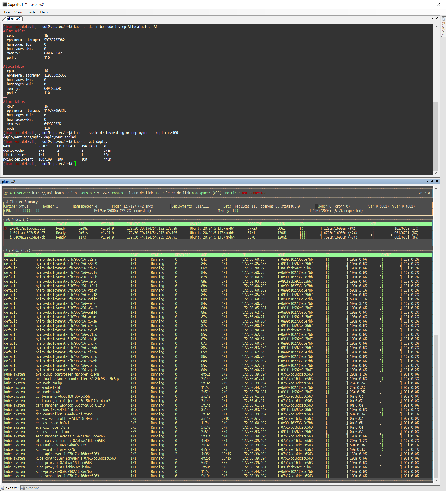


#### 과제 3 - 서비스(NLB)/파드 배포 시 ExternalDNS 설정해서, 각자 자신의 도메인으로 NLB를 통해 애플리케이션(파드)로 접속


#### 과제 4 - NLB에 TLS 적용하기


## 1. 실습 환경 세팅

### 1.1 구성 환경

- 사전 준비
  - AWS 계정, SSH 키 페어, IAM 계정 생성 후 키, S3 버킷
- 전체 구성도
  - 기본 구성 환경은 1주차 내용과 동일
- 실습 환경 내용
  - CloudFormation 스택 실행 시 파라미터를 기입하면, 해당 정보가 반영되어 배포됩니다.
  - VPC는 kOps 배포를 위한 EC2가 위치할 MyVPC 1개와 실제 kOps 가 배포되어 구동되는 VPC 1개로 총 2개가 생성됩니다.
  - CloudFormation 에 EC2의 UserData 부분(Script 실행)으로 AWS kOps 설치를 진행합니다
  - 마스터 노드 1대, 워커 노드는 기본은 2대로 구성됩니다


### 1.2 실습 환경

- 본 실습은 **미국 동부(버지니아 북부) `us-east-1`** 에서 진행됩니다.

#### 1.2.1 S3 버킷 생성

1. S3 URL 접속
   - https://s3.console.aws.amazon.com/s3/buckets?region=us-east-1
2. 버킷 만들기 버튼 클릭
   - 
3. 버킷 만들기
   - 버킷 이름 설정 후 기본 설정 그대로 버킷 만들기 버튼 클릭
     - 버킷 이름 : 20230124-learn-s3-mybucket
   - 


#### 1.2.2 Cloud Formation을 이용한 kOps 생성(이하 배포)

1. Cloud Formation URL 접속 및 스택 생성 버튼 클릭

   - https://us-east-1.console.aws.amazon.com/cloudformation/home?region=us-east-1#/stacks
   - 

2. 스택 생성 - 1단계 스택 생성

   - 템플릿 소스 URL 입력 - Amazon S3 URL
     - https://s3.ap-northeast-2.amazonaws.com/cloudformation.cloudneta.net/K8S/kops-oneclick.yaml
   - 

3. 스택 생성 - 2단계 스택 세부 정보 지정

   - 스택 이름

     - 스택 이름 : mkops
     - 

   - 파라미터

     - <<<<< Deploy EC2 : kops-ec2 >>>>>

       - 설정 설명
         - KeyName : kops-ec2에 SSH 접속을 위한 SSH 키페어 선택 *<- 미리 SSH 키 생성 해두자!*
         - MyIamUserAccessKeyID : 관리자 수준의 권한을 가진 IAM User의 액세스 키ID 입력
         - MyIamUserSecretAccessKey : 관리자 수준의 권한을 가진 IAM User의 시크릿 키ID 입력 <- 노출되지 않게 보안 주의
         - SgIngressSshCidr : kops-ec2에 SSH 접속 가능한 IP 입력 (집 공인IP/32 입력), 보안그룹 인바운드 규칙에 반영됨
         - LatestAmiId : kops-ec2에 사용할 AMI는 아마존리눅스2 최신 버전 사용, 기본값 그대로 사용
       - 설정 내용
         - 사용자 설정 입력
       - 

     - <<<<< AWS kOps Config >>>>>

       - 설정 설명

         - KubernetesVersion : 쿠버네티스 설치 버전 (기본 v1.24.9) ⇒ 변경 가능

         - ClusterBaseName : kOps 클러스터 이름이며, 사용하게될 도메인 이름이다. ‘퍼블릭 도메인’ or ‘프라이빗 도메인’ or ‘Gossip DNS’ 가능

         - S3StateStore : kOps 클러스터의 설정/상태 정보가 저장될 S3 버킷의 이름을 지정 *← 미리 S3 버킷을 생성 해두자!*

         - MasterNodeInstanceType & WorkerNodeInstanceType: 마스터(기본 t3.medium) & 워커 노드 EC2 인스턴스의 타입 (기본 t3.medium) ⇒ 변경 가능

         - WorkerNodeCount : 워커노드의 갯수를 입력 ⇒ 변경 가능

         - VpcBlock : kOps 배포되고 동작할 VPC 네트워크 대역, 기본값 그대로 사용

       - 설정 내용

         - 다음 설정 외 기본 설정 사용
           - ClusterBaseName
             - learn-dc.link
           - S3StateStore : 위에 생성한 버킷 명칭 입력
             - 20230124-learn-s3-mybucket

       - 

     - <<<<< Region AZ >>>>>

       - 설정 설명
         - TargetRegion : kOps를 배포할 리전
         - AvailabliltyZone1 : kOps를 배포할 리전의 가용 영역
         - AvailabliltyZone2 : kOps를 배포할 리전의 가용 영역
       - 설정 내용
         - TargetRegion : us-east-1
         - AvailabliltyZone1 : us-east-1a
         - AvailabliltyZone2 : us-east-1c
       - 

   - 다음 버튼 클릭

     - 

4. 스택 생성 - 3단계 스택 옵션

   - 기본 설정 그대로 다음 버튼 클릭
     - 

5. 스택 생성 - 4단계 mkops 검토

   - 기본 설정 그대로 전송 버튼 클릭
     - 

6. 스택 생성 확인 및 접속 IP 확인

   - 스택 생성 확인
     - 
   - 접속 IP 확인
     - KOPSEC2IP : 3.80.146.2
     - 


#### 1.2.3 kOps 배포 확인

##### 1. 접속 후 기본 설정

- 마스터노드 SSH 접속 - Putty
  - 

- kOps 기본 인증 : /etc/profile 에 적용되어 있음

  - ```bash
    tail -n 13 /etc/profile
    ```

    - 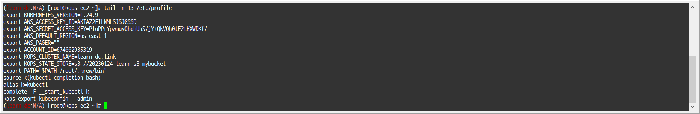

  - ```bash
    cat ~/.kube/config | yh
    ```

    - 

- 설치 확인

  - ```bash
    kops validate cluster --wait 10m
    ```

    - 

- 환경변수 정보 확인

  - ```bash
    export | egrep 'ACCOUNT|AWS|KOPS|KUBERNETES'
    ```

    - 

  - ```bash
    export | egrep 'ACCOUNT|AWS|KOPS|KUBERNETES' | grep -v SECRET
    ```

    - 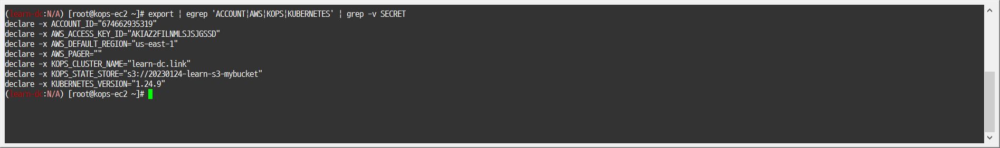

- default 네임스페이스 적용

  - ```bash
    kubectl ns default
    ```

    - 


##### 2. kOps 정보 확인

- kOps 클러스터 정보 확인

  - ```bash
    kops get cluster
    ```

    - 

  - ```bash
    kops get cluster -o yaml
    ```

    - 

    - ```yaml
      apiVersion: kops.k8s.io/v1alpha2
      kind: Cluster
      metadata:
        creationTimestamp: "2023-01-24T11:44:45Z"
        name: learn-dc.link
      spec:
        api:
          dns: {}
        authorization:
          rbac: {}
        channel: stable
        cloudProvider: aws
        configBase: s3://20230124-learn-s3-mybucket/learn-dc.link
        etcdClusters:
        - cpuRequest: 200m
          etcdMembers:
          - encryptedVolume: true
            instanceGroup: master-us-east-1a
            name: a
          memoryRequest: 100Mi
          name: main
        - cpuRequest: 100m
          etcdMembers:
          - encryptedVolume: true
            instanceGroup: master-us-east-1a
            name: a
          memoryRequest: 100Mi
          name: events
        iam:
          allowContainerRegistry: true
          legacy: false
        kubelet:
          anonymousAuth: false
        kubernetesApiAccess:
        - 0.0.0.0/0
        - ::/0
        kubernetesVersion: 1.24.9
        masterPublicName: api.learn-dc.link
        networkCIDR: 172.30.0.0/16
        networking:
          amazonvpc: {}
        nonMasqueradeCIDR: 100.64.0.0/10
        sshAccess:
        - 0.0.0.0/0
        - ::/0
        subnets:
        - cidr: 172.30.32.0/19
          name: us-east-1a
          type: Public
          zone: us-east-1a
        - cidr: 172.30.64.0/19
          name: us-east-1c
          type: Public
          zone: us-east-1c
        topology:
          dns:
            type: Public
          masters: public
          nodes: public

  - ```bash
    kops get cluster -o yaml | yh
    ```

    - 

    - ```yaml
      apiVersion: kops.k8s.io/v1alpha2
      kind: Cluster
      metadata:
        creationTimestamp: "2023-01-24T11:44:45Z"
        name: learn-dc.link
      spec:
        api:
          dns: {}
        authorization:
          rbac: {}
        channel: stable
        cloudProvider: aws
        configBase: s3://20230124-learn-s3-mybucket/learn-dc.link
        etcdClusters:
        - cpuRequest: 200m
          etcdMembers:
          - encryptedVolume: true
            instanceGroup: master-us-east-1a
            name: a
          memoryRequest: 100Mi
          name: main
        - cpuRequest: 100m
          etcdMembers:
          - encryptedVolume: true
            instanceGroup: master-us-east-1a
            name: a
          memoryRequest: 100Mi
          name: events
        iam:
          allowContainerRegistry: true
          legacy: false
        kubelet:
          anonymousAuth: false
        kubernetesApiAccess:
        - 0.0.0.0/0
        - : :/0
        kubernetesVersion: 1.24.9
        masterPublicName: api.learn-dc.link
        networkCIDR: 172.30.0.0/16
        networking:
          amazonvpc: {}
        nonMasqueradeCIDR: 100.64.0.0/10
        sshAccess:
        - 0.0.0.0/0
        - : :/0
        subnets:
        - cidr: 172.30.32.0/19
          name: us-east-1a
          type: Public
          zone: us-east-1a
        - cidr: 172.30.64.0/19
          name: us-east-1c
          type: Public
          zone: us-east-1c
        topology:
          dns:
            type: Public
          masters: public
          nodes: public
      ```

- 인스턴스그룹 정보 확인

  - ```bash
    kops get ig
    ```

    - 

  - ```bash
    kops get ig -o yaml
    ```

    - 

    - ```yaml
      apiVersion: kops.k8s.io/v1alpha2
      kind: InstanceGroup
      metadata:
        creationTimestamp: "2023-01-24T11:44:45Z"
        labels:
          kops.k8s.io/cluster: learn-dc.link
        name: master-us-east-1a
      spec:
        image: 099720109477/ubuntu/images/hvm-ssd/ubuntu-focal-20.04-amd64-server-20221206
        instanceMetadata:
          httpPutResponseHopLimit: 3
          httpTokens: required
        machineType: t3.medium
        maxSize: 1
        minSize: 1
        role: Master
        subnets:
        - us-east-1a
      
      ---
      
      apiVersion: kops.k8s.io/v1alpha2
      kind: InstanceGroup
      metadata:
        creationTimestamp: "2023-01-24T11:44:45Z"
        labels:
          kops.k8s.io/cluster: learn-dc.link
        name: nodes-us-east-1a
      spec:
        image: 099720109477/ubuntu/images/hvm-ssd/ubuntu-focal-20.04-amd64-server-20221206
        instanceMetadata:
          httpPutResponseHopLimit: 1
          httpTokens: required
        machineType: t3.medium
        maxSize: 1
        minSize: 1
        role: Node
        subnets:
        - us-east-1a
      
      ---
      
      apiVersion: kops.k8s.io/v1alpha2
      kind: InstanceGroup
      metadata:
        creationTimestamp: "2023-01-24T11:44:45Z"
        labels:
          kops.k8s.io/cluster: learn-dc.link
        name: nodes-us-east-1c
      spec:
        image: 099720109477/ubuntu/images/hvm-ssd/ubuntu-focal-20.04-amd64-server-20221206
        instanceMetadata:
          httpPutResponseHopLimit: 1
          httpTokens: required
        machineType: t3.medium
        maxSize: 1
        minSize: 1
        role: Node
        subnets:
        - us-east-1c
      ```

  - ```bash
    kops get ig -o yaml | yh
    ```

    - 

    - ```yaml
      apiVersion: kops.k8s.io/v1alpha2
      kind: InstanceGroup
      metadata:
        creationTimestamp: "2023-01-24T11:44:45Z"
        labels:
          kops.k8s.io/cluster: learn-dc.link
        name: master-us-east-1a
      spec:
        image: 099720109477/ubuntu/images/hvm-ssd/ubuntu-focal-20.04-amd64-server-20221206
        instanceMetadata:
          httpPutResponseHopLimit: 3
          httpTokens: required
        machineType: t3.medium
        maxSize: 1
        minSize: 1
        role: Master
        subnets:
        - us-east-1a
      ---
      apiVersion: kops.k8s.io/v1alpha2
      kind: InstanceGroup
      metadata:
        creationTimestamp: "2023-01-24T11:44:45Z"
        labels:
          kops.k8s.io/cluster: learn-dc.link
        name: nodes-us-east-1a
      spec:
        image: 099720109477/ubuntu/images/hvm-ssd/ubuntu-focal-20.04-amd64-server-20221206
        instanceMetadata:
          httpPutResponseHopLimit: 1
          httpTokens: required
        machineType: t3.medium
        maxSize: 1
        minSize: 1
        role: Node
        subnets:
        - us-east-1a
      ---
      apiVersion: kops.k8s.io/v1alpha2
      kind: InstanceGroup
      metadata:
        creationTimestamp: "2023-01-24T11:44:45Z"
        labels:
          kops.k8s.io/cluster: learn-dc.link
        name: nodes-us-east-1c
      spec:
        image: 099720109477/ubuntu/images/hvm-ssd/ubuntu-focal-20.04-amd64-server-20221206
        instanceMetadata:
          httpPutResponseHopLimit: 1
          httpTokens: required
        machineType: t3.medium
        maxSize: 1
        minSize: 1
        role: Node
        subnets:
        - us-east-1c

- 인스턴스 정보 확인

  - ```bash
    kops get instances
    ```

    - 

  - ```bash
    kops get instances -o yaml | yh
    ```

    - 

    - ```yaml
      - id: i-07141eab6cc9bb2e4
        instanceGroup: master-us-east-1a.masters.learn-dc.link
        internalIP: 172.30.37.165
        machineType: t3.medium
        nodeName: i-07141eab6cc9bb2e4
        roles:
        - master
        state: ""
        status: UpToDate
      - id: i-0d3406b74013db109
        instanceGroup: nodes-us-east-1a.learn-dc.link
        internalIP: 172.30.46.72
        machineType: t3.medium
        nodeName: i-0d3406b74013db109
        roles:
        - node
        state: ""
        status: UpToDate
      - id: i-0e94665f9bcb7353d
        instanceGroup: nodes-us-east-1c.learn-dc.link
        internalIP: 172.30.89.212
        machineType: t3.medium
        nodeName: i-0e94665f9bcb7353d
        roles:
        - node
        state: ""
        status: UpToDate


##### 3. k8s 정보 확인 & krew

- 클러스터 정보 확인

  - ```bash
    kubectl cluster-info
    ```

    - 

  - ```bash
    kubectl cluster-info dump
    ```

    - 
    - 

- 노드 정보 확인

  - ```bash
    kubectl get nodes -o wide
    ```

    - 

  - ```bash
    kubectl get nodes -v6
    ```

    - 

- 파드 정보 확인

  - ```bash
    kubectl get pod -A
    ```

    - 

- krew 플러그인 설치 확인

  - ```bash
    kubectl krew list
    ```

    - 

- kube-system 오브젝트 전체 확인

  - ```bash
    kubectl get-all -n kube-system
    ```

    - 

- 모니터링 (플러그인)

  - ```bash
    kubectl ktop
    ```

    - 
    - 

- 노드 인스턴스 타입 확인

  - ```bash
    kubectl describe nodes | grep "node.kubernetes.io/instance-type"
    ```

    - 


##### 4. EC2 정보 확인

- 노드 IP 확인

  - ```bash
    aws ec2 describe-instances --output table
    ```

    - 
    - 

  - ```bash
    aws ec2 describe-instances --query "Reservations[*].Instances[*].{PublicIPAdd:PublicIpAddress,PrivateIPAdd:PrivateIpAddress,InstanceName:Tags[?Key=='Name']|[0].Value,Status:State.Name}" --filters Name=instance-state-name,Values=running --output table
    ```


##### 5. AWS Route53 도메인 정보 확인

- 자신의 도메인 변수 지정 : 소유하고 있는 자신의 도메인을 입력하시면 됩니다.

  - ```bash
    # MyDomain=<자신의 도메인>
    MyDomain=learn-dc.link

- 자신의 Route 53 도메인 ID 조회 및 변수 지정

  - ```bash
    aws route53 list-hosted-zones-by-name --dns-name "${MyDomain}." | jq
    ```

  - ```bash
    MyDnzHostedZoneId=`aws route53 list-hosted-zones-by-name --dns-name "${MyDomain}." --query "HostedZones[0].Id" --output text`

- A 레코드 타입 조회

  - ```bash
    aws route53 list-resource-record-sets --hosted-zone-id "${MyDnzHostedZoneId}" --query "ResourceRecordSets[?Type == 'A']" | jq

- A 레코드 값 반복 조회

  - ```bash
    while true; do aws route53 list-resource-record-sets --hosted-zone-id "${MyDnzHostedZoneId}" --query "ResourceRecordSets[?Type == 'A']" | jq ; date ; echo ; sleep 1; done
    ```

    - 


##### 6. (옵션) 노드에 배포된 컨테이너 정보 확인

- Containerd clients 3종 : ctr, nerdctl, crictl
  - 
    - https://iximiuz.com/en/posts/containerd-command-line-clients/

- 아래는 마스터 노드 정보를 확인

- ctr 버전 확인

  - ```bash
    ssh -i ~/.ssh/id_rsa ubuntu@api.$KOPS_CLUSTER_NAME ctr --version
    ```

    - 

- ctr help

  - ```bash
    ssh -i ~/.ssh/id_rsa ubuntu@api.$KOPS_CLUSTER_NAME ctr
    ```

    - 

- 네임스페이스 확인

  - ```bash
    ssh -i ~/.ssh/id_rsa ubuntu@api.$KOPS_CLUSTER_NAME sudo ctr ns list
    ```

    - 

- 컨테이너 리스트 확인

  - ```bash
    ssh -i ~/.ssh/id_rsa ubuntu@api.$KOPS_CLUSTER_NAME sudo ctr -n k8s.io container list
    ```

    - 

- 컨테이너 이미지 확인

  - ```bash
    ssh -i ~/.ssh/id_rsa ubuntu@api.$KOPS_CLUSTER_NAME sudo ctr -n k8s.io image list --quiet
    ```

    - 

- 태스크 리스트 확인

  - ```bash
    ssh -i ~/.ssh/id_rsa ubuntu@api.$KOPS_CLUSTER_NAME sudo ctr -n k8s.io task list
    ```

    - 

- 예시) 각 태스크의 PID(5923) 확인

  - ```bash
    # ssh -i ~/.ssh/id_rsa ubuntu@api.$KOPS_CLUSTER_NAME sudo ps -c <PID>
    ssh -i ~/.ssh/id_rsa ubuntu@api.$KOPS_CLUSTER_NAME sudo ps -c 5789
    ssh -i ~/.ssh/id_rsa ubuntu@api.$KOPS_CLUSTER_NAME sudo ps -c 5051 5871 6064
    ```

    - 
    - 


## 2. 쿠버네티스 네트워크

### 2.1 AWS VPC CNI(Container Network Interface) 소개

#### 2.1.1 개념

##### 1. K8S CNI

- CNI(Container Network Interface)는 k8s 네트워크 환경을 구성해주며 다양한 플러그인이 존재함
  - https://kubernetes.io/docs/concepts/cluster-administration/networking/
  - https://kubernetes.io/docs/concepts/cluster-administration/addons/#networking-and-network-policy

##### 2. AWS VPC CNI

- 파드의 IP를 할당해주며, 파드의 IP 네트워크 대역과 노드(워커)의 IP 대역이 같아서 직접 통신이 가능함
  - https://github.com/aws/amazon-vpc-cni-k8s
  - https://github.com/aws/amazon-vpc-cni-k8s/blob/master/docs/cni-proposal.md
- supports native VPC networking with the Amazon VPC Container Network Interface(CNI) plugin for Kubernetes.
- VPC와 통합
  - VPC Flow logs, VPC 라우팅 정책, ~~보안 그룹(SG;Security Group)~~ 사용 가능
    - kOps는 SG for Pod 미지원
      - https://reaperes.medium.com/security-group-%EC%9D%84-pod-%EB%8B%A8%EC%9C%84%EB%A1%9C-%ED%95%A0%EB%8B%B9%ED%95%98%EA%B8%B0-bef922065684
- This Plugin assigns an IP address from your VPC to each pod.
- VPC ENI(Elastic Network Interface)에 미리 할당된 IP를 파드에서 사용할 수 있음

##### 3. K8S Calico CNI 와 AWS VPC CNI 차이

- 네트워크 통신의 최적화(성능, 지연)를 위해 노드와 파드의 네트워크 대역을 동일하게 설정함
  - 
- 파드간 통신 시 일반적으로 `k8s CNI`는 오버레이(VXLAN, IP-IP 등) 통신을 하고, `AWS VPC CNI`는 동일 대역으로 직접 통신함
  - 

##### 4. 워커 노드에 생성 가능한 최대 파드 갯수

- Secondary IPv4 addresses
  - 인스턴스 유형에 최대 ENI 갯수와 할당 가능 IP 수를 조합하여 선정
    - https://docs.aws.amazon.com/ko_kr/AWSEC2/latest/UserGuide/using-eni.html
- IPv4 Prefix Delegation
  - IPv4 28bit 서브넷(prefix)를 위임하여 할당 가능 IP 수와 인스턴스 유형에 권장하는 최대 갯수로 선정


#### 2.1.2 실습

##### 1. 네트워크 기본 정보 확인

- CNI 정보 확인

  - ```bash
    kubectl describe daemonset aws-node --namespace kube-system | grep Image | cut -d "/" -f 2
    ```
    
    - 

- 노드 IP 확인

  - ```bash
    aws ec2 describe-instances --query "Reservations[*].Instances[*].{PublicIPAdd:PublicIpAddress,PrivateIPAdd:PrivateIpAddress,InstanceName:Tags[?Key=='Name']|[0].Value,Status:State.Name}" --filters Name=instance-state-name,Values=running --output table
    ```
    
    - 

- 파드 IP 확인

  - ```bash
    kubectl get pod -n kube-system -o=custom-columns=NAME:.metadata.name,IP:.status.podIP,STATUS:.status.phase
    ```
    
    - 

- 파드 이름 확인

  - ```bash
    kubectl get pod -A -o name
    ```
    
    - 


- 파드 갯수 확인

  - ```bash
    kubectl get pod -A -o name | wc -l
    ```
    
    - 

- 파드 갯수 확인(플러그인)

  - https://github.com/vladimirvivien/ktop

  - ```bash
    kubectl ktop
    ```
    
    - 
    - 


- [master node] aws vpc cni log

  - ```bash
    ssh -i ~/.ssh/id_rsa ubuntu@api.$KOPS_CLUSTER_NAME ls /var/log/aws-routed-eni
    ```

    - 


##### 2. master node에 SSH 접속 후 확인

- [mater node] SSH 접속

  - ```bash
    ssh -i ~/.ssh/id_rsa ubuntu@api.$KOPS_CLUSTER_NAME
    ```
    
    - 


- 툴 설치

  - ```bash
    sudo apt install -y tree jq net-tools
    ```
    
    - 
    - 


- CNI 정보 확인

  - ```bash
    ls /var/log/aws-routed-eni
    ```
    
    - 
    
  - ```bash
    cat /var/log/aws-routed-eni/plugin.log | jq
    ```
  
    - 
    - 
    
  - ```bash
    cat /var/log/aws-routed-eni/ipamd.log | jq
    ```
    
    - 


- 네트워크 정보 확인 : eniY는 pod network 네임스페이스와 veth pair

  - ```bash
    ip -br -c addr
    ```

    - 
    
  - ```bash
    ip -c addr
    ```
  
    - 
    
  - ```bash
    ip -c route
    ```

    - 
    
  - ```bash
    sudo iptables -t nat -S
    ```
  
    - 
    - 
    
  - ```bash
    sudo iptables -t nat -L -n -v
    ```
    
    - 
    - 


- 빠져나오기

  - ```bash
    exit
    ```
    
    - 


##### 3. 워커 노드에 SSH 접속 후 확인 : 워커 노드의 public ip로 SSH 접속

- 워커 노드 public IP 확인

  - ```bash
    aws ec2 describe-instances --query "Reservations[*].Instances[*].{PublicIPAdd:PublicIpAddress,InstanceName:Tags[?Key=='Name']|[0].Value}" --filters Name=instance-state-name,Values=running --output table
    ```
    
    - 


- 워커 노드 Public IP 변수 지정

  - ```bash
    # W1PIP=<워커 노드 1 Public IP>
    W1PIP=3.86.36.119
    # W2PIP=<워커 노드 2 Public IP>
    W2PIP=35.168.13.194
    
    echo $W1PIP
    echo $W2PIP
    ```
    
    - 


- 워커 노드 SSH 접속 확인

  - 워커 노드1

    - ```bash
      ssh -i ~/.ssh/id_rsa ubuntu@$W1PIP
      exit
      ```
      
      - 
      - 
  
  - 워커 노드2
  
    - ```bash
      ssh -i ~/.ssh/id_rsa ubuntu@$W2PIP
      exit
      ```
      
      - 
      - 


- [워커 노드1, 워커 노드2] SSH 접속 후 툴 설치 및 정보 확인

  - SSH 접속

    - ```bash
      # ssh -i ~/.ssh/id_rsa ubuntu@$W1PIP
      ssh -i ~/.ssh/id_rsa ubuntu@$W2PIP
      ```
      
      - 
      - 

  
  
  - 툴 설치

    - ```bash
      sudo apt install -y tree jq net-tools
      ```
      
      - 
      - 
      - 

  
  
  - CNI 정보 확인

    - ```bash
      ls /var/log/aws-routed-eni
      ```

      - 
      - 
    
    - ```bash
      cat /var/log/aws-routed-eni/plugin.log | jq
      ```
    
      - 
    
      - 
    
      - 
    
      - 
    
      - ``` json
        {
          "level": "info",
          "ts": "2023-01-24T11:48:47.337Z",
          "caller": "routed-eni-cni-plugin/cni.go:119",
          "msg": "Constructed new logger instance"
        }
        {
          "level": "info",
          "ts": "2023-01-24T11:48:47.337Z",
          "caller": "routed-eni-cni-plugin/cni.go:128",
          "msg": "Received CNI add request: ContainerID(c7eb1fca15b325f1586072de859212e5b4f120ecdb6b7f510cb150afcb40a863) Netns(/var/run/netns/cni-009d6902-2a84-8d87-ad75-c3012ccccc43) IfName(eth0) Args(IgnoreUnknown=1;K8S_POD_NAMESPACE=kube-system;K8S_POD_NAME=coredns-autoscaler-5685d4f67b-v7vfl;K8S_POD_INFRA_CONTAINER_ID=c7eb1fca15b325f1586072de859212e5b4f120ecdb6b7f510cb150afcb40a863;K8S_POD_UID=02872caf-9307-4599-a808-77fdc99d1d7e) Path(/opt/cni/bin) argsStdinData({\"cniVersion\":\"0.4.0\",\"mtu\":\"9001\",\"name\":\"aws-cni\",\"pluginLogFile\":\"/var/log/aws-routed-eni/plugin.log\",\"pluginLogLevel\":\"DEBUG\",\"podSGEnforcingMode\":\"strict\",\"type\":\"aws-cni\",\"vethPrefix\":\"eni\"})"
        }
        {
          "level": "debug",
          "ts": "2023-01-24T11:48:47.337Z",
          "caller": "routed-eni-cni-plugin/cni.go:128",
          "msg": "Prev Result: <nil>\n"
        }
        {
          "level": "debug",
          "ts": "2023-01-24T11:48:47.337Z",
          "caller": "routed-eni-cni-plugin/cni.go:128",
          "msg": "MTU value set is 9001:"
        }
        {
          "level": "info",
          "ts": "2023-01-24T11:48:47.343Z",
          "caller": "routed-eni-cni-plugin/cni.go:128",
          "msg": "Received add network response from ipamd for container c7eb1fca15b325f1586072de859212e5b4f120ecdb6b7f510cb150afcb40a863 interface eth0: Success:true  IPv4Addr:\"172.30.37.39\"  VPCv4CIDRs:\"172.30.0.0/16\""
        }
        {
          "level": "debug",
          "ts": "2023-01-24T11:48:47.343Z",
          "caller": "routed-eni-cni-plugin/cni.go:237",
          "msg": "SetupPodNetwork: hostVethName=eni02955105579, contVethName=eth0, netnsPath=/var/run/netns/cni-009d6902-2a84-8d87-ad75-c3012ccccc43, v4Addr=172.30.37.39/32, v6Addr=<nil>, deviceNumber=0, mtu=9001"
        }
        {
          "level": "debug",
          "ts": "2023-01-24T11:48:47.400Z",
          "caller": "driver/driver.go:281",
          "msg": "Successfully disabled IPv6 RA and ICMP redirects on hostVeth eni02955105579"
        }
        {
          "level": "debug",
          "ts": "2023-01-24T11:48:47.408Z",
          "caller": "driver/driver.go:297",
          "msg": "Successfully setup container route, containerAddr=172.30.37.39/32, hostVeth=eni02955105579, rtTable=main"
        }
        {
          "level": "debug",
          "ts": "2023-01-24T11:48:47.408Z",
          "caller": "driver/driver.go:297",
          "msg": "Successfully setup toContainer rule, containerAddr=172.30.37.39/32, rtTable=main"
        }
        parse error: Invalid numeric literal at line 10, column 5
        ```
    
    - ```bash
      cat /var/log/aws-routed-eni/ipamd.log | jq
      ```
    
      - 
      - 
  
  
  
  - 네트워크 정보 확인 : eniY는 pod network 네임스페이스와 veth pair
  
    - ```bash
      ip -br -c addr
      ```
  
      - 
      - 
      
    - ```bash
      ip -c addr
      ```
    
      - 
      - 
      
    - ```bash
      ip -c route
      ```
    
      - 
      - 
      
    - ```bash
      sudo iptables -t nat -S
      ```
    
      - 
      - 
      - 
      - 
      
    - ```bash
      sudo iptables -t nat -L -n -v
      ```
      
      - 
      - 
      - 
      - 
  
  
  
  - 빠져나오기
  
    - ```bash
      exit
      ```
      
      - 
      - 


### 2.2 노트에서 기본 네트워크 정보 확인

#### 2.2.1 개념

##### 1. 워커 노드1 기본 네트워크 구성 : 워커 노드2는 구성이 유사하여 생략


- Network NS(Name Space)는 호스트(Root)와 파드 별(Per Pod)로 구분

- 특정한 파드(kube-proxy, aws-node)는 호스트(Root)의 IP를 그대로 사용

- t3.medium의 경우 ENI에 최대 6개의 IP를 가질 수 있음

  - | 인스턴스 유형 | 최대 네트워크 인터페이스 수 | 인터페이스당 프라이빗 IPv4 주소 수 | 인터페이스당 IPv6 주소 수 |
    | :------------ | :-------------------------- | :--------------------------------- | :------------------------ |
    | `t3.medium`   | 3                           | 6                                  | 6                         |

    - https://docs.aws.amazon.com/ko_kr/AWSEC2/latest/UserGuide/using-eni.html

- ENI0, ENI1으로 2개의 ENI는 자신의 IP 이외에 추가적으로 5개의 보조 프라이빗 IP를 가질 수 있음
- coredns 파드는 veth으로 호스트에는 eniY@ifN 인터페이스와 파드에 eth0과 연결되어 있음


##### 2. 워커 노드1 인스턴스의 네트워크 정보 확인


#### 2.2.2 실습

##### 1. 보조 IPv4 주소를 파드가 사용하는지 확인

- ebs-csi-node 파드 IP 정보 확인

  - ```bash
    kubectl get pod -n kube-system -l app=ebs-csi-node -owide
    ```
    
    - 


- 노드의 라우팅 정보 확인 >> EC2 네트워크 정보의 '보조 프라이빗 IPv4 주소'와 비교해보자

  - ```bash
    echo $KOPS_CLUSTER_NAME
    echo $W1PIP
    echo $W2PIP
    ```

    - 
  
  - ```bash
    ssh -i ~/.ssh/id_rsa ubuntu@api.$KOPS_CLUSTER_NAME ip -c route
    ```
  
    - 
    - 
  
  - ```bash
    ssh -i ~/.ssh/id_rsa ubuntu@$W1PIP ip -c route
    ```
  
    - 
    - 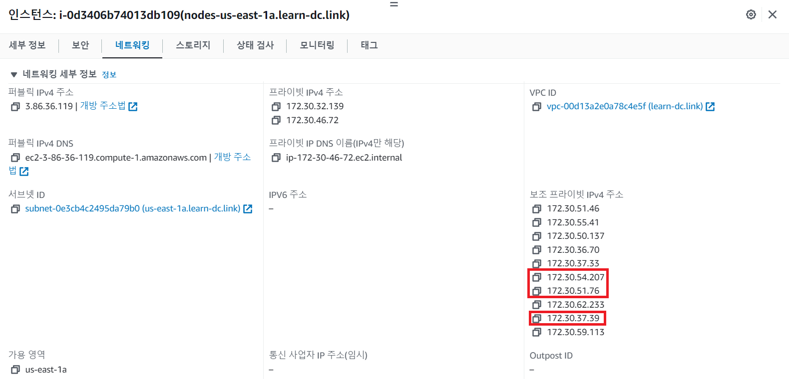
  
  - ```bash
    ssh -i ~/.ssh/id_rsa ubuntu@$W2PIP ip -c route
    ```
  
    - 
    - 
  


##### 2. 테스트용 파드 생성 - [nicolaka/netshoot](https://github.com/nicolaka/netshoot)

- [터미널1, 터미널2] 워커 노드1, 워커 노드2 모니터링

  - ```bash
    ssh -i ~/.ssh/id_rsa ubuntu@$W1PIP
    watch -d "ip link | egrep 'ens5|eni' ;echo;echo "[ROUTE TABLE]"; route -n | grep eni"
    ```

    - 
    
  - ```bash
    ssh -i ~/.ssh/id_rsa ubuntu@$W2PIP
    watch -d "ip link | egrep 'ens5|eni' ;echo;echo "[ROUTE TABLE]"; route -n | grep eni"
    ```
    
    - 


- 작업용 EC2 파드 2개 생성

  - ```bash
    cat ~/pkos/2/netshoot-2pods.yaml | yh
    ```
    
    - 
  
  - ```bash
    kubectl apply -f ~/pkos/2/netshoot-2pods.yaml
    ```
  
    - 
    - 


- 파드 확인

  - ```bash
    kubectl get pod -o wide
    ```
  
    - 
    
  - ```bash
    kubectl get pod -o=custom-columns=NAME:.metadata.name,IP:.status.podIP
    ```
  
    - 
    
  - 만약 파드 2개가 모두 1개의 노드에 배치 시 강제로 파드 1개를 다른 노드에 배치
  
    - 불편하게 nodeName 설정하지 않게 해당 실습을 netshoot 데몬셋으로 변경할 것
  
    - 파드 1개 삭제
  
      - ```bash
        kubectl delete pod pod-2
  
    - yaml 파일 편집
  
      - ```bash
        vim ~/pkos/2/netshoot-2pods.yaml
        # ...
        # spec:
        #   nodeName: i-0d3406b74013db109  <- 각자 자신의 노드의 이름을 직접 입력
        #   containers:
        #   - name: netshoot-pod
        # ...
  
    - 재배포
  
      - ```bash
        kubectl apply -f ~/pkos/2/netshoot-2pods.yaml
  
    - 파드 배포 확인
  
      - ```bash
        kubectl get pod -o wide
  


- 파드가 생성되면 **워커 노드에 eniY@ifN 추가**되고 라우팅 테이블에도 정보가 추가됨

- 테스트용 파드 eniY 정보 확인 - 워커 노드 EC2

  - 노드에서 네트워크 인터페이스 정보 확인
  
    - ```bash
      ip -br -c addr show
      ```
  
      - 
      
    - ```bash
      ip -c link
      ```
  
      - 
      
    - ```bash
      ip -c addr
      ```
  
      - 
      
    - ```bash
      # 또는 route -n
      ip -c route
      ```
      
      - 
      - 
  
  - 마지막 생성된 네임스페이스 정보 출력 -t net(네트워크 타입)
  
    - ```bash
      sudo lsns -o PID,COMMAND -t net | awk 'NR>2 {print $1}' | tail -n 1
      ```
  
  - 마지막 생성된 네임스페이스 net PID 정보 출력 -t net(네트워크 타입)을 변수 지정
  
    - ```bash
      MyPID=$(sudo lsns -o PID,COMMAND -t net | awk 'NR>2 {print $1}' | tail -n 1)
      ```
  
  - PID 정보로 파드 정보 확인
  
    - ```bash
      sudo nsenter -t $MyPID -n ip -c addr
      ```
  
    - ```bash
      sudo nsenter -t $MyPID -n ip -c route
      ```


- 테스트용 파드 접속

  - 테스트용 파드 접속(exec) 후 Shell 실행

    - ```bash
      # kubectl exec -it pod-2 -- zsh
      kubectl exec -it pod-1 -- zsh
      ```
      
      - 
  
  - 아래부터는 pod-1 Shell 에서 실행 : 네트워크 정보 확인
  
    - ```bash
      ip -c addr
      ```
  
      - 
      
    - ```bash
      ip -c route
      ```
  
      - 
      
    - ```bash
      route -n
      ```
      
      - 
      
    - ```bash
      # ping -c 1 <pod-2 IP>
      ping -c 1 172.30.62.233
      ```
      
      - 
      - 
      
    - ```bash
      ps
      ```
      
      - 
      
    - ```bash
      cat /etc/resolv.conf
      ```
      
      - 
      
    - ```bash
      exit
      ```
      
      - 
  
  - 파드2 Shell 실행 후 위와 동일하게 실행
  
    - ```bash
      kubectl exec -it pod-2 -- zsh
      ```
    
      - 


### 2.3 노드 간 파드 통신

#### 2.3.1 개념

##### 1. 파드간 통신 흐름 : 별도의 오버레이(Overlay) 통신 기술 없이, VPC Native 하게 파드간 직접 통신이 가능하다

- 
- (참고)파드간 통신 시 과정
  - 


#### 2.3.2 실습

##### 1. 파드간 통신 테스트 및 확인 : 별도의 NAT 동작 없이 통신 가능!

- 파드 IP 변수 지정

  - ```bash
    POD1=$(kubectl get pod pod-1 -o jsonpath={.status.podIP})
    echo $POD1
    ```
  
    - 
    
  - ```bash
    POD2=$(kubectl get pod pod-2 -o jsonpath={.status.podIP})
    echo $POD2
    ```
    
    - 


- 파드1 Shell 에서 파드2로 ping 테스트

  - ```bash
    kubectl exec -it pod-1 -- ping -c 2 $POD2
    ```
    
    - 

- 파드2 Shell 에서 파드1로 ping 테스트

  - ```bash
    kubectl exec -it pod-2 -- ping -c 2 $POD1
    ```
    
    - 

- 워커 노드 EC2 : TCPDUMP 확인 - ens6 에서 패킷 덤프 확인이 되나요?

  - ```bash
    sudo tcpdump -i any -nn icmp
    ```
  
    - 
    
  - ```bash
    sudo tcpdump -i ens5 -nn icmp
    ```
    
    - 
    
  - ```bash
    sudo tcpdump -i ens6 -nn icmp
    ```
    
    - 


- [워커 노드1]

  - routing policy database management 확인
  
    - ```bash
      ip rule
      ```
      
      - 
  
  - routing table management 확인
  
    - ```bash
      ip route show table local
      ```
      
      - 
  
  - 디폴트 네트워크 정보를 ens5를 통해 빠져나감
  
    - ```bash
      ip route show table main
      ```
      
      - 
  


#### 2.3.3 과제1

##### 1. 과제 내용

목표 : 파드간 통신 시 tcpdump 내용을 확인하고 관련 스샷을 올려주세요


##### 2. 과제 수행내용

- [워커 노드1, 워커 노드2] 모니터링

  - ```bash
    sudo tcpdump -i ens5 -nn icmp
    ```
    
    - 

- 워커 노드1 에서 워커 노드 2로 핑 전송

  - ```bash
    kubectl exec -it pod-1 -- ping -c 2 $POD2
    ```
    
    - 


### 2.4 파드에서 외부 통신

#### 2.4.1 개념

##### 1. 파드에서 외부 통신 흐름 : iptable에 SNAT을 통하여 노드의 eth0 IP로 변경되어서 외부와 통신됨

- VPC CNI의 External source network address translation(SNAT) 설정에 따라, 외부(인터넷) 통신 시 SNAT 하거나 혹은 SNAT 없이 통신 할 수 있음
  - https://docs.aws.amazon.com/eks/latest/userguide/external-snat.html
- 


#### 2.4.2 실습

##### 1. 파드에서 외부 통신 테스트 및 확인

- 파드 shell 실행 후 외부로 ping 테스트 & 워커 노드에서 tcpdump 및 iptables 정보 확인

  - 작업용 EC2 : pod-1 Shell 에서 외부로 ping
  
    - ```bash
      kubectl exec -it pod-1 -- ping -c 1 www.google.com
      ```
  
      - 
      
    - ```bash
      kubectl exec -it pod-1 -- ping -i 0.1 www.google.com
      ```
      
      - 
  
  - 워커 노드 EC2 : public IP 확인, tcpdump 확인
  
    - ```bash
      curl -s ipinfo.io/ip ; echo
      ```
    
      - 
      
    - ```bash
      sudo tcpdump -i any -nn icmp
      ```
      
      - 
      
    - ```bash
      sudo tcpdump -i ens5 -nn icmp
      ```
      
      - 
    
  - 작업용 EC2 : pod-1 Shell 에서 외부 접속 확인 - 공인 IP는 어떤 주소인가?
  
    - ```bash
      kubectl exec -it pod-1 -- curl -s ipinfo.io/ip ; echo
      ```
    
      - 
      
    - ```bash
      kubectl exec -it pod-1 -- curl -s wttr.in/seoul
      ```
      
      - 
      
    - ```bash
      kubectl exec -it pod-1 -- curl -s wttr.in/seoul?format=3
      ```
      
      - 
      
    - ```bash
      kubectl exec -it pod-1 -- curl -s wttr.in/Moon
      ```
      
      - 
      
    - ```bash
      kubectl exec -it pod-1 -- curl -s wttr.in/:help
      ```
      
      - 
      - 
    
  - 워커 노드 EC2
  
    - 출력된 결과를 보고 어떻게 빠져나가는지 고민해보자!
  
      - ```bash
        ip rule
        ```
      
        - 
        
      - ```bash
        ip route show table main
        ```
      
        - 
        
      - ```bash
        sudo iptables -L -n -v -t nat
        ```
      
        - 
        - 
        
      - ```bash
        sudo iptables -t nat -S
        ```
        
        - 
        - 
      
    - 파드가 외부와 통신시에는 아래 처럼 'AWS-SNAT-CHAIN-0, AWS-SNAT-CHAIN-1' 룰(rule)에 의해서 SNAT 되어서 외부와 통신!
    
      - 참고로 뒤 IP는 eth0(ENI 첫번째)의 IP 주소이다
      
      - --random-fully 동작
      
        - https://ssup2.github.io/issue/Linux_TCP_SYN_Packet_Drop_SNAT_Port_Race_Condition/
        - https://ssup2.github.io/issue/Kubernetes_TCP_Connection_Delay_VXLAN_CNI_Plugin/
      
      - ```bash
        sudo iptables -t nat -S | grep 'A AWS-SNAT-CHAIN'
        ```
        
        - 
        - 
      
    - 아래 'mark 0x4000/0x4000' 매칭되지 않아서 RETURN 됨!
    
      - ```bash
        # -A KUBE-POSTROUTING -m mark ! --mark 0x4000/0x4000 -j RETURN
        # -A KUBE-POSTROUTING -j MARK --set-xmark 0x4000/0x0
        # -A KUBE-POSTROUTING -m comment --comment "kubernetes service traffic requiring SNAT" -j MASQUERADE --random-fully
        # ...
        ```
    
    - 카운트 확인 시 'AWS-SNAT-CHAIN-0, AWS-SNAT-CHAIN-1'에 매칭되어, 목적지가 '172.30.0.0/16'이 아닌 외부로 빠져나갈 떄 SNAT 172.30.85.242 변경되어 나감
    
      - ```bash
        sudo iptables -t filter --zero; sudo iptables -t nat --zero; sudo iptables -t mangle --zero; sudo iptables -t raw --zero
        ```
      
      - ```bash
        watch -d 'sudo iptables -v --numeric --table nat --list AWS-SNAT-CHAIN-0; echo ; sudo iptables -v --numeric --table nat --list AWS-SNAT-CHAIN-1; echo ; sudo iptables -v --numeric --table nat --list KUBE-POSTROUTING'
        ```
        
        - 
        - 
      
    - conntrack 확인
    
      - ```bash
        # sudo conntrack -L -n |grep -v '169.254.169'
        sudo conntrack -L -n
        ```
        
        - 
  
- 다음 실습을 위해 파드 삭제

  - ```bash
    kubectl delete pod pod-1 pod-2
    ```
    
    - 


### 2.5 노드에서 파드 생성 갯수 제한

#### 2.5.1 개념

##### 1. 워커 노드의 인스턴스 타입 별 파드 생성 갯수 제한

- Secondary IPv4 addresses : 인스턴스 유형에 최대 ENI 갯수와 할당 가능 IP 수를 조합하여 선정

- 인스턴스 타입  별 ENI 최대 갯수와 할당 가능한 최대 IP 갯수에 따라서 파드 배치 갯수가 결정됨

  - 단, aws-node 와 kube-proxy 파드는 호스트의 IP를 사용함으로 최대 갯수에서 제외함

- 인스턴스별 유형별 네트워크 인터페이스당 IP 주소

  - https://docs.aws.amazon.com/ko_kr/AWSEC2/latest/UserGuide/using-eni.html

  - ```bash
    # AWS CLI 명령을 이용한 조회 - 예시:c5.*
    aws ec2 describe-instance-types --filters "Name=instance-type,Values=c5.*" --query "InstanceTypes[].{Type: InstanceType, MaxENI: NetworkInfo.MaximumNetworkInterfaces, IPv4addr: NetworkInfo.Ipv4AddressesPerInterface}" --output table
    
    # ---------------------------------------
    # |        DescribeInstanceTypes        |
    # +----------+----------+---------------+
    # | IPv4addr | MaxENI   |     Type      |
    # +----------+----------+---------------+
    # |  30      |  8       |  c5.4xlarge   |
    # |  50      |  15      |  c5.24xlarge  |
    # |  15      |  4       |  c5.xlarge    |
    # |  30      |  8       |  c5.12xlarge  |
    # |  10      |  3       |  c5.large     |
    # |  15      |  4       |  c5.2xlarge   |
    # |  50      |  15      |  c5.metal     |
    # |  30      |  8       |  c5.9xlarge   |
    # |  50      |  15      |  c5.18xlarge  |
    # +----------+----------+---------------+
    ```

- 최대 파드 생성 갯수 : (Number of network interfaces for the instance type × (the number of IP addressess per network interface - 1)) + 2

- 


#### 2.5.2 실습

##### 1. 워커 노드의 인스턴스 정보 확인 : 현재 t3.medium 사용 중

- t3 타입의 정보(필터) 확인

  - ```bash
    aws ec2 describe-instance-types --filters Name=instance-type,Values=t3.* \
     --query "InstanceTypes[].{Type: InstanceType, MaxENI: NetworkInfo.MaximumNetworkInterfaces, IPv4addr: NetworkInfo.Ipv4AddressesPerInterface}" \
     --output table
    ```
    
    - 


- 파드 사용 가능 계산 예시 : aws-node와 kube-proxy 파드는 host-networking 사용으로 IP 2개 남음

  - ```bash
    # ((MaxENI * (IPv4addr-1)) + 2)
    # t3.medium 경우 : ((3 * (6 - 1) + 2 ) = 17개 >> aws-node 와 kube-proxy 2개 제외하면 15개
    ```


- 워커 노드 상세 정보 확인 : 노드 상세 정보의 Allocatable에 pods에 17개 정보 확인

  - ```bash
    kubectl describe node | grep Allocatable: -A6
    ```
    
    - 


##### 2. 최대 파드 생성 및 확인

- 모니터링

  - 워커 노드 EC2 - 모니터링

    - ```bash
      watch -d "ip link | egrep 'ens|eni'"
      # while true; do ip -br -c addr show && echo "--------------" ; date "+%Y-%m-%d %H:%M:%S" ; sleep 1; done
      ```
      
      - 


  - 작업용 EC2 - 터미널1

    - ```bash
      watch -d 'kubectl get pods -o wide'
      ```
      
      - 


- 디플로이먼트 생성

  - ```bash
    cat ~/pkos/2/nginx-dp.yaml | yh
    ```
    
    - 

  - ```bash
    kubectl apply -f ~/pkos/2/nginx-dp.yaml
    ```

    - 


- 파드 확인

  - ```bash
    kubectl get pod -o wide

  - ```bash
    kubectl get pod -o=custom-columns=NAME:.metadata.name,IP:.status.podIP
    ```

  - ```bash
    kubectl ktop
    ```
    
    - 
    - 

- 파드 증가 테스트 >> 파드 정상 생성 확인, 워커 노드에서 eth, eni 갯수 확인

  - ```bash
    kubectl scale deployment nginx-deployment --replicas=8
    ```
    
    - 

- 파드 증가 테스트 >> 파드 정상 생성 확인, 워커 노드에서 eth, eni 갯수 확인 >> 어떤일이 벌어 졌는가?

  - ```bash
    kubectl scale deployment nginx-deployment --replicas=22
    ```
    
    - 
    - 

- 파드 증가 테스트 >> 파드 정상 생성 확인, 워커 노드에서 eth, eni 갯수 확인 >> 어떤일이 벌어 졌는가?

  - ```bash
    kubectl scale deployment nginx-deployment --replicas=30
    ```
    
    - 
    - 

- 파드 생성 실패!

  - ```bash
    kubectl get pods | grep Pending

  - ```bash
    # kubectl describe pod <Pending 파드> | grep Events: -A5
    kubectl describe pod nginx-deployment-6fb79bc456-7m8n2 | grep Events: -A5
    kubectl describe pod nginx-deployment-6fb79bc456-cgq4b | grep Events: -A5
    ```
    
    - 

- 디플로이먼트 삭제

  - ```bash
    kubectl delete deploy nginx-deployment
    ```
    
    - 


##### 3. 해결 방안 : Prefix Delegation, WARM & MIN IP/Prefix Targets

- 참고
  - https://www.notion.so/4-f89e3e5967b24f8c9aa5bfaab1a82ceb#33243514f4684462bd8d657d00684b6f
  - [류승현]님 VPC CNI 옵션 설정
    - https://www.notion.so/ed085ee58b454f76afd6e0d94b049983
  - [류승현]님 kOps Docs
    - https://kops.sigs.k8s.io/networking/aws-vpc/#configuration
- 

#### 2.5.3 과제2

##### 1. 과제 내용

목표 : 워커 노드 1대에 100대이상의 파드가 배포되게 설정하고 관련 스샷을 올려주세요

참고 :

- ```bash
  # 실습 참고참고
  kubectl apply -f ~/pkos/2/nginx-dp.yaml
  kubectl scale deployment nginx-deployment --replicas=110
  ```


##### 2. 과제 수행내용

- LimitRange, Kubelet 의 max-pods args, AWS VPC CNI(ENABLE_PREFIX_DELEGATION|WARM_PREFIX_TARGET)

1. (옵션) 동작 확인의 편리를 위해서 워커노드 c5.large 를 1대 배포하자

   - Nitro 인스턴스 유형 확인

     - ```bash
       aws ec2 describe-instance-types --filters Name=hypervisor,Values=nitro --query "InstanceTypes[*].[InstanceType]" --output text | sort | egrep 't3\.|c5\.'
       ```

       - 

   - 워커노드 인스턴스 타입 변경(WorkerNodeInstanceType=t3.xlarge), 워커노드 1대 배포(WorkerNodeCount=1)

     - kops 인스턴스 그룹 확인

       - ```bash
         kops get ig
         ```

         - 

     - kops 인스턴스 그룹 수정

       - ```bash
         kops edit ig nodes-us-east-1a
         
         # spec:
         #   machineType: c5.large
         ```

         - 
         - 

     - 인스턴스 그룹 삭제

       - ```bash
         kops delete ig nodes-us-east-1c
         ```

         - 

       - ```bash
         kops get ig
         kops get instances
         ```
       
         - 

     - kops 클러스터 업데이트

       - ```bash
         kops update cluster --yes && echo && sleep 5 && kops rolling-update cluster --yes
         ```

         - 
         - 

2. 기본 정보 확인

   - 노드 인스턴스 타입 확인

     - ```bash
       kubectl describe nodes | grep "node.kubernetes.io/instance-type"
       ```
       
       - 

   - 노드 상세 정보 확인 : 노드 상세 정보의 Allocatable 에 노드별 최대 생성 가능한 pods 정보 확인 - 각각 마스터 노드, 워커 노드

     - ```bash
       kubectl describe node | grep Allocatable: -A6
       ```
     
       - 

3. 파드 30개 배포 후 확인

   - 파드 배포 및 갯수 늘리기

     - ```bash
       cat ~/pkos/2/nginx-dp.yaml | yh
       ```

       - 

     - ```bash
       kubectl apply -f ~/pkos/2/nginx-dp.yaml
       ```

       - 

     - ```bash
       kubectl scale deployment nginx-deployment --replicas=30
       ```

       - 
       - 

   - 파드 배포 확인

     - ```bash
       kubectl get pod
       ```

       - 

     - ```bash
       kubectl get pod | grep Pending | wc -l
       ```

       - 

     - ```bash
       kubectl get replicasets
       ```

       - 

     - ```bash
       kubectl events | tail -n 2
       ```

       - 

   - 노드 정보 확인 : 현재 워커 노드 29개 최대 파드 생성할 수 있으지만, CPU 리소스 부족으로 22개가 동작

     - ```bash
       kubectl describe node
       ```

       - 
       - 

   - LimitRanges 기본 정책 확인 : 컨테이너는 기본적으로 0.1CPU(=100m vcpu)를 최소 보장(개런티)

     - ```bash
       kubectl describe limitranges
       ```
     
       - 

4. limitranges 정책 삭제 후 파드 30개 배포 후 확인

   - 파드 갯수 0으로 줄이기

     - ```bash
       kubectl scale deployment nginx-deployment --replicas=0
       ```

       - 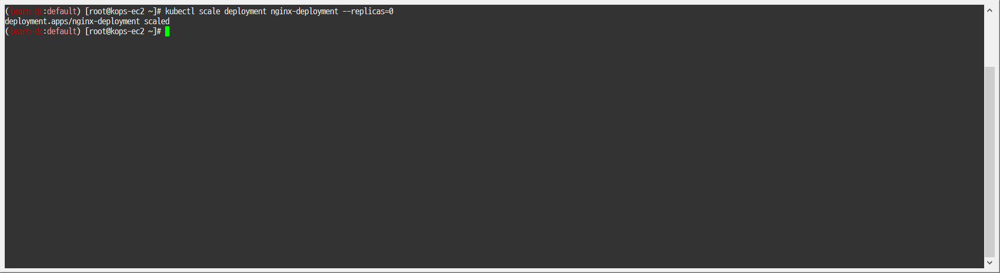
       - 

   - LimitRanges 기본 정책 삭제

     - ```bash
       kubectl delete limitranges limits
       kubectl get limitranges
       ```

       - 

   - 파드 갯수 30으로 늘리기

     - ```bash
       kubectl scale deployment nginx-deployment --replicas=30
       ```

       - 
       - 

   - 이전 17개 보다는 8개 많은 25개 파드가 배포됨 >> 하지만 아직도 5대의 파드가 배치되지 않음

     - ```bash
       kubectl get replicasets
       ```

       - 

   - 노드 정보 확인 : 현재 워커 노드 29개 최대 파드 생성할 수 있으며, 29개 파드 동작 중

     - ```bash
       kubectl describe node
       ```
     
       - 
       - 
       - 

5. kOps 클러스터와 인스턴스 그룹에 파라미터 수정

   - 파드 갯수 0으로 줄이기

     - ```bash
       kubectl scale deployment nginx-deployment --replicas=0
       ```

       - 
       - 

   - 수정 전 env 정보 확인 : WARM_PREFIX_TARGET은 기본값이 1로 이미 되어 있음

     - ```bash
       kubectl describe ds -n kube-system aws-node | grep ADDITIONAL_ENI_TAGS: -A22
       ```

       - 

   - 적용 전 노드(인스턴스)의 External-IP 확인

     - ```bash
       kubectl get node -owide
       ```

       - 

   - kOps 클러스터와 인스턴스 룹에 파라미터 수정 : 노드에 kubelet에 maxPods 110개로 수정, Prefix Assign 활성화

     - ```bash
       kops edit cluster
       
       # ...
       #   kubelet:
       #     anonymousAuth: false
       #     maxPods: 110
       # ...
       #   networking:
       #     amazonvpc:
       #       env:
       #       - name: ENABLE_PREFIX_DELEGATION
       #         value: "true"
       # ...
       ```

       - 
       - 
       - 

   - 적용을 위해서 반드시 노드 롤링 업데이트 필요 : 삭제 -> 재생성, 이 과정에서 matser node의 IP(Public, Private)가 자동으로 변경됨 >> 10분 정도 소요

     - ```bash
       kops update cluster --yes && echo && sleep 5 && kops rolling-update cluster --yes
       ```

       - 
       - 

   - 롤링 업데이트 완료 후 노드 정보 확인 : External-IP 변경 확인, 참고로 맨 아래 워커노드는 현재 삭제된 EC2로 잠시 시간이 지나면 워커 노드 목록에서 삭제됨

     - ```bash
       kubectl get node -owide
       ```

       - 

   - 변경 정보 반영된 env 정보 확인

     - ```bash
       kubectl describe ds -n kube-system aws-node | grep ADDITIONAL_ENI_TAGS: -A22
       ```

       - 

     - ```bash
       kubectl describe daemonsets.apps -n kube-system aws-node | egrep 'ENABLE_PREFIX_DELEGATION|WARM_PREFIX_TARGET'
       ```

       - 

   - 노드 상세 정보 확인 : 노드 상세 정보의 Allocatable에 노드별 최대 생성 가능한 pods 정보 확인 - 각각 마스터 노드, 워커 노드

     - ```bash
       kubectl describe node | grep Allocatable: -A6
       ```

       - 

   - Route53에 A 레코드 값을 신규 Master EC2의 IP(Public, Private)로 자동으로 변경됨

     - 변경전
       - 
     - 변경후
       - 

6. 파드 110 생성 후 확인

   - 파드 갯수 110으로 늘이기

     - ```bash
       kubectl scale deployment nginx-deployment --replicas=110
       ```

       - 
       - 
   
     - ```bash
       kubectl get replicasets
       ```
   
       - 
   
   - 노드 정보 확인 : 현재 워커 노드에 기존 6개 파드 + 106개 nginx 파드 = 총 110개 파드 배포
   
     - ```bash
       kubectl describe node
       ```
   
       - 
       - 
       - 
   
   - 삭제
   
     - ```bash
       kubectl delete deploy nginx-deployment
       ```
     
       - 


### 2.6 서비스 소개

#### 2.6.1 개념

##### 1. 서비스 종류

- ClusterIP 타입
  - 

- NodePort 타입
  - 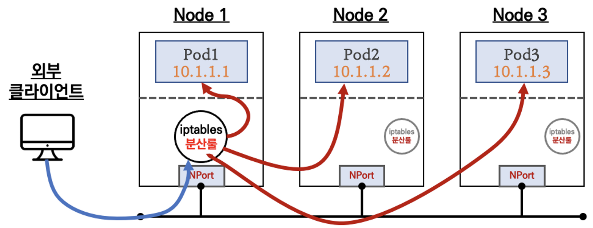

- LoadBalancer 타입(기본 모드) : NLB 인스턴스 유형
  - 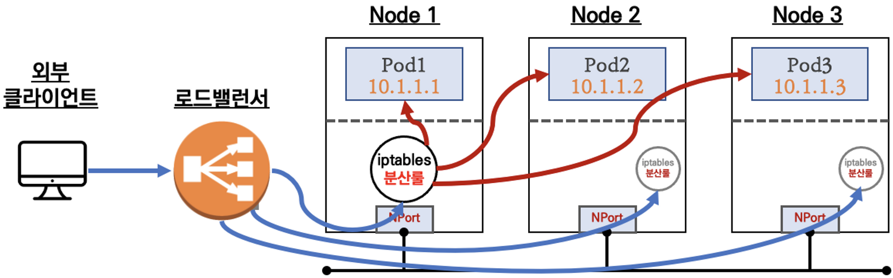

- Service (LoadBalancer Controller) : AWS Load Balancer Controller + NLB IP 모드 동작
  - 


##### 2. NLB(Network Load Balancer) 모드 전체 정리

- 인스턴스 유형
  1. externalTrafficPolicy
     - ClusterIP => 2번 분산 및 SNAT으로 Client IP 확인 불가능 <- LoadBalancer 타입 (기본 모드) 동장
  2. externalTrafficPolicy
     - Local => 1번 분산 및 ClientIP 유지, 워커 노드의 iptables 사용함
- - 인스턴스 유형 상세 설명
    - 요약 : 외부 클라이언트가 '로드밸런서' 접속 시 부하분산 되어 노드 도달 후 iptables 룰로 목적지 파드와 통신됨
      - 
      - 
    - 노드는 외부에 공개되지 않고 로드밸런서만 외부에 공개되어, 외부 클라이언트는 로드밸런서에 접속을 할 뿐 내부 노드의 정보를 알 수 없음
    - 로드밸런서가 부하분산하여 파드가 존재하는 노드들에게 전달
      - iptalbes 룰에서는 자신의 노드에 있는 파드만 연결(`externalTrafficPolicy: local`)
    - DNAT(Destination NAT) 2번 동작 : 
      - 첫번째 : 로드밸런서 접속 후 빠져 나갈때
      - 두번째 : 노드의 iptables 룰에서 파드 IP 전달 시
    - 외부 클라이언트 IP 보존(유지) : 
      - AWS NLB는 타겟이 인스턴스일 경우 클라이언트 IP를 유지
      - iptables 룰 경우도 `externalTrafficPolicy`로 클라이언트 IP를 보존
    - 부하분산 최적화 : 
      - 노드에 파드가 없을 경우 '로드밸런서'에서 노드에 헬스 체크(상태 검사)가 실패하여 해당 노드로는 외부 요청 트래픽을 전달하지 않음
        - 
        - 


- IP 유형 => 반드시 AWS LoadBalancer 컨트롤러 파드 및 정책 설정이 필요함

- - https://www.notion.so/gasidaseo/AWS-NLB-Client-IP-Proxy-protocol-57827e2c83fc474992b37e65db81f669

  1. Proxy Protocol v2 비활성화
     - NLB에서 바로 파드로 인입, 단 ClientIP가 NLB로 SNAT 되어 ClientIP 확인 불가능
  2. Proxy Protocol v2 활성화
     - NLB에서 바로 파드로 인입 및 ClientIP 확인 가능
       - 단, PPv2를 애플리케이션이 인지할 수 있게 설정 필요

#### 2.6.2 실습

##### 1. EC2 instance profiles 설정 및 AWS Load Balancer 배포

- 기본 EC2 profile 권한 확인

  - ```bash
    aws elbv2 describe-load-balancers
    ```
    
    - 


- 마스터/워커 노드에 EC2 IAM Role에 Policy (AWSLoadBalancerControllerIAMPolicy) 추가

  - IAM Policy 정책 생성

    - ```bash
      curl -o iam_policy.json https://raw.githubusercontent.com/kubernetes-sigs/aws-load-balancer-controller/v2.4.5/docs/install/iam_policy.json
      aws iam create-policy --policy-name AWSLoadBalancerControllerIAMPolicy --policy-document file://iam_policy.json
      ```
      
      - 


- 계정 Account ID 변수 지정

  - ```bash
    ACCOUNT_ID=`aws sts get-caller-identity --query 'Account' --output text`
    echo $ACCOUNT_ID
    ```
    
    - 


- 생성된 IAM Policy Arn 확인

  - ```bash
    aws iam list-policies --scope Local
    ```
  
    - 
    - 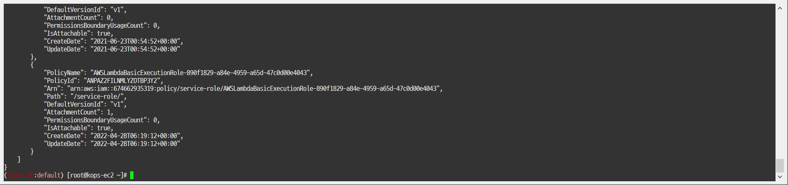
    
  - ```bash
    aws iam get-policy --policy-arn arn:aws:iam::$ACCOUNT_ID:policy/AWSLoadBalancerControllerIAMPolicy
    ```
    
    - 
    
  - ```bash
    aws iam get-policy --policy-arn arn:aws:iam::$ACCOUNT_ID:policy/AWSLoadBalancerControllerIAMPolicy --query 'Policy.Arn'
    ```
    
    - 


- EC2 Instance profiles 이름 확인

  - ```bash
    aws iam list-instance-profiles
    ```
  
    - 
    - 
    
  - ```bash
    aws iam list-instance-profiles --query 'InstanceProfiles[*].InstanceProfileName'
    ```
    
    - 


- EC2 instance profiles에 IAM Policy 추가(attach)

  - ```bash
    aws iam attach-role-policy --policy-arn arn:aws:iam::$ACCOUNT_ID:policy/AWSLoadBalancerControllerIAMPolicy --role-name masters.$KOPS_CLUSTER_NAME
    ```
  
  - ```bash
    aws iam attach-role-policy --policy-arn arn:aws:iam::$ACCOUNT_ID:policy/AWSLoadBalancerControllerIAMPolicy --role-name nodes.$KOPS_CLUSTER_NAME
    ```
    
    - 

- kOps 클러스터 편집 : 아래 내용 추가

  - ```bash
    ## 인증서 구성을 웹훅에 삽입할 수 있도록 cert-manager를 설치합니다. 
    ## Cert-manager는 쿠버네티스 클러스터 내에서 TLS인증서를 자동으로 프로비저닝 및 관리하는 오픈 소스입니다
    kops edit cluster --name ${KOPS_CLUSTER_NAME}
    ```
  
    - 
    
  - ```bash
    # ...
    # spec:
    #   certManager:
    #     enabled: true
    #   awsLoadBalancerController:
    #     enabled: true
    # ...
    ```
    
    - 
    - 


- 업데이트 적용 : 적용이 안될 경우 한번 더 아래 명령 실행

  - ```bash
    kops update cluster --yes && echo && sleep 5 && kops rolling-update cluster
    ```
    
    - 
    - 


- aws-load-balancer-controller 파드 확인 : 서비스 정상 상태로 변경까지 대략 2분 30초 정도 소요

  - ```bash
    watch kubectl get pod -A
    ```
    
    - 


- 버전 확인 : v2.4.3

  - ```bash
    kubectl describe deploy -n kube-system aws-load-balancer-controller | grep Image | cut -d "/" -f 2
    ```
    
    - 

- crds 확인

  - ```bash
    kubectl get crd
    ```
    
    - 


##### 2. 서비스/파드 배포 테스트 with NLB

- https://kubernetes-sigs.github.io/aws-load-balancer-controller/v2.4/guide/service/nlb/

- - 작업용 EC2 - 디플로이먼트 & 서비스 생성

    - ```bash
      cat ~/pkos/2/echo-service-nlb.yaml | yh
      kubectl apply -f ~/pkos/2/echo-service-nlb.yaml
      ```
      
      - 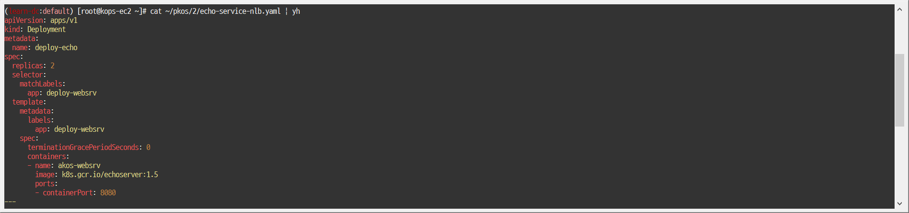
      - 
  
  
  - 확인
  
    - ```bash
      kubectl get deploy,pod
      ```
  
      - 
      
    - ```bash
      kubectl get svc,ep,targetgroupbindings
      ```
  
      - 
      
    - ```bash
      kubectl get targetgroupbindings -o json | jq
      ```
      
      - 
      - 
  
  - AWS ELB(NLB) 정보 확인
  
    - ```bash
      aws elbv2 describe-load-balancers | jq
      ```
  
      - 
      - 
      
    - ```bash
      aws elbv2 describe-load-balancers --query 'LoadBalancers[*].State.Code' --output text
      ```
      
      - 
      - 
      - 
      - 
  
  - 웹 접속 주소 확인
  
    - ```bash
      kubectl get svc svc-nlb-ip-type -o jsonpath={.status.loadBalancer.ingress[0].hostname} | awk '{ print "Pod Web URL = http://"$1 }'
      ```
      
      - 
      - 
      - 
  
  - 파드 로깅 모니터링
  
    - ```bash
      kubectl mtail app=deploy-websrv
      ```
      
      - 
      - 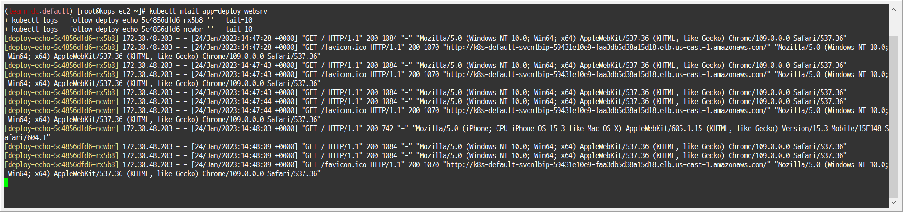
  
  - 분산 접속 확인
  
    - ```bash
      NLB=$(kubectl get svc svc-nlb-ip-type -o jsonpath={.status.loadBalancer.ingress[0].hostname})
      echo $NLB
      ```
      
      - 
      
    - ```bash
      curl -s $NLB
      ```
  
      - 
      - 
      
    - ```bash
      for i in {1..100}; do curl -s $NLB | grep Hostname ; done | sort | uniq -c | sort -nr
      ```
      
      - 
  
  - 지속적인 접속 시도 : 아래 상세 동작 확인 시 유용(패킷 덤프 등)
  
    - ```bash
      while true; do curl -s --connect-timeout 1 $NLB | egrep 'Hostname|client_address'; echo "----------" ; date "+%Y-%m-%d %H:%M:%S" ; sleep 1; done
      ```
      
      - 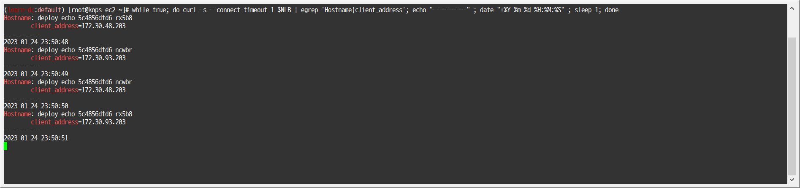
  


- AWS NLB의 대상 그룹 확인 : IP를 확인해보자

- 파드 2개 -> 1개 -> 3개 설정 시 동작 : auto discovery <- 어떻게 가능할까?

  - 작업용 EC2 - 파드 1개 설정

    - ```bash
      kubectl scale deployment deploy-echo --replicas=1
      ```
      
      - 
      - 
  
  - 확인

    - ```bash
      kubectl get deploy,pod,svc,ep
      ```
  
      - 
      
    - ```bash
      for i in {1..100}; do curl -s $NLB | grep Hostname ; done | sort | uniq -c | sort -nr
      ```
      
      - 
  
  - 작업용 EC2 - 파드 3개 설정

    - ```bash
      kubectl scale deployment deploy-echo --replicas=3
      ```
      
      - 
      - 
  
  - 확인
  
    - ```bash
      kubectl get deploy,pod,svc,ep
      ```
  
      - 
      
    - ```bash
      for i in {1..100}; do curl -s $NLB | grep Hostname ; done | sort | uniq -c | sort -nr
      ```
      
      - 
  
  - [AWS LB Ctrl] 클러스터 롤 바인딩 정보 확인
  
    - ```bash
      kubectl describe clusterrolebindings.rbac.authorization.k8s.io aws-load-balancer-controller-rolebinding
      ```
      
      - 
  
  - [AWS LB Ctrl] 클러스터 롤 확인
  
    - ```bash
      kubectl describe clusterroles.rbac.authorization.k8s.io aws-load-balancer-controller-role
      ```
      
      - 


##### 3. 실습 리소스 삭제

- ```bash
  kubectl delete deploy deploy-echo; kubectl delete svc svc-nlb-ip-type
  ```
  
  - 


### 2.7 ExternalDNS

#### 2.7.1 개념

##### 1. ExternalDNS 소개

- k8s 서비스/인그레스 생성 시 도메인을 설정하면, AWS(Route 53), Azure(DNS), GCP(Cloud DNS)에 A 레코드(TXT 레코드)로 자동 생성/삭제

- 
  - https://edgehog.blog/a-self-hosted-external-dns-resolver-for-kubernetes-111a27d6fc2c


#### 2.7.2 실습

##### 1. 설치

- 모니터링

  - ```bash
    watch -d kubectl get pod -A
    ```
    
    - 

- dns 관련 파드 갯수 줄이기(2개)

  - ```bash
    kubectl delete deploy -n kube-system coredns-autoscaler
    ```

  - ```bash
    kubectl scale deploy -n kube-system coredns --replicas 1
    ```
    
    - 

- 정책 생성 -> 마스터/워커 노드에 정책 연결

  - ```bash
    curl -s -O https://s3.ap-northeast-2.amazonaws.com/cloudformation.cloudneta.net/AKOS/externaldns/externaldns-aws-r53-policy.json
    ```

  - ```bash
    aws iam create-policy --policy-name AllowExternalDNSUpdates --policy-document file://externaldns-aws-r53-policy.json
    ```
    
    - 

- example : arn:aws:iam::XXXXXXXXXXXX:policy/AllowExternalDNSUpdates

  - ```bash
    aws iam list-policies --query 'Policies[?PolicyName==`AllowExternalDNSUpdates`].Arn' --output text
    ```

  - ```bash
    export POLICY_ARN=$(aws iam list-policies --query 'Policies[?PolicyName==`AllowExternalDNSUpdates`].Arn' --output text)
    ```
    
    - 

- EC2 instance profiles에 IAM Policy 추가(attach)

  - ```bash
    aws iam attach-role-policy --policy-arn $POLICY_ARN --role-name masters.$KOPS_CLUSTER_NAME
    ```

  - ```bash
    aws iam attach-role-policy --policy-arn $POLICY_ARN --role-name nodes.$KOPS_CLUSTER_NAME
    ```
    
    - 
    - 
    - 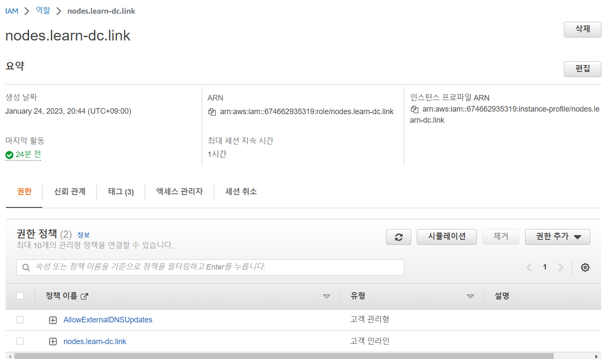

- 설치

  - ```bash
    kops edit cluster
    # ...
    # spec:
    #   externalDns:
    #     provider: external-dns
    # ...
    ```
    
    - 
    - 
    - 

- 업데이트 적용

  - ```bash
    kops update cluster --yes && echo && sleep 5 && kops rolling-update cluster
    ```
    
    - 
    - 
    - 

- 버전 확인 : v0.12.2

  - ```bash
    kubectl describe deploy -n kube-system external-dns | grep Image | cut -d "/" -f 3
    ```
    
    - 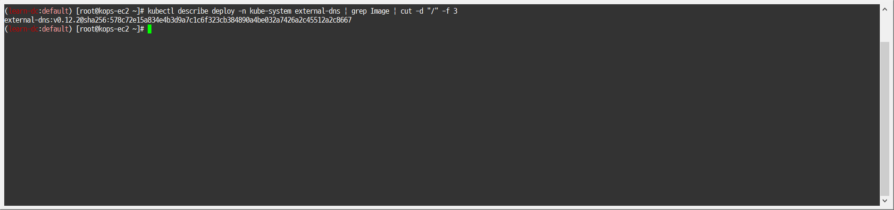

- externalDNS 컨트롤러 파드 확인

  - ```bash
    kubectl get pod -n kube-system -l k8s-app=external-dns
    ```
    
    - 


##### 2. 서비스(NLB)/파드 배포 시 ExternalDNS 설정해보기

- ExternalDNS 로그 모니터링

  - ```bash
    kubectl logs -n kube-system -f $(kubectl get po -n kube-system | egrep -o 'external-dns[A-Za-z0-9-]+')
    ```
    
    - 


- 서비스/파드 배포

  - ```bash
    kubectl apply -f ~/pkos/2/echo-service-nlb.yaml
    ```
    
    - 


- 확인

  - ```bash
    kubectl get deploy,pod
    ```

    - 
    
  - ```bash
    kubectl get svc,ep,targetgroupbindings
    ```
    
    - 

- 각자 자신의 도메인 정보 입력

  - ```bash
    # MyDOMAIN1=<각자 자신의 nginx 도메인 지정>
    MyDOMAIN1=nginx.learn-dc.link
    echo $MyDOMAIN1
    ```
    
    - 
    
  - ```bash
    kubectl annotate service svc-nlb-ip-type "external-dns.alpha.kubernetes.io/hostname=$MyDOMAIN1."
    ```
  
    - 
    - 
    - 
    
  - ```bash
    kubectl describe svc svc-nlb-ip-type | grep Annotations: -A5
    ```
    
    - 


- 확인

  - ```bash
    dig +short $MyDOMAIN1
    ```
    
    - 


- 분산 접속 확인

  - ```bash
    curl -s $MyDOMAIN1
    ```
  
    - 
    
  - ```bash
    for i in {1..100}; do curl -s $MyDOMAIN1 | grep Hostname ; done | sort | uniq -c | sort -nr
    ```
    
    - 


- 지속적입 접속 시도 : 아래 상세 동작 확인 시 유용(패킷 덤프 등)

  - ```bash
    while true; do curl -s --connect-timeout 1 $MyDOMAIN1 | egrep 'Hostname|client_address'; echo "----------" ; date "+%Y-%m-%d %H:%M:%S" ; sleep 1; done
    ```
    
    - 

- AWS Route53 A 레코드 확인

  - 


##### 3. 실습 리소스 삭제

- 과제3 진행 후 삭제

  - ```bash
    kubectl delete deploy deploy-echo; kubectl delete svc svc-nlb-ip-type
    ```

    - 
    - A 레코드 자동 삭제 확인
      - 


#### 2.7.3 과제3

##### 1. 과제 내용

목표 : 서비스(NLB)/파드 배포 시 ExternalDNS 설정해서, 각자 자신의 도메인으로 NLB를 통해 애플리케이션(파드)로 접속해보고 관련 스샷을 올려주세요

- 퍼블릭 도메인이 없는 멤버분들은, ExternalDNS 제외하고 NLB 도메인으로 접속한 결과를 올려주세요


##### 2. 과제 수행내용

- 분산 접속 확인

  - ```bash
    echo $MyDOMAIN1
    for i in {1..100}; do curl -s $MyDOMAIN1 | grep Hostname ; done | sort | uniq -c | sort -nr
    ```
    
    - 

- 웹에서 확인

  - 
    
    

### 2.8 과제4

목표 : 아래 활용 기능 중 1개를 선택해서 실습 후 결과 내용을 올려주세요

#### 1. NLB에 TLS 적용하기

- 참고

  - https://kubernetes-sigs.github.io/aws-load-balancer-controller/v2.4/guide/use_cases/nlb_tls_termination/

- 실습

  - ACM(AWs Certificate Manager)에서 us-east-1(버지니아 북부) 인증서 발급

    - https://us-east-1.console.aws.amazon.com/acm/home?region=us-east-1#/certificates/list
    
  - 클러스터 네임 확인

    - ```bash
      echo $KOPS_CLUSTER_NAME
      ```
      
      - 
  
  - 사용 리전(us-east-1)의 인증서 ARN 확인

    - ```bash
      aws acm list-certificates
      ```
      
      - 
    
    - ```bash
      aws acm list-certificates --max-items 10
      ```
    
      - 
    
    - ```bash
      aws acm list-certificates --query 'CertificateSummaryList[].CertificateArn[]' --output text
      ```
    
      - 
    
    - ```bash
      CERT_ARN=`aws acm list-certificates --query 'CertificateSummaryList[].CertificateArn[]' --output text`
      echo $CERT_ARN
      ```
    
      - 
    
  - 자신의 도메인 변수 지정
  
    - ```bash
      # MyDomain=<자신의 도메인>
      MyDomain=websrv.learn-dc.link
      echo $MyDomain
      ```
      
      - 
  
  - 생성
  
    - ```bash
      cat <<EOF | kubectl create -f -
      apiVersion: apps/v1
      kind: Deployment
      metadata:
        name: deploy-echo
      spec:
        replicas: 2
        selector:
          matchLabels:
            app: deploy-websrv
        template:
          metadata:
            labels:
              app: deploy-websrv
          spec:
            terminationGracePeriodSeconds: 0
            containers:
            - name: akos-websrv
              image: k8s.gcr.io/echoserver:1.5
              ports:
              - containerPort: 8080
      ---
      apiVersion: v1
      kind: Service
      metadata:
        name: svc-nlb-ip-type
        annotations:
          external-dns.alpha.kubernetes.io/hostname: "${MyDomain}"
          service.beta.kubernetes.io/aws-load-balancer-nlb-target-type: ip
          service.beta.kubernetes.io/aws-load-balancer-scheme: internet-facing
          service.beta.kubernetes.io/aws-load-balancer-healthcheck-port: "8080"
          service.beta.kubernetes.io/aws-load-balancer-cross-zone-load-balancing-enabled: "true"
          service.beta.kubernetes.io/aws-load-balancer-ssl-ports: "https"
          service.beta.kubernetes.io/aws-load-balancer-ssl-cert: ${CERT_ARN}
          service.beta.kubernetes.io/aws-load-balancer-backend-protocol: "http"
      spec:
        ports:
          - port: 80
            targetPort: 8080
            protocol: TCP
            name: http
          - port: 443
            targetPort: 8080
            protocol: TCP
            name: https
        type: LoadBalancer
        loadBalancerClass: service.k8s.aws/nlb
        selector:
          app: deploy-websrv
      EOF
      ```
      
      - 
      - 
      - 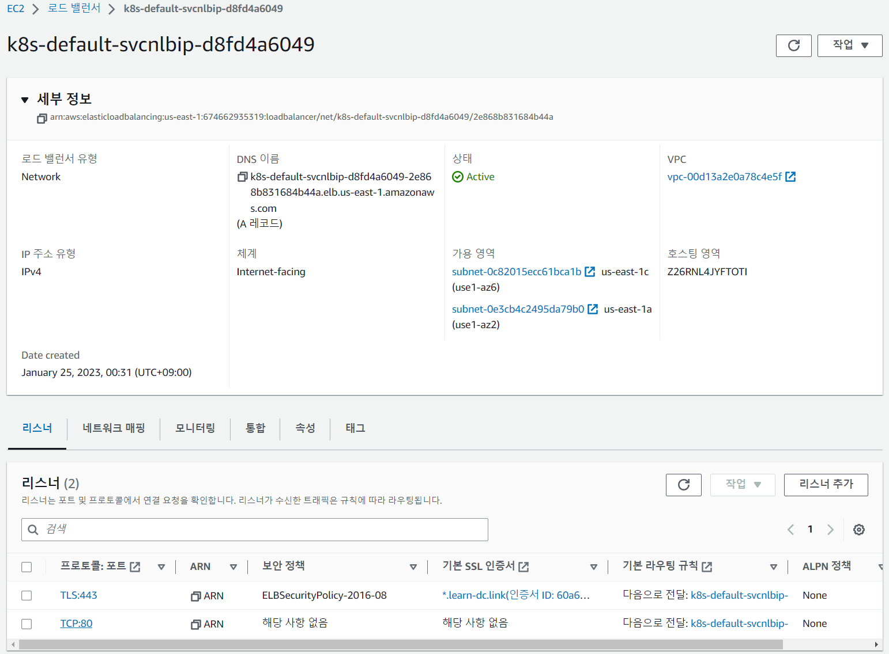
      - 
  
  - 모니터링
  
    - ```bash
      watch -d kubectl get svc,ep
      ```
      
      - 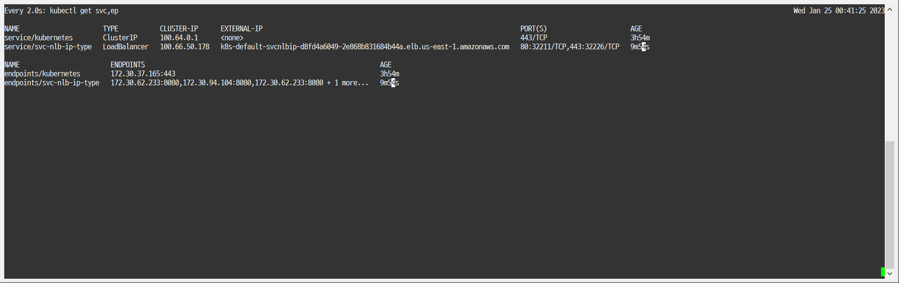
  
  - 확인
  
    - ```bash
      kubectl get svc,ep
      ```
      
      - 
    
    - ```bash
      kubectl describe svc svc-nlb-ip-type
      ```
    
      - 
    
    - ```bash
      kubectl describe svc svc-nlb-ip-type | grep Annotations: -A8
      ```
    
      - 
  
  - (외부) 접속 테스트
  
    - ```bash
      # curl -s http://<접속 도메인 주소> | grep Hostname
      curl -s -k http://$MyDomain | grep Hostname
      ```
      
      - 
    
    - ```bash
      # curl -s -k https://<접속 도메인 주소> | grep Hostname
      curl -s -k https://$MyDomain | grep Hostname
      ```
    
      - 
      - 
    
  - 삭제
  
    - ```bash
      kubectl delete deploy deploy-echo; kubectl delete svc svc-nlb-ip-type
      ```
      
      - 
      - 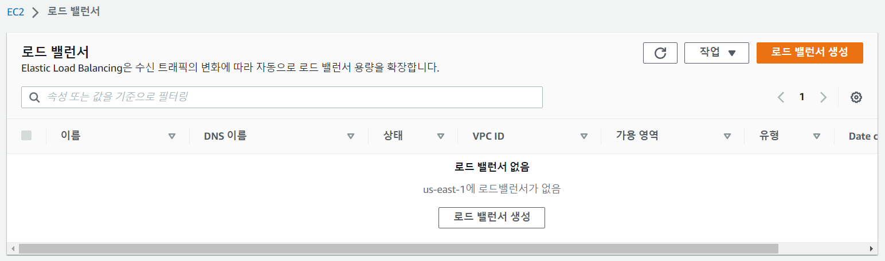
      - 
  
  

#### 2. NLB 대상타겟을 Instance mode로 설정해보기


#### 3. kOps dns-controller compatibility mode

- 참고
  - https://github.com/kubernetes-sigs/external-dns/blob/master/docs/tutorials/kops-dns-controller.md


#### 4. NLB IP Target & Proxy Protocol v2 활성화 : NLB에서 바로 파드로 인입 및 CLient IP 확인 설정

- 참고
  - https://www.notion.so/57827e2c83fc474992b37e65db81f669#a599aa7f26774fecb73bbd1f42c5e52a
  - https://hub.docker.com/r/gasida/httpd/tags
  - 

#### 5. AWS kOps Private Cluster 설정하기

- 참고
  - https://kops.sigs.k8s.io/topology/
  - https://kops.sigs.k8s.io/operations/high_availability/#example-2-private-topology


## 3. 실습 완료 후 자원 삭제

- kOps 클러스터 삭제 & AWS CloudFormation 스택 삭제

  - ```bash
    kops delete cluster --yes && aws cloudformation delete-stack --stack-name mykops
    ```
    
    - 
    - 
    - 

