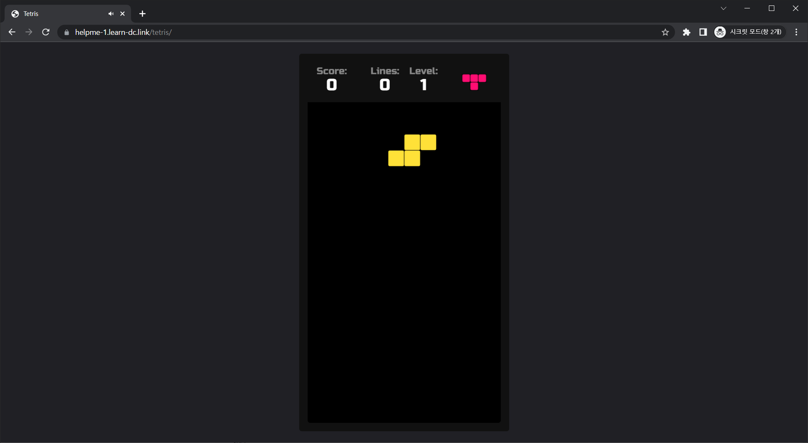
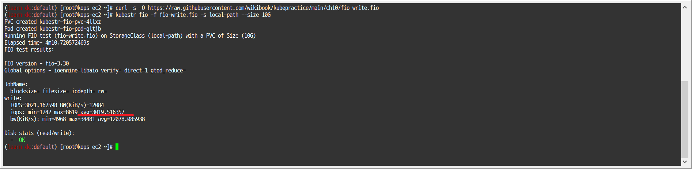
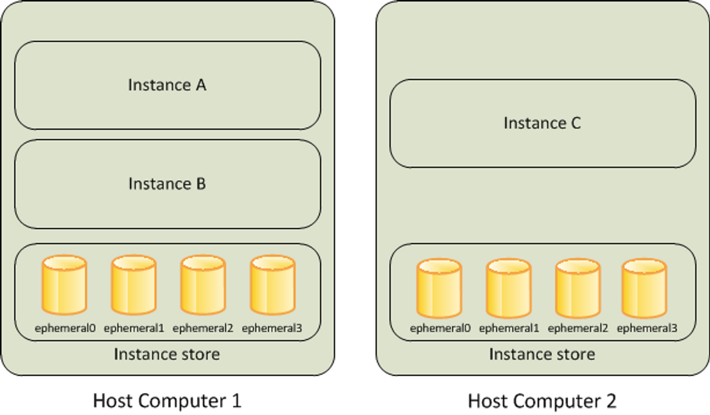
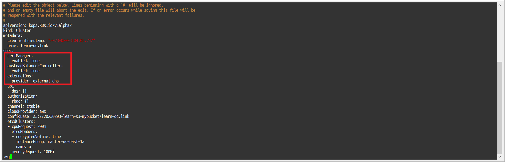
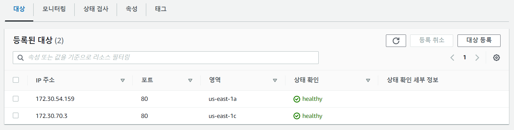
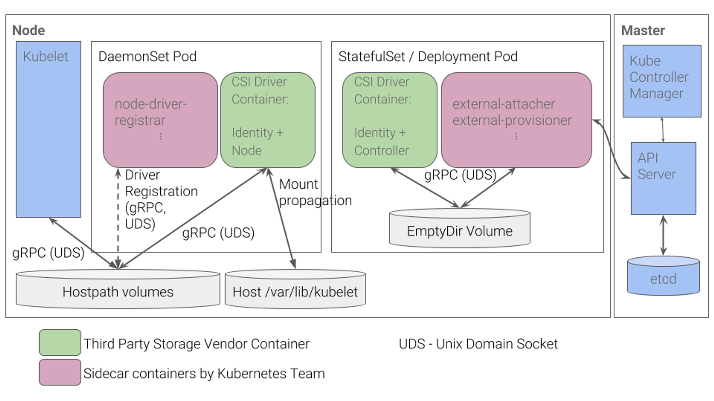
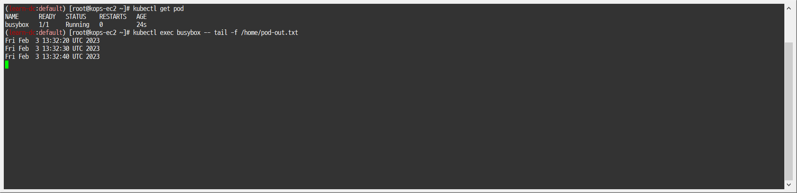
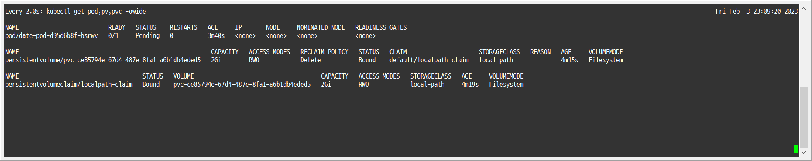
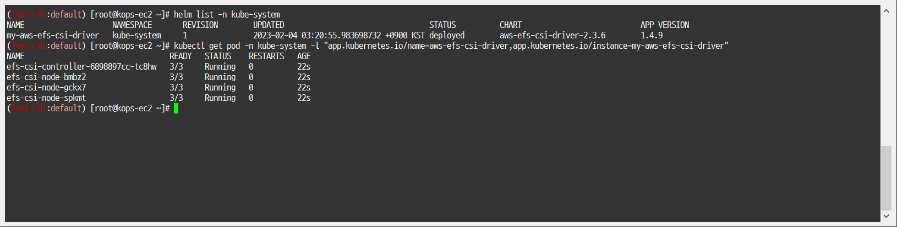
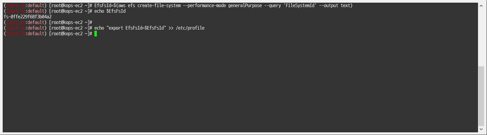

[PKOS 1주차 - 회고(4L)](../pkos_w1_4l)

[PKOS - Production Kubernetes Online Study 포스팅을 시작하며](../pkos_intro)

[PKOS 1주차 - AWS kOps 설치 및 기본 사용](../pkos_w1_hands-on)

[PKOS 2주차 - 회고(4L)](../pkos_w2_4l)

[PKOS 2주차 - 쿠버네티스 네트워크](../pkos_w2_hands-on)

[PKOS 3주차 - 회고(4L)](../pkos_w3_4l)

[PKOS 3주차 - Ingress & Storage](../pkos_w3_hands-on)

[PKOS 4주차 - 회고(4L)](../pkos_w4_4l)

[PKOS 4주차 - Harbor & Gitlab & ArgoCD](../pkos_w4_hands-on)

[PKOS 5주차 - 회고(4L)](../pkos_w5_4l)

[PKOS 5주차 - Prometheus & Grafana](../pkos_w5_hands-on)

---

왜 그런지 모르겠는데 이미지 위아래로 여백이 생깁니다.

에디터에서는 안그러는데 왜 그런지 좀 찾아봐야겠습니다.

본 글은 초안이기에 다듬는 과정에서 내용이 수정될 수 있습니다. 

---

# PKOS 3주차


## 들어가기전에

본 내용은 `CloudNet@` 팀에서 진행하는 `쿠버네티스 실무 실습` 스터디를 기반으로 작성된 내용입니다.

또한 개념 설명에서 사용된 이미지의 출처는 스터디 학습 자료에서 가져온 것을 밝힙니다.

- 참조: https://www.notion.so/AWS-EKS-VPC-CNI-1-POD-f89e3e5967b24f8c9aa5bfaab1a82ceb

3주차에는 CloudFormation을 이용해 kOps를 설치하고 Ingress를 활용한 ALB와 Storage 개념과 백업/복구 실습을 진행했습니다.


### 과제 수행결과

- 과제 수행과정은 본문에 자세히 기술했습니다.

#### 과제1

- 목표 : Ingress(with 도메인)에 PATH /mario 는 mario 게임 접속하게 설정하고, /tetris 는 tetris 게임에 접속하게 설정하고, SSL 적용 후 관련 스샷 올려주세요
  - 특히 ALB 규칙 RUles 를 상세히 보고, 의미를 이해해 볼 것

- 수행결과

  - 

  - 

  - 

  - 

#### 과제2

- 목표 : 호스트 Path(local-path-provisioner) 실습 및 문제점 확인과 성능 측정 후 관련 스샷 올려주세요


- 수행결과

  - 

  - 읽기

    - ```bash
      kubestr fio -f fio-read.fio -s local-path --size 10G
      ```

      - 

  - 쓰기

    - ```bash
      kubestr fio -f fio-write.fio -s local-path --size 10G
      ```

      - 


#### 과제3

- 목표 : AWS EBS를 PVC로 사용 후 온라인 볼륨 증가 후 관련 스샷 올려주세요


- 수행결과

  - 


  - 읽기

    - ```bash
      kubestr fio -f fio-read.fio -s local-path --size 10G
      ```

      - 


  - 쓰기

    - ```bash
      kubestr fio -f fio-write.fio -s local-path --size 10G
      ```

      - 


#### 과제4

- 목표 : AWS Volume SnapShots 실습 후 관련 스샷 올려주세요


- 수행결과

  - 백업
    - 
    - 
  - 복구
    - 

  


## 1. 실습환경 세팅

### 1.1 구성 환경

- 사전 준비
  - AWS 계정, SSH 키 페어, IAM 계정 생성 후 키, S3 버킷
- 전체 구성도
  - 기본 구성 환경은 1주차 내용과 동일
- 실습 환경 내용
  - CloudFormation 스택 실행 시 파라미터를 기입하면, 해당 정보가 반영되어 배포됩니다.
  - VPC는 kOps 배포를 위한 EC2가 위치할 MyVPC 1개와 실제 kOps 가 배포되어 구동되는 VPC 1개로 총 2개가 생성됩니다.
  - CloudFormation 에 EC2의 UserData 부분(Script 실행)으로 AWS kOps 설치를 진행합니다
  - 마스터 노드 1대, 워커 노드는 기본은 2대로 구성됩니다


- c5d.large의 EC2 인스턴스 스토어(임시 블록 스토리지) - [링크](https://docs.aws.amazon.com/ko_kr/AWSEC2/latest/UserGuide/InstanceStorage.html) , NVMe SSD - [링크](https://docs.aws.amazon.com/ko_kr/AWSEC2/latest/UserGuide/ssd-instance-store.html)
  - 데이터 손실

    - 기본 디스크 드라이브 오류, 인스턴스가 중지됨, 인스턴스가 최대 절전 모드로 전환됨, 인스턴스가 종료됨
    - 


### 1.2 실습 환경

- 본 실습은 **미국 동부(버지니아 북부) `us-east-1`** 에서 진행됩니다.


#### 1.2.1 S3 버킷 생성

1. S3 URL 접속
   - https://s3.console.aws.amazon.com/s3/buckets?region=us-east-1
2. 버킷 만들기 버튼 클릭
   - 
3. 버킷 만들기
   - 버킷 이름 설정 후 기본 설정 그대로 버킷 만들기 버튼 클릭
     - 버킷 이름 : 20230203-learn-s3-mybucket
   - 


#### 1.2.2 Cloud Formation을 이용한 kOps 생성(이하 배포)

1. Cloud Formation URL 접속 및 스택 생성 버튼 클릭

   - https://us-east-1.console.aws.amazon.com/cloudformation/home?region=us-east-1#/stacks
   - 

2. 스택 생성 - 1단계 스택 생성

   - 템플릿 소스 URL 입력 - Amazon S3 URL
     - https://s3.ap-northeast-2.amazonaws.com/cloudformation.cloudneta.net/K8S/kops-oneclick.yaml
   - 

3. 스택 생성 - 2단계 스택 세부 정보 지정

   - 스택 이름

     - 스택 이름 : mkops
     - 

   - 파라미터

     - <<<<< Deploy EC2 : kops-ec2 >>>>>
       - 설정 설명
         - KeyName : kops-ec2에 SSH 접속을 위한 SSH 키페어 선택 *<- 미리 SSH 키 생성 해두자!*
         - MyIamUserAccessKeyID : 관리자 수준의 권한을 가진 IAM User의 액세스 키ID 입력
         - MyIamUserSecretAccessKey : 관리자 수준의 권한을 가진 IAM User의 시크릿 키ID 입력 <- 노출되지 않게 보안 주의
         - SgIngressSshCidr : kops-ec2에 SSH 접속 가능한 IP 입력 (집 공인IP/32 입력), 보안그룹 인바운드 규칙에 반영됨
         - LatestAmiId : kops-ec2에 사용할 AMI는 아마존리눅스2 최신 버전 사용, 기본값 그대로 사용
       - 설정 내용
         - 사용자 설정 입력
       - 

     - <<<<< AWS kOps Config >>>>>

       - 설정 설명

         - KubernetesVersion : 쿠버네티스 설치 버전 (기본 v1.24.9) ⇒ 변경 가능

         - ClusterBaseName : kOps 클러스터 이름이며, 사용하게될 도메인 이름이다. ‘퍼블릭 도메인’ or ‘프라이빗 도메인’ or ‘Gossip DNS’ 가능

         - S3StateStore : kOps 클러스터의 설정/상태 정보가 저장될 S3 버킷의 이름을 지정 *← 미리 S3 버킷을 생성 해두자!*

         - MasterNodeInstanceType & WorkerNodeInstanceType: 마스터(기본 t3.medium) & 워커 노드 EC2 인스턴스의 타입 (기본 t3.medium) ⇒ 변경 가능

         - WorkerNodeCount : 워커노드의 갯수를 입력 ⇒ 변경 가능

         - VpcBlock : kOps 배포되고 동작할 VPC 네트워크 대역, 기본값 그대로 사용

       - 설정 내용

         - 다음 설정 외 기본 설정 사용
           - ClusterBaseName
             - learn-dc.link
           - S3StateStore : 위에 생성한 버킷 명칭 입력
             - 20230203-learn-s3-mybucket
           - MasterNodeInstanceType
             - c5d.large
           - WorkerNodeInstanceType
             - c5d.large

       - 

     - <<<<< Region AZ >>>>>
       - 설정 설명
         - TargetRegion : kOps를 배포할 리전
         - AvailabliltyZone1 : kOps를 배포할 리전의 가용 영역
         - AvailabliltyZone2 : kOps를 배포할 리전의 가용 영역
       - 설정 내용
         - TargetRegion : us-east-1
         - AvailabliltyZone1 : us-east-1a
         - AvailabliltyZone2 : us-east-1c
       - 

   - 다음 버튼 클릭

     - 

4. 스택 생성 - 3단계 스택 옵션

   - 기본 설정 그대로 다음 버튼 클릭
     - 

5. 스택 생성 - 4단계 mkops 검토

   - 스택 파라미터 설정 확인
     - 
   - 기본 설정 그대로 전송 버튼 클릭
     - 

6. 스택 생성 확인 및 접속 IP 확인

   - 스택 생성 확인
     - 
   - 접속 IP 확인
     - KOPSEC2IP : 3.83.175.151
     - 


#### 1.2.3 배포 확인

- default NS 진입

  - ```bash
    kubectl ns default
    ```

    - 

- 인스턴스 스토어 볼륨이 있는 c5 모든 타입의 스토리지 크기

  - ```bash
    aws ec2 describe-instance-types \
     --filters "Name=instance-type,Values=c5*" "Name=instance-storage-supported,Values=true" \
     --query "InstanceTypes[].[InstanceType, InstanceStorageInfo.TotalSizeInGB]" \
     --output table
    ```

    - 

- 워커 노드 Public IP 확인

  - ```bash
    aws ec2 describe-instances --query "Reservations[*].Instances[*].{PublicIPAdd:PublicIpAddress,InstanceName:Tags[?Key=='Name']|[0].Value}" --filters Name=instance-state-name,Values=running --output table
    ```

    - 

- 워커 노드 Public IP 변수 지정

  - ```bash
    # W1PIP=<워커 노드 1 Public IP>
    # W2PIP=<워커 노드 2 Public IP>
    W1PIP=52.91.28.228 ;echo $W1PIP
    W2PIP=3.84.173.15 ;echo $W2PIP
    ```

    - 

- 워커 노드 스토리지 확인 : NVMe SSD 인스턴스 스토어 볼륨 확인

  - ```bash
    ssh -i ~/.ssh/id_rsa ubuntu@$W1PIP lsblk -e 7 -d
    ssh -i ~/.ssh/id_rsa ubuntu@$W2PIP lsblk -e 7
    ssh -i ~/.ssh/id_rsa ubuntu@$W1PIP df -hT -t ext4
    ssh -i ~/.ssh/id_rsa ubuntu@$W2PIP df -hT -t ext4
    ssh -i ~/.ssh/id_rsa ubuntu@$W1PIP lspci | grep Non-Volatile
    ```

    - 

- 파일시스템 생성 및 /data 마운트

  - ```bash
    ssh -i ~/.ssh/id_rsa ubuntu@$W1PIP sudo mkfs -t xfs /dev/nvme1n1
    ssh -i ~/.ssh/id_rsa ubuntu@$W1PIP sudo mkdir /data
    ssh -i ~/.ssh/id_rsa ubuntu@$W1PIP sudo mount /dev/nvme1n1 /data
    ssh -i ~/.ssh/id_rsa ubuntu@$W1PIP df -hT -t ext4 -t xfs
    
    ssh -i ~/.ssh/id_rsa ubuntu@$W2PIP sudo mkfs -t xfs /dev/nvme1n1
    ssh -i ~/.ssh/id_rsa ubuntu@$W2PIP sudo mkdir /data
    ssh -i ~/.ssh/id_rsa ubuntu@$W2PIP sudo mount /dev/nvme1n1 /data
    ssh -i ~/.ssh/id_rsa ubuntu@$W2PIP df -hT -t ext4 -t xfs
    ```
    
    - 

- 인스턴스 스토어는 스토리지 정보에 출력되지는 않는다
  - 
- (참고) 재부팅 후에도 연결된 볼륨을 자동으로 탑재
  - https://docs.aws.amazon.com/ko_kr/AWSEC2/latest/UserGuide/ebs-using-volumes.html#ebs-mount-after-reboot


## 2. Ingress

### 2.1 k8s Ingress

- Ingress 소개
  - 클러스터 내부의 서비스(ClusterIP, NodePort, Loadbalancer)를 외부로 노출(HTTP/HTTPS) - Web Proxy 역할
- AWS Load Balancer Controller + Ingress (ALB) IP 모드 동작
  - 그림처럼 EKS Cluster 는 없고, AWS kOps 클러스터가 배포되어 있음
  - 

### 2.2 EC2 instance profiles 설정 및 aWS LoadBalancer 배포 & ExternalDNS 설치 및 배포

- 마스터/워커 노드에 EC2 IAM Role 에 Policy (AWSLoadBalancerControllerIAMPolicy) 추가

  - ```bash
    curl -o iam_policy.json https://raw.githubusercontent.com/kubernetes-sigs/aws-load-balancer-controller/v2.4.5/docs/install/iam_policy.json
    aws iam create-policy --policy-name AWSLoadBalancerControllerIAMPolicy --policy-document file://iam_policy.json
    ```

    - 

- EC2 instance profiles 에 IAM Policy 추가(attach)

  - ```bash
    aws iam attach-role-policy --policy-arn arn:aws:iam::$ACCOUNT_ID:policy/AWSLoadBalancerControllerIAMPolicy --role-name masters.$KOPS_CLUSTER_NAME
    aws iam attach-role-policy --policy-arn arn:aws:iam::$ACCOUNT_ID:policy/AWSLoadBalancerControllerIAMPolicy --role-name nodes.$KOPS_CLUSTER_NAME
    ```

    - 

- IAM Policy 정책 생성 : 2주차에서 IAM Policy 를 미리 만들어두었으니 Skip

  - ```bash
    curl -s -O https://s3.ap-northeast-2.amazonaws.com/cloudformation.cloudneta.net/AKOS/externaldns/externaldns-aws-r53-policy.json
    aws iam create-policy --policy-name AllowExternalDNSUpdates --policy-document file://externaldns-aws-r53-policy.json
    ```

    - 

- EC2 instance profiles 에 IAM Policy 추가(attach)

  - ```bash
    aws iam attach-role-policy --policy-arn arn:aws:iam::$ACCOUNT_ID:policy/AllowExternalDNSUpdates --role-name masters.$KOPS_CLUSTER_NAME
    aws iam attach-role-policy --policy-arn arn:aws:iam::$ACCOUNT_ID:policy/AllowExternalDNSUpdates --role-name nodes.$KOPS_CLUSTER_NAME
    ```

    - 

- kOps 클러스터 편집 : 아래 내용 추가

  - ```bash
    kops edit cluster
    
    # -----
    # spec:
    #   certManager:
    #     enabled: true
    #   awsLoadBalancerController:
    #     enabled: true
    #   externalDns:
    #     provider: external-dns
    # -----
    ```
    
    - 
    - 
    - 

- 업데이트 적용

  - ```bash
    kops update cluster --yes && echo && sleep 3 && kops rolling-update cluster
    ```

    - 

### 2.3 서비스/파드 배포 테스트 with Ingress(ALB)

- 게임 파드와 Service, Ingress 배포

  - ```bash
    cat ~/pkos/3/ingress1.yaml | yh
    kubectl apply -f ~/pkos/3/ingress1.yaml
    ```

    - ```yaml
      # cat ~/pkos/3/ingress1.yaml | yh
      apiVersion: v1
      kind: Namespace
      metadata:
        name: game-2048
      ---
      apiVersion: apps/v1
      kind: Deployment
      metadata:
        namespace: game-2048
        name: deployment-2048
      spec:
        selector:
          matchLabels:
            app.kubernetes.io/name: app-2048
        replicas: 2
        template:
          metadata:
            labels:
              app.kubernetes.io/name: app-2048
          spec:
            containers:
            - image: public.ecr.aws/l6m2t8p7/docker-2048:latest
              imagePullPolicy: Always
              name: app-2048
              ports:
              - containerPort: 80
      ---
      apiVersion: v1
      kind: Service
      metadata:
        namespace: game-2048
        name: service-2048
      spec:
        ports:
          - port: 80
            targetPort: 80
            protocol: TCP
        type: NodePort
        selector:
          app.kubernetes.io/name: app-2048
      ---
      apiVersion: networking.k8s.io/v1
      kind: Ingress
      metadata:
        namespace: game-2048
        name: ingress-2048
        annotations:
          alb.ingress.kubernetes.io/scheme: internet-facing
          alb.ingress.kubernetes.io/target-type: ip
      spec:
        ingressClassName: alb
        rules:
          - http:
              paths:
              - path: /
                pathType: Prefix
                backend:
                  service:
                    name: service-2048
                    port:
                      number: 80
    
    - 

- 생성 확인

  - ```bash
    kubectl get-all -n game-2048
    kubectl get ingress,svc,ep,pod -n game-2048
    kubectl get targetgroupbindings -n game-2048
    ```

    - 

- Ingress 확인

  - ```bash
    kubectl describe ingress -n game-2048 ingress-2048
    ```

    - 

- 게임 접속 : ALB 주소로 웹 접속

  - ```bash
    kubectl get ingress -n game-2048 ingress-2048 -o jsonpath={.status.loadBalancer.ingress[0].hostname} | awk '{ print "Game URL = http://"$1 }'
    ```

    - 
    - 

- 파드 IP 확인

  - ```bash
    kubectl get pod -n game-2048 -o wide
    ```

    - 


- ALB 대상 그룹에 등록된 대상 확인 : ALB에서 파드 IP로 직접 전달

  - 

- 파드 3개로 증가

  - 터미널1

    - ```bash
      watch kubectl get pod -n game-2048
      ```

      - 

  - 터미널2 : 파드 3개로 증가

    - ```bash
      kubectl scale deployment -n game-2048 deployment-2048 --replicas 3
      ```

      - 
      - 
      - 

- 파드 1개로 감소

  - 터미널2 : 파드 1개로 감소

    - ```bash
      kubectl scale deployment -n game-2048 deployment-2048 --replicas 1
      ```

      - 
      - 
      - 

- 실습 리소스  삭제

  - ```bash
    kubectl delete ingress ingress-2048 -n game-2048
    kubectl delete svc service-2048 -n game-2048 && kubectl delete deploy deployment-2048 -n game-2048 && kubectl delete ns game-2048
    ```

    - 


### 2.4 Ingress with ExternalDNS

- 변수 지정 - 자신의 full 도메인

  - ```bash
    # WEBDOMAIN=<각자편한웹서버도메인>
    WEBDOMAIN=albweb123.learn-dc.link ; echo $WEBDOMAIN
    ```

    - 

- 게임 파드와 Service, Ingress 배포

  - ```bash
    cat ~/pkos/3/ingress2.yaml | yh
    WEBDOMAIN=$WEBDOMAIN envsubst < ~/pkos/3/ingress2.yaml | kubectl apply -f -
    ```

    - ```yaml
      # cat ~/pkos/3/ingress2.yaml | yh
      apiVersion: v1
      kind: Namespace
      metadata:
        name: game-2048
      ---
      apiVersion: apps/v1
      kind: Deployment
      metadata:
        namespace: game-2048
        name: deployment-2048
      spec:
        selector:
          matchLabels:
            app.kubernetes.io/name: app-2048
        replicas: 2
        template:
          metadata:
            labels:
              app.kubernetes.io/name: app-2048
          spec:
            containers:
            - image: public.ecr.aws/l6m2t8p7/docker-2048:latest
              imagePullPolicy: Always
              name: app-2048
              ports:
              - containerPort: 80
      ---
      apiVersion: v1
      kind: Service
      metadata:
        namespace: game-2048
        name: service-2048
      spec:
        ports:
          - port: 80
            targetPort: 80
            protocol: TCP
        type: NodePort
        selector:
          app.kubernetes.io/name: app-2048
      ---
      apiVersion: networking.k8s.io/v1
      kind: Ingress
      metadata:
        namespace: game-2048
        name: ingress-2048
        annotations:
          alb.ingress.kubernetes.io/scheme: internet-facing
          alb.ingress.kubernetes.io/target-type: ip
      spec:
        ingressClassName: alb
        rules:
          - host: ${WEBDOMAIN}
            http:
              paths:
              - path: /
                pathType: Prefix
                backend:
                  service:
                    name: service-2048
                    port:
                      number: 80
    
    - 

- 확인

  - ```bash
    kubectl get ingress,svc,ep,pod -n game-2048
    ```

    - 

- AWS R53 적용 확인

  - ```bash
    dig +short $WEBDOMAIN
    dig +short $WEBDOMAIN @8.8.8.8
    ```

    - 전파되는데 시간이 걸림
    - 

- 외부단말(집PC 등)에서 접속 확인 : curl or 웹브라우저

  - 

- 로그 확인

  - ```bash
    kubectl logs -n kube-system -f $(kubectl get po -n kube-system | egrep -o 'external-dns[A-Za-z0-9-]+')
    ```

    - 

- 삭제

  - ```bash
    kubectl delete ingress ingress-2048 -n game-2048
    kubectl delete svc service-2048 -n game-2048 && kubectl delete deploy deployment-2048 -n game-2048 && kubectl delete ns game-2048
    ```

    - 

### 2.5 과제 1

#### 1. 과제 내용

목표 : Ingress(with 도메인, 단일 ALB 사용)에 PATH /mario 는 mario 게임 접속하게 설정하고, /tetris 는 tetris 게임에 접속하게 설정하고, SSL 적용 후 관련 스샷 올려주세요

- 특히 ALB 규칙 Rules 를 상세히 보고, 의미를 이해해볼것
  - https://aws.amazon.com/ko/blogs/containers/how-to-expose-multiple-applications-on-amazon-eks-using-a-single-application-load-balancer/
  - https://catalog.workshops.aws/eks-immersionday/en-US/services-and-ingress/multi-ingress
  - 

#### 2. 과제 수행내용

- 참고 URL

  - 게임 ymal : https://www.notion.so/MSA-12-382799b72d5d49a9a15dcafd123c1aa8#256a108eda864c9babdc166c46893444
  - 과제 : https://www.notion.so/K8S-Ingress-Storage-08b9113a7c6e4ad2a6ecbbcc6952c234
  - 과제 : https://djdakf1234.tistory.com/90

- 네임스페이스 생성 및 이동

  - ```bash
    kubectl create ns games
    kubectl ns games
    ```

    - 

- 게임 yaml 생성

  - 마리오 게임 yaml 생성

    - ```yaml
      # mario.yaml (수정전)
      apiVersion: apps/v1
      kind: Deployment
      metadata:
        name: mario
        labels:
          app: mario
      spec:
        replicas: 1
        selector:
          matchLabels:
            app: mario
        template:
          metadata:
            labels:
              app: mario
          spec:
            containers:
            - name: mario
              image: pengbai/docker-supermario
      ---
      apiVersion: v1
      kind: Service
      metadata:
         name: mario
      spec:
        selector:
          app: mario
        ports:
        - port: 80
          protocol: TCP
          targetPort: 8080
        type: NodePort
        externalTrafficPolicy: Local

    - ```yaml
      # mario.yaml (수정후)
      apiVersion: apps/v1
      kind: Deployment
      metadata:
        name: mario
        namespace: games # 추가
        labels:
          app: mario
      spec:
        replicas: 1
        selector:
          matchLabels:
            app: mario
        template:
          metadata:
            labels:
              app: mario
          spec:
            containers:
            - name: mario
              image: pengbai/docker-supermario
      ---
      apiVersion: v1
      kind: Service
      metadata:
         name: mario
         namespace: games  # 추가
         annotations:   # 추가(중요 (Health Check 경로 지정))
           alb.ingress.kubernetes.io/healthcheck-path: /mario/index.html  # 추가
      spec:
        selector:
          app: mario
        ports:
        - port: 80
          protocol: TCP
          targetPort: 8080
        type: NodePort
        externalTrafficPolicy: Local

    - ```bash
      cd ~
      vim mario.yaml
      ```

      - 

  - 테트리스 게임 yaml 생성

    - ```yaml
      # tetris.yaml (수정전)
      apiVersion: apps/v1
      kind: Deployment
      metadata:
        name: tetris
        labels:
          app: tetris
      spec:
        replicas: 1
        selector:
          matchLabels:
            app: tetris
        template:
          metadata:
            labels:
              app: tetris
          spec:
            containers:
            - name: tetris
              image: bsord/tetris
      ---
      apiVersion: v1
      kind: Service
      metadata:
         name: tetris
      spec:
        selector:
          app: tetris
        ports:
        - port: 80
          protocol: TCP
          targetPort: 80
        type: NodePort
      ```

    - ```yaml
      # tetris.yaml (수정후)
      apiVersion: apps/v1
      kind: Deployment
      metadata:
        name: tetris
        namespace: games # 추가
        labels:
          app: tetris
      spec:
        replicas: 1
        selector:
          matchLabels:
            app: tetris
        template:
          metadata:
            labels:
              app: tetris
          spec:
            containers:
            - name: tetris
              image: bsord/tetris
      ---
      apiVersion: v1
      kind: Service
      metadata:
         name: tetris
         namespace: games # 추가
         annotations:   # 추가(중요 (Health Check 경로 지정))
           alb.ingress.kubernetes.io/healthcheck-path: /tetris/index.html # 추가
      spec:
        selector:
          app: tetris
        ports:
        - port: 80
          protocol: TCP
          targetPort: 80
        type: NodePort
      ```

    - ```bash
      cd ~
      vim tetris.yaml
      ```

      - 

- 애플리케이션 배포

  - ```bash
    k apply -f mario.yaml
    k apply -f tetris.yaml
    ```

    - 

  - ```bash
    kubectl get ingress,svc,ep,pod -n games
    k get all -n games -o wide
    ```

    - 

    ```bash
    kubectl get deploy,svc mario
    kubectl get deploy,svc tetris
    ```

    - 

- 애플리케이션 실행 디렉토리 변경

  - 마리오

    - ```bash
      k exec -it $(kubectl get pod | grep mario | awk '{print $1}') -- bash -c "mkdir -p /usr/local/tomcat/webapps/ROOT/mario && mv /usr/local/tomcat/webapps/ROOT/* /usr/local/tomcat/webapps/ROOT/mario"
      k exec -it $(kubectl get pod | grep mario | awk '{print $1}') -- ls /usr/local/tomcat/webapps/ROOT/
      k exec -it $(kubectl get pod | grep mario | awk '{print $1}') -- ls /usr/local/tomcat/webapps/ROOT/mario
      ```

      - 

  - 테트리스

    - ```bash
      k exec -it $(kubectl get pod | grep tetris | awk '{print $1}') -- bash -c "mkdir -p /usr/share/nginx/html/tetris && mv /usr/share/nginx/html/* /usr/share/nginx/html/tetris"
      k exec -it $(kubectl get pod | grep tetris | awk '{print $1}') -- ls /usr/share/nginx/html
      k exec -it $(kubectl get pod | grep tetris | awk '{print $1}') -- ls /usr/share/nginx/html/tetris
      ```

      - 

- 인증서 가져오기

  - ```bash
    CERT_ARN=`aws acm list-certificates --query 'CertificateSummaryList[].CertificateArn[]' --output text`
    echo $CERT_ARN
    ```

    - 


- 도메인 설정

  - ```bash
    # WEBDOMAIN=<각자편한웹서버도메인>
    WEBDOMAIN=helpme-1.learn-dc.link ; echo $WEBDOMAIN
    ```

    - 


- 인그레스 적용

  - ```bash
    cat<<EOF | k apply -f -
    apiVersion: networking.k8s.io/v1
    kind: Ingress
    metadata:
      namespace: games
      name: games-ingress
      annotations:
        alb.ingress.kubernetes.io/scheme: internet-facing
        alb.ingress.kubernetes.io/target-type: ip
        alb.ingress.kubernetes.io/certificate-arn: ${CERT_ARN}
        alb.ingress.kubernetes.io/listen-ports: '[{"HTTP": 80}, {"HTTPS": 443}]'
        alb.ingress.kubernetes.io/healthcheck-protocol: HTTP
        alb.ingress.kubernetes.io/healthcheck-port: traffic-port
        alb.ingress.kubernetes.io/healthcheck-interval-seconds: '15'
        alb.ingress.kubernetes.io/healthcheck-timeout-seconds: '5'
        alb.ingress.kubernetes.io/success-codes: '200'
        alb.ingress.kubernetes.io/healthy-threshold-count: '2'
        alb.ingress.kubernetes.io/unhealthy-threshold-count: '2'
    spec:
      ingressClassName: alb
      rules:
        - host: ${WEBDOMAIN}
          http:
            paths:
            - path: /tetris
              pathType: Prefix
              backend:
                service:
                  name: tetris
                  port:
                    number: 80
            - path: /mario
              pathType: Prefix
              backend:
                service:
                  name: mario
                  port:
                    number: 80
    EOF
    ```

    - 

  - ```bash
    kubectl logs -n kube-system -f $(kubectl get po -n kube-system | egrep -o 'external-dns[A-Za-z0-9-]+')
    ```

    - 
    - 

  - ```bash
    kubectl get ingress,svc,ep,pod -n games
    ```

    - 

- ALB 확인
  - 
  - 
  - 
  - 

- 실습 리소스 삭제

  - ```bash
    kubectl delete ingress games-ingress -n games
    kubectl delete svc mario tetris -n games && kubectl delete ns games
    ```


---


## 3. 쿠버네티스 스토리지

### 3.1 배경소개

- 파드 내부의 데이터는 파드가 정지되면 모두 삭제됨 
  - → 즉, 파드가 모두 상태가 없는(Stateless) 애플리케이션이였음!
- 데이터베이스(파드)처럼 데이터 보존이 필요 == 상태가 있는(Stateful) 애플리케이션 → 로컬 볼륨(hostPath)
  - ⇒ **퍼시스턴트 볼륨(Persistent Volume, PV) - 어느 노드에서도 연결하여 사용 가능**, 예시) NFS, **AWS EBS**, Ceph 등
- 파드가 생성될 때 자동으로 볼륨을 마운트하여 파드에 연결하는 기능을 동적 프로비저닝(Dynamic Provisioning)이라고 함
- 퍼시스턴트 볼륨의 사용이 끝났을 때 해당 볼륨은 어떻게 초기화할 것인지 별도로 설정할 수 있는데, 쿠버네티스는 이를 Reclaim Policy 라고 부릅니다.
- Reclaim Policy 에는 크게 Retain(보존), Delete(삭제, 즉 EBS 볼륨도 삭제됨), ~~Recycle~~ 방식이 있습니다.


### 3.2 스토리지 소개 : 출처 - (🧝🏻‍♂️) 김태민 기술 블로그 - [링크](https://kubetm.github.io/k8s/03-beginner-basic-resource/volume/)

- 볼륭 : emptyDir, hostPath, PV/PVC
  - 

- 다양한 볼륨 사용 : K8S 자체 제공(hostPath, local), 온프렘 솔루션(ceph 등), NFS, 클라우드 스토리지(AWS EBS 등)
  - 
- 동적 프로비저닝 & 볼륨 상태 , ReclaimPolicy
  - 


### 3.3 (옵션) CSI(Contaier Storage Interface) 소개

- **CSI Driver 배경** : Kubernetes source code 내부에 존재하는 AWS EBS provisioner는 당연히 Kubernetes release lifecycle을 따라서 배포되므로, provisioner 신규 기능을 사용하기 위해서는 Kubernetes version을 업그레이드해야 하는 제약 사항이 있습니다. 
- 따라서, Kubernetes 개발자는 Kubernetes 내부에 내장된 provisioner (in-tree)를 모두 삭제하고, 별도의 controller Pod을 통해 동적 provisioning을 사용할 수 있도록 만들었습니다. 이것이 바로 CSI (Container Storage Interface) driver 입니다.
- CSI 를 사용하면, K8S 의 공통화된 CSI 인터페이스를 통해 다양한 프로바이더를 사용할 수 있습니다.
  - 

- 일반적인 CSI driver의 구조입니다. AWS EBS CSI driver 역시 아래와 같은 구조를 가지는데, 오른쪽 StatefulSet 또는 Deployment로 배포된 controller Pod이 AWS API를 사용하여 실제 EBS volume을 생성하는 역할을 합니다.
- 왼쪽 DaemonSet으로 배포된 node Pod은 AWS API를 사용하여 Kubernetes node (EC2 instance)에 EBS volume을 attach 해줍니다.
  - 


### 3.4 기본 컨테이너 환경의 임시 디스크 사용 : 책 p153

- 파드 배포
- date 명령어로 현재 시간을 10초 간격으로 /home/pod-out.txt 파일에 저장
  
  - ```bash
    cat ~/pkos/3/date-busybox-pod.yaml | yh
    kubectl apply -f ~/pkos/3/date-busybox-pod.yaml
    ```
    
    - ```yaml
      # cat ~/pkos/3/date-busybox-pod.yaml | yh
      apiVersion: v1
      kind: Pod
      metadata:
        name: busybox
      spec:
        terminationGracePeriodSeconds: 3
        containers:
        - name: busybox
          image: busybox
          command:
          - "/bin/sh"
          - "-c"
          - "while true; do date >> /home/pod-out.txt; cd /home; sync; sync; sleep 10; done"
    
    - 
- 파일 확인
  - ```bash
    kubectl get pod
    kubectl exec busybox -- tail -f /home/pod-out.txt
    ```
    
    - 
- 파드 삭제 후 다시 생성 후 파일 정보 확인 > 이전 기록이 보존되어 있는지?
  - ```bash
    kubectl delete pod busybox
    kubectl apply -f ~/pkos/3/date-busybox-pod.yaml
    kubectl exec busybox -- tail -f /home/pod-out.txt
    ```
    
    - 
- 실습 완료 후 삭제
  - ```bash
    kubectl delete pod busybox
    ```
    
    - 


### 3.5 호스트 Path 를 사용하는 PV/PVC : local-path-provisioner 스토리지 클래스 배포 - [링크](https://github.com/rancher/local-path-provisioner)

- 

  - 마스터 노드의 이름 확인해두기
    - ```bash
      kubectl get node | grep control-plane
      kubectl get node | grep control-plane | awk '{print $1}'
      ```
      
      - 
    
  - 배포: vim 직접 편집 할 것
    - ```bash
      curl -s -O https://raw.githubusercontent.com/rancher/local-path-provisioner/v0.0.23/deploy/local-path-storage.yaml
      vim local-path-storage.yaml
      
      # ----------------------------
      # '##' 부분 추가 및 수정
      # apiVersion: apps/v1
      # kind: Deployment
      # metadata:
      #   name: local-path-provisioner
      #   namespace: local-path-storage
      # spec:
      #   replicas: 1
      #   selector:
      #     matchLabels:
      #       app: local-path-provisioner
      #   template:
      #     metadata:
      #       labels:
      #         app: local-path-provisioner
      #     spec:
      ##       nodeSelector:
      ##         kubernetes.io/hostname: "<각자 자신의 마스터 노드 이름 입력>"
      ##         kubernetes.io/hostname: i-0759bef5c8b7386e6
      ##       tolerations:
      ##         - effect: NoSchedule
      ##           key: node-role.kubernetes.io/control-plane
      ##           operator: Exists
      # ...
      # kind: ConfigMap
      # apiVersion: v1
      # metadata:
      #   name: local-path-config
      #   namespace: local-path-storage
      # data:
      #   config.json: |-
      #     {
      #             "nodePathMap":[
      #             {
      #                     "node":"DEFAULT_PATH_FOR_NON_LISTED_NODES",
      ##                     "paths":["/data/local-path"]
      #             }
      #             ]
      #     }
      # ----------------------------
      ```
      
      - 
      - 
      
    - 배포
      - ```bash
        kubectl apply -f local-path-storage.yaml
        ```
        
        - 
    
  - 확인 : 마스터노드에 배포됨
    - ```bash
      kubectl get-all -n local-path-storage
      kubectl get pod -n local-path-storage -owide
      kubectl describe cm -n local-path-storage local-path-config
      kubectl get sc local-path
      ```
      
      - 


- PV/PVC를 사용하는 파드 생성

  - PVC 생성
    - ```bash
      cat ~/pkos/3/localpath1.yaml | yh
      kubectl apply -f ~/pkos/3/localpath1.yaml
      ```
      
      - ```yaml
        # cat ~/pkos/3/localpath1.yaml | yh
        apiVersion: v1
        kind: PersistentVolumeClaim
        metadata:
          name: localpath-claim
        spec:
          accessModes:
            - ReadWriteOnce
          resources:
            requests:
              storage: 1Gi
          storageClassName: "local-path"
      
      - 
  
  - PVC 확인
    - ```bash
      kubectl get pvc
      kubectl describe pvc
      ```
      
      - 
      
  
  - 파드 생성
    - ```bash
      cat ~/pkos/3/localpath2.yaml | yh
      kubectl apply -f ~/pkos/3/localpath2.yaml
      ```
      
      - ```yaml
        # cat ~/pkos/3/localpath2.yaml | yh
        apiVersion: v1
        kind: Pod
        metadata:
          name: app
        spec:
          terminationGracePeriodSeconds: 3
          containers:
          - name: app
            image: centos
            command: ["/bin/sh"]
            args: ["-c", "while true; do echo $(date -u) >> /data/out.txt; sleep 5; done"]
            volumeMounts:
            - name: persistent-storage
              mountPath: /data
          volumes:
          - name: persistent-storage
            persistentVolumeClaim:
              claimName: localpath-claim
      
      - 
  
  - 파드 확인
    - ```bash
      kubectl get pod,pv,pvc
      kubectl df-pv
      kubectl  exec -it app -- tail -f /data/out.txt
      ```
      
      - 
  
  - 워커노드에 툴 설치
    - ```bash
      ssh -i ~/.ssh/id_rsa ubuntu@$W1PIP sudo apt install -y tree jq sysstat
      ssh -i ~/.ssh/id_rsa ubuntu@$W2PIP sudo apt install -y tree jq sysstat
      ```
      
      - 
      - 
      - 
      - 
  
  - 워커노드 중 현재 파드가 배포되어 있다만, 아래 경로에 out.txt 파일 존재 확인
    - ```bash
      ssh -i ~/.ssh/id_rsa ubuntu@$W1PIP tree /data
      ssh -i ~/.ssh/id_rsa ubuntu@$W2PIP tree /data
      ssh -i ~/.ssh/id_rsa ubuntu@$W1PIP tree /opt/local-path-provisioner
      ssh -i ~/.ssh/id_rsa ubuntu@$W2PIP tree /opt/local-path-provisioner
      ```
      
      - 
  
  - 해당 워커노드 자체에서 out.txt 파일 확인 : `pvc-...lacalpath-claim` 부분은 각자 실습 환경에 따라 다름
    - ```bash
      ssh -i ~/.ssh/id_rsa ubuntu@$W1PIP tail -f /opt/local-path-provisioner/pvc-ab58055c-d860-4ba3-933f-5c4c44101681_default_localpath-claim/out.txt
      ```
      
      - 


- 파드 삭제 후 파드 재생성해서 데이터 유지 되는지 확인

  - 파드 삭제 후 PV/PVC 확인
    - ```bash
      kubectl delete pod app
      kubectl get pod,pv,pvc
      ssh -i ~/.ssh/id_rsa ubuntu@$W1PIP tree /data
      ssh -i ~/.ssh/id_rsa ubuntu@$W2PIP tree /data
      ssh -i ~/.ssh/id_rsa ubuntu@$W1PIP tree /opt/local-path-provisioner
      ssh -i ~/.ssh/id_rsa ubuntu@$W2PIP tree /opt/local-path-provisioner
      ```
      
      - 
  
  - 파드 다시 실행
    - ```bash
      kubectl apply -f ~/pkos/3/localpath2.yaml
      ```
      
      - 
      
  
  - 확인
    - ```bash
      kubectl exec -it app -- head /data/out.txt
      kubectl exec -it app -- tail -f /data/out.txt
      ```
      
      - 


- 다음 실습을 위해서 파드와 PVC 삭제

  - 파드와 PVC 삭제
    - ```bash
      kubectl delete pod app
      kubectl get pv,pvc
      kubectl delete pvc localpath-claim
      ```
      
      - 

  - 확인
    - ```bash
      kubectl get pv
      ssh -i ~/.ssh/id_rsa ubuntu@$W1PIP tree /data
      ssh -i ~/.ssh/id_rsa ubuntu@$W2PIP tree /data
      ssh -i ~/.ssh/id_rsa ubuntu@$W1PIP tree /opt/local-path-provisioner
      ssh -i ~/.ssh/id_rsa ubuntu@$W2PIP tree /opt/local-path-provisioner
      ```

      - 


### 3.6 hostpath 형태의 데이터 저장소의 문제점 확인 : 강제로 디플로이먼트(파드)를 쫓아내서 문제 발생 후 확인 -> 어떤 문제가 발생하는가?

- 현재 상태에서 해결 할 수 있는 방법(아이디어)가 있는가?
  - 스토리지 복제 vs 애플리케이션 복제, 혹은 또 다른 아이디어 애플리케이션(파드) 간 복제가 된다면 로컬에 있는 저장소를 사용하는 것에 대해서 어떻게 생각하나요?


- 파드 배포된 워커노드 drain 해서 문제 확인 → 다시 원복

  - 모니터링
    - ```bash
      watch kubectl get pod,pv,pvc -owide
      ```
      
      - 
  
  - 디플로이먼트
    - ```bash
      cat ~/pkos/3/localpath-fail.yaml | yh
      kubectl apply -f ~/pkos/3/localpath-fail.yaml
      ```
      
      - ```yaml
        apiVersion: v1
        kind: PersistentVolumeClaim
        metadata:
          name: localpath-claim
        spec:
          accessModes:
            - ReadWriteOnce
          resources:
            requests:
              storage: 2Gi
          storageClassName: "local-path"
        ---
        apiVersion: apps/v1
        kind: Deployment
        metadata:
          name: date-pod
          labels:
            app: date
        spec:
          replicas: 1
          selector:
            matchLabels:
              app: date
          template:
            metadata:
              labels:
                app: date
            spec:
              terminationGracePeriodSeconds: 3
              containers:
              - name: app
                image: centos
                command: ["/bin/sh"]
                args: ["-c", "while true; do echo $(date -u) >> /data/out.txt; sleep 5; done"]
                volumeMounts:
                - name: pod-persistent-volume
                  mountPath: /data
              volumes:
              - name: pod-persistent-volume
                persistentVolumeClaim:
                  claimName: localpath-claim
        
      
      - 
      
      - 
      
  
  - 배포 확인
    - ```bash
      kubectl exec deploy/date-pod -- cat /data/out.txt
      ```
      
      - 
  
  - 파드가 배포된 워커노드 변수 지정
    - ```bash
      PODNODE=$(kubectl get pod -l app=date -o jsonpath={.items[0].spec.nodeName})
      echo $PODNODE
      ```
      
      - 
  
  - 파드가 배포된 워커노드에 장애유지 보수를 위한 drain 설정
    - ```bash
      kubectl drain $PODNODE --force --ignore-daemonsets --delete-emptydir-data && kubectl get pod -w
      ```
      
      - 
      - 
  - 상태 확인
    - ```bash
      kubectl get node
      kubectl get deploy/date-pod
      kubectl describe pod -l app=date | grep Events: -A5
      ```
      
      - 
  - local-path 스토리지클래스에서 생성되는 PV 에 Node Affinity 설정 확인
    - ```bash
      kubectl describe pv
      
      # ...
      # Node Affinity:
      #   Required Terms:
      #     Term 0:        kubernetes.io/hostname in [i-0e700c0d6c23d8e84]
      # ...
      ```
      
      - 
  - 파드가 배포된 워커노드에 장애유지 보수를 완료 후 uncordon 정상 상태로 원복 Failback
    - ```bash
      kubectl uncordon $PODNODE && kubectl get pod -w
      kubectl exec deploy/date-pod -- cat /data/out.txt
      ```
      
      - 
      - 
      - 


- 다음 실습을 위해서 파드와 PVC 삭제
  - 파드와 PVC 삭제
    - ```bash
      kubectl delete deploy/date-pod
      kubectl delete pvc localpath-claim
      ```
      
      - 
      - 


### 3.7 Kuberstr & sar 모니터링 및 성능 측정 확인(NVMe SSD) - [링크](https://kubestr.io/) [Github](https://github.com/kastenhq/kubestr) [한글](https://flavono123.github.io/posts/kubestr-and-monitoring-tools/) [CloudStorage](https://www.cncf.io/blog/2021/04/05/kubernetes-storage-options-can-be-overwhelming-pick-the-right-one/)

- **Kubestr 이용한 성능 측정** - [링크](https://kubestr.io/) [Youtube](https://youtu.be/GJag6DwQDEA) [Blog](https://www.civo.com/learn/benchmarking-kubernetes-storage-using-kubestr) ⇒ local-path 와 NFS 등 스토리지 클래스의 **IOPS 차이**를 확인

- 디스크 I/O 성능 원리 : 아래 그림은 `시스템 성능 분석과 최적화` 책 중 그림을 참조
  1. 대기열이 있는 단순한 **디스크**
     - 
  2. 디스크 **캐시**가 있는 간단한 **디스크**
     - 
  3. **시간 측정** : 저장 장치의 **응답시간**은 디스크 I/O **요청**부터 **완료**까지 걸리는 시간을 의미, 서비스 시간과 대기 시간으로 나눔
     - 

- 

  - kubestr 툴 다운로드
    - ```bash
      wget https://github.com/kastenhq/kubestr/releases/download/v0.4.36/kubestr_0.4.36_Linux_amd64.tar.gz
      tar xvfz kubestr_0.4.36_Linux_amd64.tar.gz && mv kubestr /usr/local/bin/ && chmod +x /usr/local/bin/kubestr
      ```
      
      - 

  - 스토리지클래스 점검
    - ```bash
      kubestr -h
      kubestr
      ```
      
      - 
      

  - 모니터링
    - ```bash
      watch 'kubectl get pod -owide;echo;kubectl get pv,pvc'
      ssh -i ~/.ssh/id_rsa ubuntu@$W1PIP iostat -xmdz 1 -p nvme1n1
      ssh -i ~/.ssh/id_rsa ubuntu@$W2PIP iostat -xmdz 1 -p nvme1n1
      # ssh -i ~/.ssh/id_rsa ubuntu@$W1PIP iostat -xmdz 1 -p nvme0n1
      # ssh -i ~/.ssh/id_rsa ubuntu@$W2PIP iostat -xmdz 1 -p nvme0n1
      
      # --------------------------------------------------------------
      # # rrqm/s : 초당 드라이버 요청 대기열에 들어가 병합된 읽기 요청 횟수
      # # wrqm/s : 초당 드라이버 요청 대기열에 들어가 병합된 쓰기 요청 횟수
      # # r/s : 초당 디스크 장치에 요청한 읽기 요청 횟수
      # # w/s : 초당 디스크 장치에 요청한 쓰기 요청 횟수
      # # rMB/s : 초당 디스크 장치에서 읽은 메가바이트 수
      # # wMB/s : 초당 디스크 장치에 쓴 메가바이트 수
      # # await : 가장 중요한 지표, 평균 응답 시간. 드라이버 요청 대기열에서 기다린 시간과 장치의 I/O 응답시간을 모두 포함 (단위: ms)
      # iostat -xmdz 1 -p xvdf
      # Device:         rrqm/s   wrqm/s     r/s     w/s    rMB/s    wMB/s avgrq-sz avgqu-sz   await r_await w_await  svctm  %util
      # xvdf              0.00     0.00 2637.93    0.00    10.30     0.00     8.00     6.01    2.28    2.28    0.00   0.33  86.21
      # --------------------------------------------------------------
      ```
      
      - 
      - 

  - 측정
    - ```bash
      curl -s -O https://raw.githubusercontent.com/wikibook/kubepractice/main/ch10/fio-read.fio
      kubestr fio -f fio-read.fio -s local-path --size 10G
      # curl -s -O https://raw.githubusercontent.com/wikibook/kubepractice/main/ch10/fio-write.fio
      # kubestr fio -f fio-write.fio -s local-path --size 10G
      ```
      
      - 
      - 

  - 4k 디스크 블록 기준 Read 평균 IOPS는 20309

    - ```bash
      kubestr fio -f fio-read.fio -s local-path --size 10G
      ```
      
      - 
      - 
      - 
  - 4k 디스크 블록 기준 Write 평균 IOPS는 3019

    - ```bash
      curl -s -O https://raw.githubusercontent.com/wikibook/kubepractice/main/ch10/fio-write.fio
      kubestr fio -f fio-write.fio -s local-path --size 10G
      ```
      
      - 
      - 
      - 


### 3.8 과제2

#### 1. 과제 내용

목표 : 호스트 Path(local-path-provisioner) 실습 및 문제점 확인과 성능 측정 후 관련 스샷 올려주세요

#### 2. 과제 수행내용

- 

- 읽기

  - ```bash
    kubestr fio -f fio-read.fio -s local-path --size 10G
    ```

    - 

- 쓰기

  - ```bash
    kubestr fio -f fio-write.fio -s local-path --size 10G
    ```
    
    - 


## 4. AWS EBS Controller

### 4.1 개요

- Volume (ebs-csi-controller) : EBS CSI driver 동작 : 볼륨 생성 및 파드에 볼륨 연결 - [링크](https://github.com/kubernetes-sigs/aws-ebs-csi-driver)
  - 

### 4.2 PV PVC 파드 테스트

- 

  - kOps 설치 시 기본 배포됨
    - ```bash
      kubectl get pod -n kube-system -l app.kubernetes.io/instance=aws-ebs-csi-driver
      ```
      
      - 

  - 스토리지 클래스 확인
    - ```bash
      kubectl get sc kops-csi-1-21 kops-ssd-1-17
      kubectl describe sc kops-csi-1-21 | grep Parameters
      kubectl describe sc kops-ssd-1-17 | grep Parameters
      ```
      
      - 
      

  - 워커노드의 EBS 볼륨 확인 : tag(키/값) 필터링 - 링크
    - ```bash
      aws ec2 describe-volumes --filters Name=tag:k8s.io/role/node,Values=1 --output table
      aws ec2 describe-volumes --filters Name=tag:k8s.io/role/node,Values=1 --query "Volumes[*].Attachments" | jq
      aws ec2 describe-volumes --filters Name=tag:k8s.io/role/node,Values=1 --query "Volumes[*].Attachments[*].State" | jq
      aws ec2 describe-volumes --filters Name=tag:k8s.io/role/node,Values=1 --query "Volumes[*].Attachments[*].State" --output text
      aws ec2 describe-volumes --filters Name=tag:k8s.io/role/node,Values=1 --query "Volumes[*].Attachments[].State" --output text
      aws ec2 describe-volumes --filters Name=tag:k8s.io/role/node,Values=1 --query "Volumes[*].Attachments[?State=='attached'].VolumeId[]" | jq
      aws ec2 describe-volumes --filters Name=tag:k8s.io/role/node,Values=1 --query "Volumes[*].Attachments[?State=='attached'].VolumeId[]" --output text
      aws ec2 describe-volumes --filters Name=tag:k8s.io/role/node,Values=1 --query "Volumes[*].Attachments[?State=='attached'].InstanceId[]" | jq
      aws ec2 describe-volumes --filters Name=tag:k8s.io/role/node,Values=1 --query "Volumes[*].{ID:VolumeId,Tag:Tags}" | jq
      aws ec2 describe-volumes --filters Name=tag:k8s.io/role/node,Values=1 --query "Volumes[].[VolumeId, VolumeType]" | jq
      aws ec2 describe-volumes --filters Name=tag:k8s.io/role/node,Values=1 --query "Volumes[].[VolumeId, VolumeType, Attachments[].[InstanceId, State]]" | jq
      aws ec2 describe-volumes --filters Name=tag:k8s.io/role/node,Values=1 --query "Volumes[].[VolumeId, VolumeType, Attachments[].[InstanceId, State][]][]" | jq
      aws ec2 describe-volumes --filters Name=tag:k8s.io/role/node,Values=1 --query "Volumes[].{VolumeId: VolumeId, VolumeType: VolumeType, InstanceId: Attachments[0].InstanceId, State: Attachments[0].State}" | jq
      ```
      
      - 
      - 
      - 
      - 
      - 
      - 
      - 
      - 
      - 
      - 
    
  - 워커노드에서 파드에 추가한 EBS 볼륨 확인
    - ```bash
      aws ec2 describe-volumes --filters Name=tag:ebs.csi.aws.com/cluster,Values=true --output table
      aws ec2 describe-volumes --filters Name=tag:ebs.csi.aws.com/cluster,Values=true --query "Volumes[*].{ID:VolumeId,Tag:Tags}" | jq
      aws ec2 describe-volumes --filters Name=tag:ebs.csi.aws.com/cluster,Values=true --query "Volumes[].{VolumeId: VolumeId, VolumeType: VolumeType, InstanceId: Attachments[0].InstanceId, State: Attachments[0].State}" | jq
      ```
      
      - 
  
  - 워커노드에서 파드에 추가한 EBS 볼륨 모니터링
    - ```bash
      while true; do aws ec2 describe-volumes --filters Name=tag:ebs.csi.aws.com/cluster,Values=true --query "Volumes[].{VolumeId: VolumeId, VolumeType: VolumeType, InstanceId: Attachments[0].InstanceId, State: Attachments[0].State}" --output text; date; sleep 1; done
      ```
      
      - 
  - PVC 생성
    - ```bash
      cat ~/pkos/3/awsebs-pvc.yaml | yh
      kubectl apply -f ~/pkos/3/awsebs-pvc.yaml
      ```
      
      - ```yaml
        # cat ~/pkos/3/awsebs-pvc.yaml | yh
        apiVersion: v1
        kind: PersistentVolumeClaim
        metadata:
          name: ebs-claim
        spec:
          accessModes:
            - ReadWriteOnce
          resources:
            requests:
              storage: 4Gi
      
      - 
  - 파드 생성
    - ```bash
      cat ~/pkos/3/awsebs-pod.yaml | yh
      kubectl apply -f ~/pkos/3/awsebs-pod.yaml
      ```
      
      - ```yaml
        # cat ~/pkos/3/awsebs-pod.yaml | yh
        apiVersion: v1
        kind: Pod
        metadata:
          name: app
        spec:
          terminationGracePeriodSeconds: 3
          containers:
          - name: app
            image: centos
            command: ["/bin/sh"]
            args: ["-c", "while true; do echo $(date -u) >> /data/out.txt; sleep 5; done"]
            volumeMounts:
            - name: persistent-storage
              mountPath: /data
          volumes:
          - name: persistent-storage
            persistentVolumeClaim:
              claimName: ebs-claim
      
      - 
      
      - 
  - PVC, 파드 확인
    - ```bash
      kubectl get pvc,pv,pod
      kubectl df-pv
      ```
      
      - 
  
  - 추가된 EBS 볼륨 상세 정보 확인
    - ```bash
      aws ec2 describe-volumes --volume-ids $(kubectl get pv -o jsonpath="{.items[0].spec.csi.volumeHandle}") | jq
      ```
      
      - 
      - 
      
    
  - 파일 내용 추가 저장 확인
    - ```bash
      kubectl exec app -- tail -f /data/out.txt
      ```
      
      - 
  
  - 파드 내에서 볼륨 정보 확인
    - ```bash
      kubectl exec -it app -- sh -c 'df -hT --type=ext4'
      ```
      
      - 


- 볼륨 증가 - [링크](https://github.com/kubernetes-sigs/aws-ebs-csi-driver/tree/master/examples/kubernetes/resizing) -> 늘릴수는 있어도 줄일수는 없단다! - [링크](https://kubernetes.io/blog/2018/07/12/resizing-persistent-volumes-using-kubernetes/)

  - 현재 pv 의 이름을 기준하여 4G > 10G 로 증가 : .spec.resources.requests.storage의 4Gi 를 10Gi로 변경

    - ```bash
      # kubectl edit pvc ebs-claim
      kubectl get pvc ebs-claim -o jsonpath={.spec.resources.requests.storage} ; echo
      kubectl get pvc ebs-claim -o jsonpath={.status.capacity.storage} ; echo
      kubectl patch pvc ebs-claim -p '{"spec":{"resources":{"requests":{"storage":"10Gi"}}}}'
      # kubectl patch pvc ebs-claim -p '{"status":{"capacity":{"storage":"10Gi"}}}' # status 는 바로 위 커멘드 적용 후 EBS 10Gi 확장 후 알아서 10Gi 반영됨
      ```

      - 

  - 확인 : 수치 반영이 조금 느릴수 있다

    - ```bash
      kubectl exec -it app -- sh -c 'df -hT --type=ext4'
      kubectl df-pv
      aws ec2 describe-volumes --volume-ids $(kubectl get pv -o jsonpath="{.items[0].spec.csi.volumeHandle}") | jq
      ```

      - 
      - 
      - 


- 삭제

  - ```bash
    kubectl delete pod app & kubectl delete pvc ebs-claim
    ```

    - 


### 4.3 과제 3

#### 1. 과제 내용

목표 : AWS EBS를 PVC로 사용 후 온라인 볼륨 증가 후 관련 스샷 올려주세요


#### 2. 과제 수행내용

- 볼륨 증가 전
  - 
  - 
- 볼륭 증가 후
  - 
  - 


## 5. AWS Volume SnapShots Controller

### 5.1 Volumesnapshots 사용 - [링크](https://kops.sigs.k8s.io/addons/#snapshot-controller) [VolumeSnapshot](https://kubernetes.io/docs/concepts/storage/volume-snapshots/) [example](https://github.com/kubernetes-sigs/aws-ebs-csi-driver/tree/master/examples/kubernetes/snapshot)

- 스냅샷 컨트롤러 설치

  - kOps 클러스터 편집

    - ```bash
      kops edit cluster
      
      # -----
      # spec:
      #   snapshotController:
      #     enabled: true
      #   certManager:  # 이미 설치됨
      #     enabled: true  # 이미 설치됨
      # -----
      ```

      - 

  - 업데이트 적용

    - ```bash
      kops update cluster --yes && sleep 3 && kops rolling-update cluster
      ```

      - 

  - 확인 >> 배포 시 3분 정도 소요됨

    - ```bash
      watch kubectl get pod -n kube-system
      kubectl get crd | grep volumesnapshot
      ```

      - 
      - 
  
  - vsclass 생성
  
    - ```bash
      kubectl apply -f https://raw.githubusercontent.com/kubernetes-sigs/aws-ebs-csi-driver/master/examples/kubernetes/snapshot/manifests/classes/snapshotclass.yaml
      kubectl get volumesnapshotclass
      ```
  
      - 


- 테스트 PVC/파드 생성

  - PVC 생성

    - ```bash
      cat ~/pkos/3/awsebs-pvc.yaml | yh
      kubectl apply -f ~/pkos/3/awsebs-pvc.yaml
      
      # cat <<EOF | kubectl create -f -
      # apiVersion: v1
      # kind: PersistentVolumeClaim
      # metadata:
      #   name: ebs-claim
      # spec:
      #   accessModes:
      #     - ReadWriteOnce
      #   resources:
      #     requests:
      #       storage: 4Gi
      # EOF
      ```
      
      - ```yaml
        # cat ~/pkos/3/awsebs-pvc.yaml | yh
        apiVersion: v1
        kind: PersistentVolumeClaim
        metadata:
          name: ebs-claim
        spec:
          accessModes:
            - ReadWriteOnce
          resources:
            requests:
              storage: 4Gi
      
      - 

  - 파드 생성
  
    - ```bash
      cat ~/pkos/3/awsebs-pod.yaml | yh
      kubectl apply -f ~/pkos/3/awsebs-pod.yaml
      
      # cat <<EOF | kubectl create -f -
      # apiVersion: v1
      # kind: Pod
      # metadata:
      #   name: app
      # spec:
      #   containers:
      #   - name: app
      #     image: centos
      #     command: ["/bin/sh"]
      #     args: ["-c", "while true; do echo $(date -u) >> /data/out.txt; sleep 5; done"]
      #     volumeMounts:
      #     - name: persistent-storage
      #       mountPath: /data
      #   volumes:
      #   - name: persistent-storage
      #     persistentVolumeClaim:
      #       claimName: ebs-claim
      # EOF
      ```
      
      - ```yaml
        # cat ~/pkos/3/awsebs-pod.yaml | yh
        apiVersion: v1
        kind: Pod
        metadata:
          name: app
        spec:
          terminationGracePeriodSeconds: 3
          containers:
          - name: app
            image: centos
            command: ["/bin/sh"]
            args: ["-c", "while true; do echo $(date -u) >> /data/out.txt; sleep 5; done"]
            volumeMounts:
            - name: persistent-storage
              mountPath: /data
          volumes:
          - name: persistent-storage
            persistentVolumeClaim:
              claimName: ebs-claim
      
      - 
  
  - VolumeSnapshot 생성 : Create a VolumeSnapshot referencing the PersistentVolumeClaim name
  
    - ```bash
      cat ~/pkos/3/ebs-volume-snapshot.yaml | yh
      kubectl apply -f ~/pkos/3/ebs-volume-snapshot.yaml
      
      # cat <<EOF | kubectl create -f -
      # apiVersion: snapshot.storage.k8s.io/v1
      # kind: VolumeSnapshot
      # metadata:
      #   name: ebs-volume-snapshot
      # spec:
      #   volumeSnapshotClassName: csi-aws-vsc
      #   source:
      #     persistentVolumeClaimName: ebs-claim
      # EOF
      ```
      
      - ```yaml
        # cat ~/pkos/3/awsebs-pod.yaml | yh
        apiVersion: snapshot.storage.k8s.io/v1
        kind: VolumeSnapshot
        metadata:
          name: ebs-volume-snapshot
        spec:
          volumeSnapshotClassName: csi-aws-vsc
          source:
            persistentVolumeClaimName: ebs-claim
      
      - 
  
  - 파일 내용 추가 저장 확인
  
    - ```bash
      kubectl exec app -- tail -f /data/out.txt
      ```
  
      - 
  
  - VolumeSnapshot 확인
  
    - ```bash
      kubectl get volumesnapshot
      kubectl get volumesnapshot ebs-volume-snapshot -o jsonpath={.status.boundVolumeSnapshotContentName}
      kubectl describe volumesnapshot.snapshot.storage.k8s.io ebs-volume-snapshot
      ```
  
      - 
      - 
      - 
  
  - AWS EBS 스냅샷 확인
  
    - ```bash
      aws ec2 describe-snapshots --owner-ids self | jq
      aws ec2 describe-snapshots --owner-ids self --query 'Snapshots[]' --output table
      ```
  
      - 
      - 
      - 
      - 
  
  - app & pvc 제거 : 강제로 장애 재현
  
    - ```bash
      kubectl delete pod app && kubectl delete pvc ebs-claim
      ```
  
      - 
      - 


- 스냅샷으로 복원

  - 스냅샷에서 PVC 로 복원

    - ```bash
      cat ~/pkos/3/ebs-snapshot-restored-claim.yaml | yh
      kubectl apply -f ~/pkos/3/ebs-snapshot-restored-claim.yaml
      
      # cat <<EOF | kubectl create -f -
      # apiVersion: v1
      # kind: PersistentVolumeClaim
      # metadata:
      #   name: ebs-snapshot-restored-claim
      # spec:
      #   accessModes:
      #     - ReadWriteOnce
      #   resources:
      #     requests:
      #       storage: 4Gi
      #   dataSource:
      #     name: ebs-volume-snapshot
      #     kind: VolumeSnapshot
      #     apiGroup: snapshot.storage.k8s.io
      # EOF
      ```
      
      - ```yaml
        # cat ~/pkos/3/ebs-snapshot-restored-claim.yaml | yh
        apiVersion: v1
        kind: PersistentVolumeClaim
        metadata:
          name: ebs-snapshot-restored-claim
        spec:
          accessModes:
            - ReadWriteOnce
          resources:
            requests:
              storage: 4Gi
          dataSource:
            name: ebs-volume-snapshot
            kind: VolumeSnapshot
            apiGroup: snapshot.storage.k8s.io
      
      - 
      
      - 
  
  - 확인
  
    - ```bash
      kubectl get pvc,pv
      ```
  
      - 
  
  - 파드 생성
  
    - ```bash
      cat ~/pkos/3/ebs-snapshot-restored-pod.yaml | yh
      kubectl apply -f ~/pkos/3/ebs-snapshot-restored-pod.yaml
      
      # cat <<EOF | kubectl create -f -
      # apiVersion: v1
      # kind: Pod
      # metadata:
      #   name: app
      # spec:
      #   containers:
      #   - name: app
      #     image: centos
      #     command: ["/bin/sh"]
      #     args: ["-c", "while true; do echo $(date -u) >> /data/out.txt; sleep 5; done"]
      #     volumeMounts:
      #     - name: persistent-storage
      #       mountPath: /data
      #   volumes:
      #   - name: persistent-storage
      #     persistentVolumeClaim:
      #       claimName: ebs-snapshot-restored-claim
      # EOF
      ```
      
      - ```yaml
        # cat ~/pkos/3/ebs-snapshot-restored-pod.yaml | yh
        apiVersion: v1
        kind: Pod
        metadata:
          name: app
        spec:
          containers:
          - name: app
            image: centos
            command: ["/bin/sh"]
            args: ["-c", "while true; do echo $(date -u) >> /data/out.txt; sleep 5; done"]
            volumeMounts:
            - name: persistent-storage
              mountPath: /data
          volumes:
          - name: persistent-storage
            persistentVolumeClaim:
              claimName: ebs-snapshot-restored-claim
      
      - 
      
      - 
  
  - 파일 내용 저장 확인 : 파드 삭제 전까지의 저장 기록이 남아 있다. 이후 파드 재생성 후 기록도 잘 저장되고 있다
  
    - ```bash
      kubectl exec app -- cat /data/out.txt
      ```
  
      - 
  
  - 삭제
  
    - ```bash
      kubectl delete pod app && kubectl delete pvc ebs-snapshot-restored-claim && kubectl delete volumesnapshots ebs-volume-snapshot
      ```
  
      - 
      - 


### 5.2 과제 4

#### 1. 과제 내용

목표 : AWS Volume SnapShots 실습 후 관련 스샷 올려주세요


#### 2. 과제 수행내용

- 백업
  - 
  - 
- 복구
  - 


## 6. AWS EFS Controller

### 6.1 EFS 파일시스템 생성 및 EFS Controller 설치 - [링크](https://docs.aws.amazon.com/eks/latest/userguide/efs-csi.html) [Github](https://github.com/kubernetes-sigs/aws-efs-csi-driver) [Helm](https://artifacthub.io/packages/helm/aws-efs-csi-driver/aws-efs-csi-driver)

- 

  - EFS 정보 확인

    - ```bash
      aws efs describe-file-systems
      while true; do aws efs describe-file-systems --query "FileSystems[*].FileSystemId" --output text; date; sleep 1; done
      ```

      - 

  - IAM 정책 생성

    - ```bash
      curl -s -o iam-policy-example.json https://raw.githubusercontent.com/kubernetes-sigs/aws-efs-csi-driver/master/docs/iam-policy-example.json
      aws iam create-policy --policy-name AmazonEKS_EFS_CSI_Driver_Policy --policy-document file://iam-policy-example.json
      ```
      
      - 
  
  - EC2 instance profiles 에 IAM Policy 추가(attach)
  
    - ```bash
      aws iam attach-role-policy --policy-arn arn:aws:iam::$ACCOUNT_ID:policy/AmazonEKS_EFS_CSI_Driver_Policy --role-name masters.$KOPS_CLUSTER_NAME
      aws iam attach-role-policy --policy-arn arn:aws:iam::$ACCOUNT_ID:policy/AmazonEKS_EFS_CSI_Driver_Policy --role-name nodes.$KOPS_CLUSTER_NAME
      ```
  
      - 
  
  - EFS Controller 설치
  
    - ```bash
      helm repo add aws-efs-csi-driver https://kubernetes-sigs.github.io/aws-efs-csi-driver/
      helm repo update
      helm install my-aws-efs-csi-driver aws-efs-csi-driver/aws-efs-csi-driver --version 2.3.6 --set replicaCount=1 --namespace kube-system
      ```
  
      - 
  
  - 확인
  
    - ```bash
      helm list -n kube-system
      kubectl get pod -n kube-system -l "app.kubernetes.io/name=aws-efs-csi-driver,app.kubernetes.io/instance=my-aws-efs-csi-driver"
      ```
  
      - 


- AWS EFS 파일 시스템 생성 - [링크](https://docs.aws.amazon.com/eks/latest/userguide/efs-csi.html#efs-create-filesystem)

  - kops가 동작하는 vpc id 출력

    - ```bash
      # aws ec2 describe-vpcs --query 'Vpcs[?Tags[?Key==`Name`]|[?Value==`<각자 자신의 클러스터 이름 직접 입력>`]].VpcId' --output text
      aws ec2 describe-vpcs --query 'Vpcs[?Tags[?Key==`Name`]|[?Value==`learn-dc.link`]].VpcId' --output text
      ```

      - 

  - kops가 동작하는 vpc id 출력 변수 입력

    - ```bash
      VPCID=$(aws ec2 describe-vpcs --query 'Vpcs[?Tags[?Key==`Name`]|[?Value==`learn-dc.link`]].VpcId' --output text)
      echo $VPCID
      ```
      
      - 
  
  - kops가 동작하는 vpc id의 CIDR 정보 변수 입력
  
    - ```bash
      CIDR=$(aws ec2 describe-vpcs --vpc-ids $VPCID --query "Vpcs[].CidrBlock" --output text)
      echo $CIDR
      ```
      
      - 

  - kops가 동작하는 vpc id의 CIDR 대역에서 EFS 통신(TCP 2049)을 허용하는 인바운드 보안 그룹 생성
  
    - ```bash
      SGID=$(aws ec2 create-security-group --group-name MyEfsSg --description "My EFS security group" --vpc-id $VPCID --output text)
      echo $SGID
      aws ec2 authorize-security-group-ingress --group-id $SGID --protocol tcp --port 2049 --cidr $CIDR
      ```
      
      - 
  
  - EFS 파일 시스템 생성
  
    - ```bash
      EfsFsId=$(aws efs create-file-system --performance-mode generalPurpose --query 'FileSystemId' --output text)
      echo $EfsFsId
      echo "export EfsFsId=$EfsFsId" >> /etc/profile
      ```
  
      - 
      - 
  
  - kops가 동작하는 서브넷 정보 출력
  
    - ```bash
      # aws ec2 describe-subnets --filters "Name=vpc-id,Values=$VPCID" --query 'Subnets[*].{SubnetId: SubnetId,AvailabilityZone: AvailabilityZone,CidrBlock: CidrBlock}' --output table
      aws ec2 describe-subnets --filters "Name=vpc-id,Values=$VPCID" --query 'Subnets[*].{SubnetId: SubnetId,AvailabilityZone: AvailabilityZone,CidrBlock: CidrBlock}' --output text
      ```

      - 
  
  - kops가 동작하는 서브넷ID를 변수에 지정
  
    - ```bash
      # us-east-1a      172.30.32.0/19  subnet-0fb4409610731189d
      # us-east-1c      172.30.64.0/19  subnet-06f857069a74e1c5e
      
      # SUB1=<바로 위 서브넷 ID중 하나를 입력>
      # SUB2=<바로 위 서브넷 ID중 나머지 입력>
      SUB1=subnet-0fb4409610731189d ; echo $SUB1
      SUB2=subnet-06f857069a74e1c5e ; echo $SUB2
      ```
      
      - 

  - efs mount target 생성

    - ```bash
      aws efs create-mount-target --file-system-id $EfsFsId --subnet-id $SUB1 --security-groups $SGID
      aws efs create-mount-target --file-system-id $EfsFsId --subnet-id $SUB2 --security-groups $SGID
      ```
  
      - 
  
  - EFS 확인
  
    - ```bash
      # aws efs describe-file-systems --output text
      aws efs describe-file-systems --output table
      echo $EfsFsId
      ```
  
      - 


- AWS -> EFS -> 파일시스템 : 네트워크 -> 탑재 대상 ID 확인
  - 


### 6.2 EFS 파일시스템을 다수의 파드가 사용하게 설정 : Add empty StorageClasses from static example - [링크](https://github.com/kubernetes-sigs/aws-efs-csi-driver/tree/master/examples/kubernetes/multiple_pods)

- 

  - 모니터링

    - ```bash
      watch 'kubectl get sc efs-sc; echo; kubectl get pv,pvc,pod'
      ```

      - 

  - 실습 코드 clone

    - ```bash
      git clone https://github.com/kubernetes-sigs/aws-efs-csi-driver.git /root/efs-csi
      cd /root/efs-csi/examples/kubernetes/multiple_pods/specs && tree
      ```

      - 

  - EFS 스토리지클래스 생성 및 확인

    - ```bash
      cat storageclass.yaml | yh
      kubectl apply -f storageclass.yaml
      kubectl get sc efs-sc
      ```

      - ```yaml
        kind: StorageClass
        apiVersion: storage.k8s.io/v1
        metadata:
          name: efs-sc
        provisioner: efs.csi.aws.com
      
      - 
      
      - 
  
  - PV 생성 및 확인 : volumeHandle을 자신의 EFS 파일시스템ID로 변경
  
    - ```bash
      sed -i "s/fs-4af69aab/$EfsFsId/g" pv.yaml
      
      # cat pv.yaml | yh
      # apiVersion: v1
      # kind: PersistentVolume
      # metadata:
      #   name: efs-pv
      # spec:
      #   capacity:
      ##     storage: 5Gi
      #   volumeMode: Filesystem
      #   accessModes:
      ##     - ReadWriteMany
      #   persistentVolumeReclaimPolicy: Retain
      #   storageClassName: efs-sc
      #   csi:
      #     driver: efs.csi.aws.com
      ##     volumeHandle: fs-0ffe229f68f3b04a2
      
      kubectl apply -f pv.yaml
      kubectl get pv
      ```

      - 
      - 
  
  - PVC 생성 및 확인
  
    - ```bash
      cat claim.yaml | yh
      kubectl apply -f claim.yaml
      kubectl get pvc
      ```
      
      - ```yaml
        # cat claim.yaml | yh
        apiVersion: v1
        kind: PersistentVolumeClaim
        metadata:
          name: efs-claim
        spec:
          accessModes:
            - ReadWriteMany
          storageClassName: efs-sc
          resources:
            requests:
              storage: 5Gi
      
      - 
      
      - 
  
  - 파드 생성 및 연동 : 파드 내에 /data 데이터는 EFS를 사용
  
    - ```bash
      cat pod1.yaml pod2.yaml | yh
      kubectl apply -f pod1.yaml,pod2.yaml
      # kubectl df-pv
      ```
      
      - ```yaml
        # cat pod1.yaml pod2.yaml | yh
        apiVersion: v1
        kind: Pod
        metadata:
          name: app1
        spec:
          containers:
          - name: app1
            image: busybox
            command: ["/bin/sh"]
            args: ["-c", "while true; do echo $(date -u) >> /data/out1.txt; sleep 5; done"]
            volumeMounts:
            - name: persistent-storage
              mountPath: /data
          volumes:
          - name: persistent-storage
            persistentVolumeClaim:
              claimName: efs-claim
        apiVersion: v1
        kind: Pod
        metadata:
          name: app2
        spec:
          containers:
          - name: app2
            image: busybox
            command: ["/bin/sh"]
            args: ["-c", "while true; do echo $(date -u) >> /data/out2.txt; sleep 5; done"]
            volumeMounts:
            - name: persistent-storage
              mountPath: /data
          volumes:
          - name: persistent-storage
            persistentVolumeClaim:
              claimName: efs-claim
      
      - 
      
      - 
  
  - 파드 정보 확인 : PV에 5Gi 와 파드 내에서 확인한 NFS4 볼륨 크기 8.0E의 차이는 무엇? 파드에 6Gi 이상 저장 가능한가?
  
    - ```bash
      kubectl get pods
      kubectl exec -ti app1 -- sh -c "df -hT -t nfs4"
      kubectl exec -ti app2 -- sh -c "df -hT -t nfs4"
      ```
  
      - 
  
  - 공유 저장소 저장 동작 확인
  
    - ```bash
      kubectl exec -ti app1 -- tail -f /data/out1.txt
      kubectl exec -ti app2 -- tail -f /data/out2.txt
      ```
  
      - 


- 실습 완료 후 삭제 & EFS 파일 시스템 삭제

  - 쿠버네티스 리소스 삭제

    - ```bash
      kubectl delete pod app1 app2
      kubectl delete pvc efs-claim
      kubectl delete pv efs-pv
      kubectl delete sc efs-sc
      ```

      - 

  - EFS 삭제

    - ```bash
      ## efs mount target 삭제 : 아래 출력된 mount target id 값으로 삭제
      aws efs describe-mount-targets --file-system-id $EfsFsId --query 'MountTargets[].MountTargetId' --output text
      ## fsmt-0f0e25bd48c731598  fsmt-088d1e49effcd6acc
      
      # aws efs delete-mount-target --mount-target-id <value>
      aws efs delete-mount-target --mount-target-id fsmt-0f0e25bd48c731598
      aws efs delete-mount-target --mount-target-id fsmt-088d1e49effcd6acc
      ```
      
      - 
  
  - EFS 파일 시스템 삭제
  
    - ```bash
      aws efs delete-file-system --file-system-id $EfsFsId
      ```
  
      - 
      - 
  


### 6.3 EFS access points 를 이용하여 Dynamic Provisioning - [링크](https://github.com/kubernetes-sigs/aws-efs-csi-driver/tree/master/examples/kubernetes/dynamic_provisioning) [Docs](https://docs.aws.amazon.com/eks/latest/userguide/efs-csi.html#efs-sample-app)

- https://github.com/kubernetes-sigs/aws-efs-csi-driver/tree/master/examples/kubernetes/dynamic_provisioning


## 7. 실습 완료 후 클러스터 삭제

- EFS가 사용했던 보안 그룹 삭제 후 아래 삭제 진행

  - ```bash
    kops delete cluster --yes && aws cloudformation delete-stack --stack-name mykops
    ```
    
    - 
    - 
