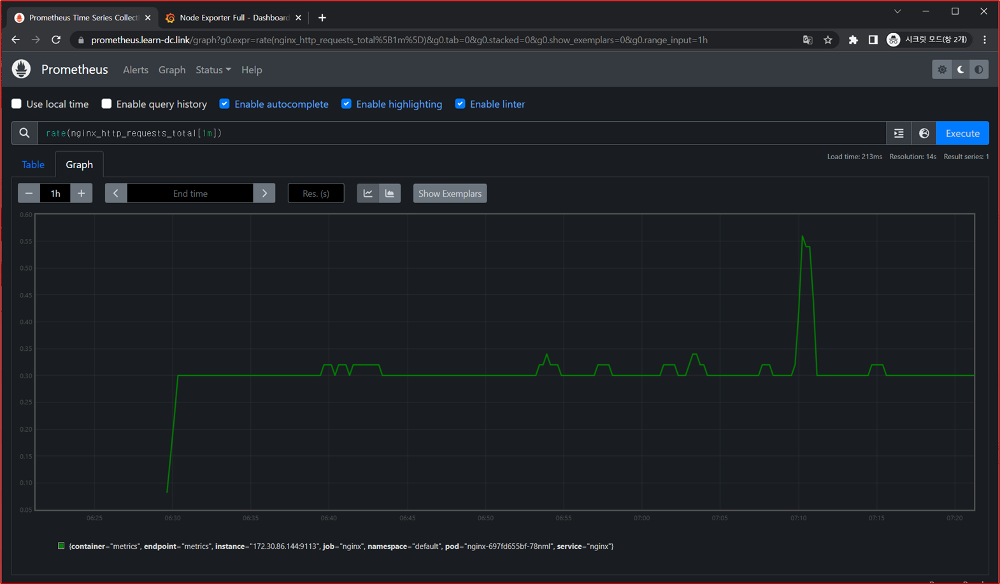

# PKOS 5주차

## 과제 수행결과

- 과제 수행과정은 본문에 자세히 기술했습니다.

### 과제1

- 목표 : **프로메테우스-스택** 설치 후 ‘**공식 or 여러가지 대시보드**’를 **추가**해보시고, 관련 스샷 올려주세요

- 수행결과
  - 

### 과제2

- 목표 : **Nginx 파드**를 배포 후 관련 metric 를 **프로메테우스 웹**에서 확인하고, **그라파나에 nginx 웹서버 대시보드**를 추가 후 확인하시고, 관련 스샷 올려주세요

- 수행결과
  - 프로메테우스 확인
    - 
    - 
  - 그라파나 확인
    - 

