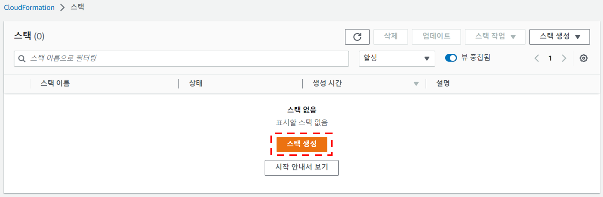
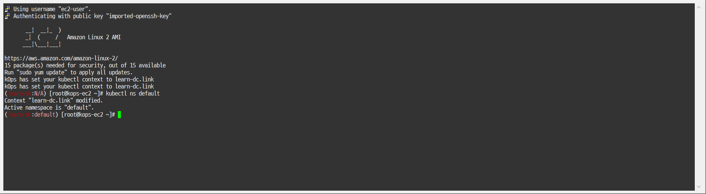
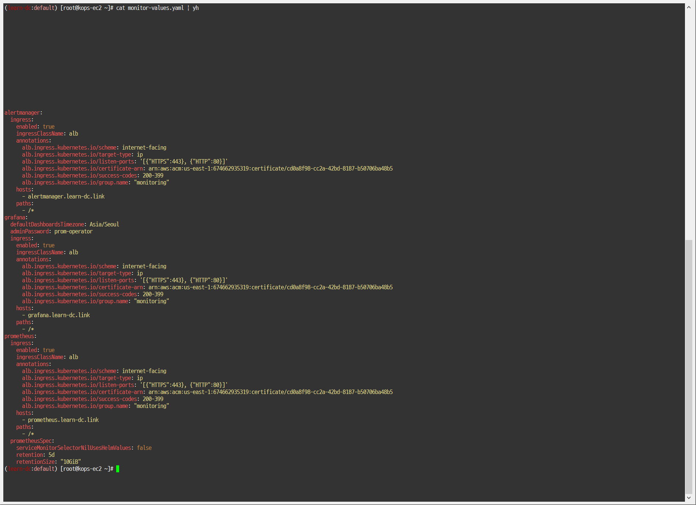
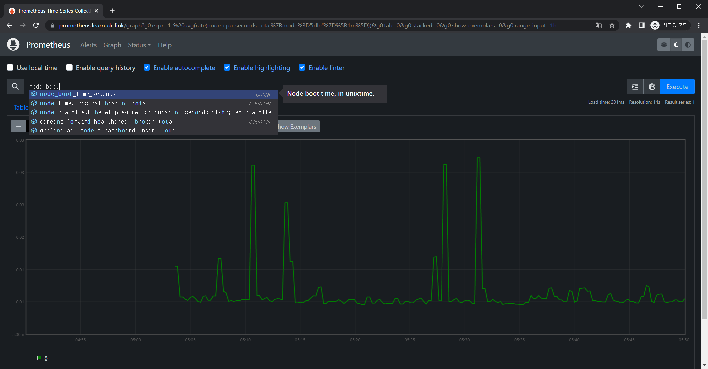
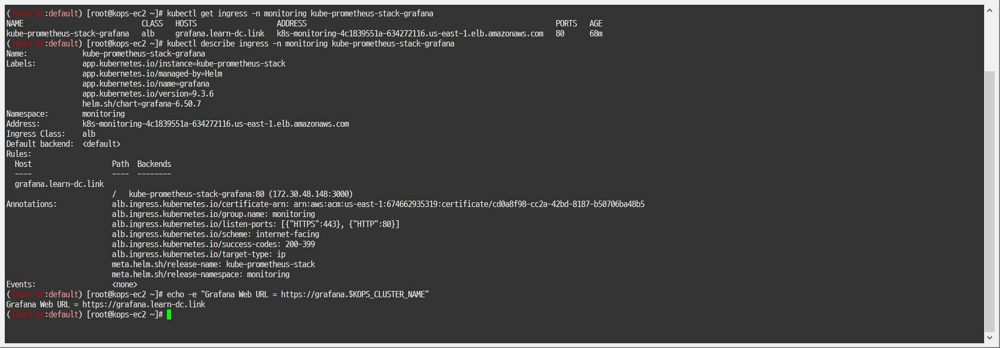
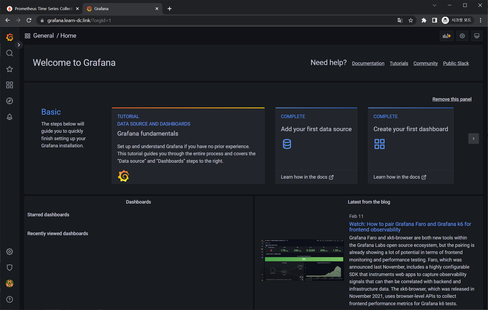

[PKOS 1주차 - 회고(4L)](../pkos_w1_4l)

[PKOS - Production Kubernetes Online Study 포스팅을 시작하며](../pkos_intro)

[PKOS 1주차 - AWS kOps 설치 및 기본 사용](../pkos_w1_hands-on)

[PKOS 2주차 - 회고(4L)](../pkos_w2_4l)

[PKOS 2주차 - 쿠버네티스 네트워크](../pkos_w2_hands-on)

[PKOS 3주차 - 회고(4L)](../pkos_w3_4l)

[PKOS 3주차 - Ingress & Storage](../pkos_w3_hands-on)

[PKOS 4주차 - 회고(4L)](../pkos_w4_4l)

[PKOS 4주차 - Harbor & Gitlab & ArgoCD](../pkos_w4_hands-on)

[PKOS 5주차 - 회고(4L)](../pkos_w5_4l)

[PKOS 5주차 - Prometheus & Grafana](../pkos_w5_hands-on)

[PKOS 6주차 - 회고(4L)](../pkos_w6_4l)

[PKOS 6주차 - Alert Manager & Logging System](../pkos_w6_hands-on)

---

왜 그런지 모르겠는데 이미지 위아래로 여백이 생깁니다.

에디터에서는 안그러는데 왜 그런지 좀 찾아봐야겠습니다.

본 글은 초안이기에 다듬는 과정에서 내용이 수정될 수 있습니다. 

---

# PKOS 5주차


## 들어가기전에

본 내용은 `CloudNet@` 팀에서 진행하는 `쿠버네티스 실무 실습` 스터디를 기반으로 작성된 내용입니다.

또한 개념 설명에서 사용된 이미지의 출처는 스터디 학습 자료에서 가져온 것을 밝힙니다.

- 참조: https://www.notion.so/AWS-EKS-VPC-CNI-1-POD-f89e3e5967b24f8c9aa5bfaab1a82ceb
- 참조: ‘[24단계 실습으로 정복하는 쿠버네티스 - 이정훈 저](https://product.kyobobook.co.kr/detail/S000200152893)’ 책을 기준하여 정리

5주차에는 쿠버네티스 환경에서 모니터링하는 도구인 Prometheus, Grafana 실습을 진행했습니다.


### 과제 수행결과

- 과제 수행과정은 본문에 자세히 기술했습니다.

#### 과제1

- 목표 : **프로메테우스-스택** 설치 후 ‘**공식 or 여러가지 대시보드**’를 **추가**해보시고, 관련 스샷 올려주세요

- 수행결과
  - 


#### 과제2

- 목표 : **Nginx 파드**를 배포 후 관련 metric 를 **프로메테우스 웹**에서 확인하고, **그라파나에 nginx 웹서버 대시보드**를 추가 후 확인하시고, 관련 스샷 올려주세요

- 수행결과
  - 프로메테우스 확인
    - 
    - 
  - 그라파나 확인
    - 


## 1. 실습 환경 세팅

### 1.1 구성 환경

- 사전 준비
  - AWS 계정, SSH 키 페어, IAM 계정 생성 후 키, S3 버킷
- 전체 구성도
  - 기본 구성 환경은 1주차 내용과 동일
- 실습 환경 내용
  - CloudFormation 스택 실행 시 파라미터를 기입하면, 해당 정보가 반영되어 배포됩니다.
  - VPC는 kOps 배포를 위한 EC2가 위치할 MyVPC 1개와 실제 kOps 가 배포되어 구동되는 VPC 1개로 총 2개가 생성됩니다.
  - CloudFormation 에 EC2의 UserData 부분(Script 실행)으로 AWS kOps 설치를 진행합니다.
  - 마스터 노드 1대, 워커 노드는 기본은 2대로 구성됩니다.
  - 실습 환경은 지난 주차와 다르게 노드 사양은 c5.2xlarge(vCPU 8, Memory 16GiB) 으로 진행 됩니다.


### 1.2 실습 환경

- 본 실습은 **미국 동부(버지니아 북부) `us-east-1`** 에서 진행됩니다.

#### 1.2.1 S3 버킷 생성

1. S3 URL 접속
   - https://s3.console.aws.amazon.com/s3/buckets?region=us-east-1
2. 버킷 만들기 버튼 클릭
   - 
3. 버킷 만들기
   - 버킷 이름 설정 후 기본 설정 그대로 버킷 만들기 버튼 클릭
     - 버킷 이름 : 20230213-learn-s3-mybucket
   - 


#### 1.2.2 Cloud Formation을 이용한 kOps 생성(이하 배포)

1. Cloud Formation URL 접속 및 스택 생성 버튼 클릭

   - https://us-east-1.console.aws.amazon.com/cloudformation/home?region=us-east-1#/stacks
   - 

2. 스택 생성 - 1단계 스택 생성

   - 템플릿 소스 URL 입력 - Amazon S3 URL
     - https://s3.ap-northeast-2.amazonaws.com/cloudformation.cloudneta.net/K8S/kops-oneclick.yaml
   - 

3. 스택 생성 - 2단계 스택 세부 정보 지정

   - 스택 이름

     - 스택 이름 : mkops
     - 

   - 파라미터

     - <<<<< Deploy EC2 : kops-ec2 >>>>>

       - 설정 설명
         - KeyName : kops-ec2에 SSH 접속을 위한 SSH 키페어 선택 *<- 미리 SSH 키 생성 해두자!*
         - MyIamUserAccessKeyID : 관리자 수준의 권한을 가진 IAM User의 액세스 키ID 입력
         - MyIamUserSecretAccessKey : 관리자 수준의 권한을 가진 IAM User의 시크릿 키ID 입력 <- 노출되지 않게 보안 주의
         - SgIngressSshCidr : kops-ec2에 SSH 접속 가능한 IP 입력 (집 공인IP/32 입력), 보안그룹 인바운드 규칙에 반영됨
         - LatestAmiId : kops-ec2에 사용할 AMI는 아마존리눅스2 최신 버전 사용, 기본값 그대로 사용
       - 설정 내용
         - 사용자 설정 입력
       - 

     - <<<<< AWS kOps Config >>>>>

       - 설정 설명

         - KubernetesVersion : 쿠버네티스 설치 버전 (기본 v1.24.9) ⇒ 변경 가능

         - ClusterBaseName : kOps 클러스터 이름이며, 사용하게될 도메인 이름이다. ‘퍼블릭 도메인’ or ‘프라이빗 도메인’ or ‘Gossip DNS’ 가능

         - S3StateStore : kOps 클러스터의 설정/상태 정보가 저장될 S3 버킷의 이름을 지정 *← 미리 S3 버킷을 생성 해두자!*

         - MasterNodeInstanceType & WorkerNodeInstanceType: 마스터(기본 t3.medium) & 워커 노드 EC2 인스턴스의 타입 (기본 t3.medium) ⇒ 변경 가능

         - WorkerNodeCount : 워커노드의 갯수를 입력 ⇒ 변경 가능

         - VpcBlock : kOps 배포되고 동작할 VPC 네트워크 대역, 기본값 그대로 사용

       - 설정 내용

         - 다음 설정 외 기본 설정 사용
           - ClusterBaseName
             - learn-dc.link
           - S3StateStore : 위에 생성한 버킷 명칭 입력
             - 20230213-learn-s3-mybucket
           - MasterNodeInstanceType & WorkerNodeInstanceType
             - c5.2xlarge

       - 

     - <<<<< Region AZ >>>>>

       - 설정 설명
         - TargetRegion : kOps를 배포할 리전
         - AvailabliltyZone1 : kOps를 배포할 리전의 가용 영역
         - AvailabliltyZone2 : kOps를 배포할 리전의 가용 영역
       - 설정 내용
         - TargetRegion : us-east-1
         - AvailabliltyZone1 : us-east-1a
         - AvailabliltyZone2 : us-east-1c
       - 

   - 다음 버튼 클릭

     - 

4. 스택 생성 - 3단계 스택 옵션

   - 기본 설정 그대로 다음 버튼 클릭
     - 

5. 스택 생성 - 4단계 mkops 검토

   - 스택 파라미터 설정 확인
     - 
   - 기본 설정 그대로 전송 버튼 클릭
     - 

6. 스택 생성 확인 및 접속 IP 확인

   - 스택 생성 확인
     - 
   - 접속 IP 확인
     - KOPSEC2IP : 3.89.36.81
     - 


#### 1.2.3 kOps 배포 확인

##### 1. 접속 후 기본 설정

- 마스터노드 SSH 접속 - Putty

  - 

- default NS 진입

  - ```bash
    kubectl ns default
    ```

    - 


### 1.3 기타 설정 및 배포 - 약 9분 정도 소요

#### 1.3.1 EC2 instance profiles 설정

- EC2 instance profiles 에 IAM Policy 추가(attach)

  - ```bash
    aws iam attach-role-policy --policy-arn arn:aws:iam::$ACCOUNT_ID:policy/AWSLoadBalancerControllerIAMPolicy --role-name masters.$KOPS_CLUSTER_NAME
    aws iam attach-role-policy --policy-arn arn:aws:iam::$ACCOUNT_ID:policy/AWSLoadBalancerControllerIAMPolicy --role-name nodes.$KOPS_CLUSTER_NAME
    aws iam attach-role-policy --policy-arn arn:aws:iam::$ACCOUNT_ID:policy/AllowExternalDNSUpdates --role-name masters.$KOPS_CLUSTER_NAME
    aws iam attach-role-policy --policy-arn arn:aws:iam::$ACCOUNT_ID:policy/AllowExternalDNSUpdates --role-name nodes.$KOPS_CLUSTER_NAME
    ```

    - 


#### 1.3.2 AWS LoadBalancer 배포 & ExternalDNS & Metrics-server 설치 및 배포

- kOps 클러스터 편집 : 아래 내용 추가

  - ```bash
    kops edit cluster
    # ...
    # spec:
    #   certManager:
    #     enabled: true
    #   awsLoadBalancerController:
    #     enabled: true
    #   externalDns:
    #     provider: external-dns
    #   metricsServer:
    #     enabled: true
    # ...
    ```

    - 

- 업데이트 적용 : 마스터 노드 롤링업데이트 필요 >> EC2인스턴스 삭제 후 재생성되므로 9분 정소 시간이 소요됨

  - ```bash
    kops update cluster --yes && echo && sleep 3 && kops rolling-update cluster --yes
    ```

    - 


### 1.4 Metrics-server 확인

- kubelet으로부터 수집한 리소스 메트릭을 수집 및 집계하는 클러스터 애드온 구성 요소 - [링크](https://github.com/kubernetes-sigs/metrics-server) [Docs](https://kubernetes.io/ko/docs/tasks/debug/debug-cluster/resource-metrics-pipeline/) [CMD](https://kubernetes.io/docs/reference/generated/kubectl/kubectl-commands#top)
- 리소스 메트릭 파이프라인 아키텍처
  - 
    - 출처: https://kubernetes.io/ko/docs/tasks/debug/debug-cluster/resource-metrics-pipeline/
      - cAdvisor
        - kubelet에 포함된 컨테이너 메트릭을 수집, 집계, 노출하는 데몬
      - kubelet
        - 컨테이너 리소스 관리를 위한 노드 에이전트. 리소스 메트릭은 kubelet API 엔드포인트 `/metrics/resource` 및 `/stats` 를 사용하여 접근 가능하다.
      - 요약 API
        - `/stats` 엔드포인트를 통해 사용할 수 있는 노드 별 요약된 정보를 탐색 및 수집할 수 있도록 kubelet이 제공하는 API
      - metrics-server
        - 각 kubelet으로부터 수집한 리소스 메트릭을 수집 및 집계하는 클러스터 애드온 구성 요소.
        - API 서버는 HPA, VPA 및 `kubectl top` 명령어가 사용할 수 있도록 메트릭 API를 제공한다.
        - metrics-server는 메트릭 API에 대한 기준 구현(reference implementation) 중 하나이다.
      - 메트릭 API
        - 워크로드 오토스케일링에 사용되는 CPU 및 메모리 정보로의 접근을 지원하는 쿠버네티스 API.
        - 이를 클러스터에서 사용하려면, 메트릭 API를 제공하는 API 확장(extension) 서버가 필요하다.

- 메트릭 서버

  - 메트릭 서버 확인 : 메트릭은 15초 간격으로 cAdvisor를 통하여 가져옴

    - ```bash
      kubectl get pod -n kube-system -l k8s-app=metrics-server
      kubectl get apiservices |egrep '(AVAILABLE|metrics)'
      ```

      - 

  - 노드 메트릭 확인

    - ```bash
      kubectl top node
      ```

      - 

  - 파드 메트릭 확인

    - ```bash
      kubectl top pod -A
      kubectl top pod -n kube-system --sort-by='cpu'
      kubectl top pod -n kube-system --sort-by='memory'
      ```

      - 
      - 
      - 


### 1.5 명령어 기반 쿠버네티스 모니터링 도구 k9s

- 명령어 기반 쿠버네티스 모니터링 도구 *k9s : *Skip*, 책 p292~297 참고 - [링크](https://k9scli.io/)


## 2. 프로메테우스(Prometheus)

### 2.1 개요

- 프로메테우스란? - https://prometheus.io/docs/introduction/overview/#what-is-prometheus
  - [Prometheus](https://github.com/prometheus) is an open-source systems monitoring and alerting toolkit originally built at [SoundCloud](https://soundcloud.com/)
- 제공 기능 - https://prometheus.io/docs/introduction/overview/#features
  - a multi-dimensional [data model](https://prometheus.io/docs/concepts/data_model/) with **time series data**(=**TSDB, 시계열 데이터베이스**) identified by metric name and **key/value** pairs
  - **PromQL**, a [flexible query language](https://prometheus.io/docs/prometheus/latest/querying/basics/) to leverage this dimensionality
  - no reliance on distributed storage; single server nodes are autonomous
  - time series collection happens via a **pull** model over **HTTP** ⇒ **Push** 와 **Pull** 수집 방식 장단점 - [링크](https://velog.io/@zihs0822/Push-vs-Pull-모니터링-데이터-수집-방식)
  - [pushing time series](https://prometheus.io/docs/instrumenting/pushing/) is supported via an intermediary gateway
  - targets are discovered via **service discovery** or **static** configuration
  - multiple modes of **graphing** and **dashboarding** support
- 아키텍처
  - 
    - 출처: https://prometheus.io/docs/introduction/overview/#architecture

- 구성요소 - https://prometheus.io/docs/introduction/overview/#components
  - the main [**Prometheus server**](https://github.com/prometheus/prometheus) which scrapes and stores **time series data**
  - [**client libraries**](https://prometheus.io/docs/instrumenting/clientlibs/) for instrumenting application code
  - a [**push gateway**](https://github.com/prometheus/pushgateway) for supporting short-lived jobs
  - special-purpose [**exporters**](https://prometheus.io/docs/instrumenting/exporters/) for services like HAProxy, StatsD, Graphite, etc.
  - an [**alertmanager**](https://github.com/prometheus/alertmanager) to handle alerts
  - various support tools


### 2.2 실습

#### 2.2.1 프로메테우스-스택 설치

- 모니터링에 필요한 여러 요소를 단일 차트(스택)으로 제공 ← 시각화(그라파나), 이벤트 메시지 정책(경고 임계값, 경고 수준) 등 - [Helm](https://artifacthub.io/packages/helm/prometheus-community/kube-prometheus-stack)


1. kube-prometheus-stack collects Kubernetes manifests, Grafana dashboards, and Prometheus rules combined with documentation and scripts to provide easy to operate end-to-end Kubernetes cluster monitoring with Prometheus using the Prometheus Operator.

   - 모니터링

     - ```bash
       kubectl create ns monitoring
       watch kubectl get pod,pvc,svc,ingress -n monitoring
       ```

       - 
       - 

   - 사용 리전의 인증서 ARN 확인

     - ```bash
       CERT_ARN=`aws acm list-certificates --query 'CertificateSummaryList[].CertificateArn[]' --output text`
       echo "alb.ingress.kubernetes.io/certificate-arn: $CERT_ARN"
       # alb.ingress.kubernetes.io/certificate-arn: arn:aws:acm:us-east-1:674662935319:certificate/cd0a8f98-cc2a-42bd-8187-b50706ba48b5
       echo $CERT_ARN
       # arn:aws:acm:us-east-1:674662935319:certificate/cd0a8f98-cc2a-42bd-8187-b50706ba48b5
       ```
       
       - 

   - 설치

     - ```bash
       helm repo add prometheus-community https://prometheus-community.github.io/helm-charts
       ```

       - 

   - 파라미터 파일 생성

     - ```bash
       cat <<EOT > ~/monitor-values.yaml
       alertmanager:
         ingress:
           enabled: true
           ingressClassName: alb
       
           annotations:
             alb.ingress.kubernetes.io/scheme: internet-facing
             alb.ingress.kubernetes.io/target-type: ip
             alb.ingress.kubernetes.io/listen-ports: '[{"HTTPS":443}, {"HTTP":80}]'
             alb.ingress.kubernetes.io/certificate-arn: $CERT_ARN
             alb.ingress.kubernetes.io/success-codes: 200-399
             alb.ingress.kubernetes.io/group.name: "monitoring"
       
           hosts:
             - alertmanager.$KOPS_CLUSTER_NAME
       
           paths:
             - /*
       
       
       grafana:
         defaultDashboardsTimezone: Asia/Seoul
         adminPassword: prom-operator
       
         ingress:
           enabled: true
           ingressClassName: alb
       
           annotations:
             alb.ingress.kubernetes.io/scheme: internet-facing
             alb.ingress.kubernetes.io/target-type: ip
             alb.ingress.kubernetes.io/listen-ports: '[{"HTTPS":443}, {"HTTP":80}]'
             alb.ingress.kubernetes.io/certificate-arn: $CERT_ARN
             alb.ingress.kubernetes.io/success-codes: 200-399
             alb.ingress.kubernetes.io/group.name: "monitoring"
       
           hosts:
             - grafana.$KOPS_CLUSTER_NAME
       
           paths:
             - /*
       
       prometheus:
         ingress:
           enabled: true
           ingressClassName: alb
       
           annotations:
             alb.ingress.kubernetes.io/scheme: internet-facing
             alb.ingress.kubernetes.io/target-type: ip
             alb.ingress.kubernetes.io/listen-ports: '[{"HTTPS":443}, {"HTTP":80}]'
             alb.ingress.kubernetes.io/certificate-arn: $CERT_ARN
             alb.ingress.kubernetes.io/success-codes: 200-399
             alb.ingress.kubernetes.io/group.name: "monitoring"
       
           hosts:
             - prometheus.$KOPS_CLUSTER_NAME
       
           paths:
             - /*
       
         prometheusSpec:
           serviceMonitorSelectorNilUsesHelmValues: false
           retention: 5d
           retentionSize: "10GiB"
       EOT
       
       
       cat monitor-values.yaml | yh
       ```
       
       - 
       
       - 
       
       - ```yaml
         # monitor-values.yaml
         alertmanager:
           ingress:
             enabled: true
             ingressClassName: alb
             annotations:
               alb.ingress.kubernetes.io/scheme: internet-facing
               alb.ingress.kubernetes.io/target-type: ip
               alb.ingress.kubernetes.io/listen-ports: '[{"HTTPS":443}, {"HTTP":80}]'
               alb.ingress.kubernetes.io/certificate-arn: arn:aws:acm:us-east-1:674662935319:certificate/cd0a8f98-cc2a-42bd-8187-b50706ba48b5
               alb.ingress.kubernetes.io/success-codes: 200-399
               alb.ingress.kubernetes.io/group.name: "monitoring"
             hosts:
               - alertmanager.learn-dc.link
             paths:
               - /*
         grafana:
           defaultDashboardsTimezone: Asia/Seoul
           adminPassword: prom-operator
           ingress:
             enabled: true
             ingressClassName: alb
             annotations:
               alb.ingress.kubernetes.io/scheme: internet-facing
               alb.ingress.kubernetes.io/target-type: ip
               alb.ingress.kubernetes.io/listen-ports: '[{"HTTPS":443}, {"HTTP":80}]'
               alb.ingress.kubernetes.io/certificate-arn: arn:aws:acm:us-east-1:674662935319:certificate/cd0a8f98-cc2a-42bd-8187-b50706ba48b5
               alb.ingress.kubernetes.io/success-codes: 200-399
               alb.ingress.kubernetes.io/group.name: "monitoring"
             hosts:
               - grafana.learn-dc.link
             paths:
               - /*
         prometheus:
           ingress:
             enabled: true
             ingressClassName: alb
             annotations:
               alb.ingress.kubernetes.io/scheme: internet-facing
               alb.ingress.kubernetes.io/target-type: ip
               alb.ingress.kubernetes.io/listen-ports: '[{"HTTPS":443}, {"HTTP":80}]'
               alb.ingress.kubernetes.io/certificate-arn: arn:aws:acm:us-east-1:674662935319:certificate/cd0a8f98-cc2a-42bd-8187-b50706ba48b5
               alb.ingress.kubernetes.io/success-codes: 200-399
               alb.ingress.kubernetes.io/group.name: "monitoring"
             hosts:
               - prometheus.learn-dc.link
             paths:
               - /*
           prometheusSpec:
             serviceMonitorSelectorNilUsesHelmValues: false
             retention: 5d
             retentionSize: "10GiB"

   - 배포

     - ```bash
       helm install kube-prometheus-stack prometheus-community/kube-prometheus-stack --version 45.0.0 -f monitor-values.yaml --namespace monitoring
       ```

       - 
       - 

   - 확인

     - ```bash
       ## alertmanager-0 : 사전에 정의한 정책 기반(예: 노드 다운, 파드 Pending 등)으로 시스템 경고 메시지를 생성 후 경보 채널(슬랙 등)로 전송
       ## grafana : 프로메테우스는 메트릭 정보를 저장하는 용도로 사용하며, 그라파나로 시각화 처리
       ## prometheus-0 : 모니터링 대상이 되는 파드는 ‘exporter’라는 별도의 사이드카 형식의 파드에서 모니터링 메트릭을 노출, pull 방식으로 가져와 내부의 시계열 데이터베이스에 저장
       ## node-exporter : 노드익스포터는 물리 노드에 대한 자원 사용량(네트워크, 스토리지 등 전체) 정보를 메트릭 형태로 변경하여 노출
       ## operator : 시스템 경고 메시지 정책(prometheus rule), 애플리케이션 모니터링 대상 추가 등의 작업을 편리하게 할수 있게 CRD 지원
       ## kube-state-metrics : 쿠버네티스의 클러스터의 상태(kube-state)를 메트릭으로 변환하는 파드
       helm list -n monitoring
       kubectl get pod,pvc,svc,ingress -n monitoring
       kubectl get-all -n monitoring
       kubectl get prometheus,alertmanager -n monitoring
       kubectl get prometheusrule -n monitoring
       kubectl get servicemonitors -n monitoring
       # kubectl krew install df-pv && kubectl df-pv
       ```

       - 
       - 
       - 
       - 

2. (참고) 삭제 시

   - helm 삭제

     - ```bash
       helm uninstall -n monitoring kube-prometheus-stack
       ```

   - crd 삭제

     - ```bash
       kubectl delete crd alertmanagerconfigs.monitoring.coreos.com
       kubectl delete crd alertmanagers.monitoring.coreos.com
       kubectl delete crd podmonitors.monitoring.coreos.com
       kubectl delete crd probes.monitoring.coreos.com
       kubectl delete crd prometheuses.monitoring.coreos.com
       kubectl delete crd prometheusrules.monitoring.coreos.com
       kubectl delete crd servicemonitors.monitoring.coreos.com
       kubectl delete crd thanosrulers.monitoring.coreos.com
       ```
   


#### 2.2.2 프로메테우스 기본 사용 : 모니터링 그래프

1. 모니터링 대상이 되는 서비스는 일반적으로 자체 웹 서버의 /metrics 엔드포인트 경로에 다양한 메트릭 정보를 노출

2. 이후 프로메테우스는 해당 경로에 http get 방식으로 메트릭 정보를 가져와 TSDB 형식으로 저장

   - 아래 처럼 프로메테우스가 각 서비스의 9100 접속하여 메트릭 정보를 수집

     - ```bash
       kubectl get node -o wide
       kubectl get svc,ep -n monitoring kube-prometheus-stack-prometheus-node-exporter
       ```

       - 

   - 마스터노드에 lynx 설치

     - ```bash
       ssh -i ~/.ssh/id_rsa ubuntu@api.$KOPS_CLUSTER_NAME hostname
       ssh -i ~/.ssh/id_rsa ubuntu@api.$KOPS_CLUSTER_NAME sudo apt install lynx -y
       ```

       - 

   - 노드의 9100번의 /metrics 접속 시 다양한 메트릭 정보를 확인할수 있음 : 마스터 이외에 워커노드도 확인 가능

     - ```bash
       ssh -i ~/.ssh/id_rsa ubuntu@api.$KOPS_CLUSTER_NAME lynx -dump localhost:9100/metrics
       ```

       - 
       - 

3. 프로메테우스 ingress 도메인으로 웹 접속

   - ingress 확인

     - ```bash
       kubectl get ingress -n monitoring kube-prometheus-stack-prometheus
       kubectl describe ingress -n monitoring kube-prometheus-stack-prometheus
       ```

       - 

   - 프로메테우스 ingress 도메인으로 웹 접속

     - ```bash
       echo -e "Prometheus Web URL = https://prometheus.$KOPS_CLUSTER_NAME"
       # Prometheus Web URL = https://prometheus.learn-dc.link
       ```
       
       - 

   - 웹 상단 주요 메뉴 설명

     - 경고(Alert) : 사전에 정의한 시스템 경고 정책(Prometheus Rules)에 대한 상황
     - 그래프(Graph) : 프로메테우스 자체 검색 언어 PromQL을 이용하여 메트릭 정보를 조회 -> 단순한 그래프 형태 조회
     - 상태(Status) : 경고 메시지 정책(Rules), 모니터링 대상(Targets) 등 다양한 프로메테우스 설정 내역을 확인
     - 도움말(Help)
       - 

4. 프로메테우스 설정(Configuration) 확인 : Status → Configuration ⇒ “node-exporter” 검색

   - ```yaml
     global:
       scrape_interval: 30s     # 메트릭 가져오는(scrape) 주기
       scrape_timeout: 10s      # 메트릭 가져오는(scrape) 타임아웃
       evaluation_interval: 30s # alert 보낼지 말지 판단하는 주기
     ...
     - job_name: serviceMonitor/monitoring/kube-prometheus-stack-prometheus-node-exporter/0
       scrape_interval: 30s
       scrape_timeout: 10s
       metrics_path: /metrics
       scheme: http
     ...
     kubernetes_sd_configs:    # 서비스 디스커버리(SD) 방식을 이용하고, 파드의 엔드포인트 List 자동 반영
       - role: endpoints
         kubeconfig_file: ""
         follow_redirects: true
         enable_http2: true
         namespaces:
           own_namespace: false
           names:
           - monitoring        # 서비스 엔드포인트가 속한 네임 스페이스 이름을 지정, 서비스 네임스페이스가 속한 포트 번호를 구분하여 메트릭 정보를 가져옴
     ```

     - 

5. 전체 메트릭 대상(Targets) 확인 : Status → Targets

   - 
   - 

   1. 해당 스택은 ‘노드-익스포터’, cAdvisor, 쿠버네티스 전반적인 현황 이외에 다양한 메트릭을 포함

      - 모니터링

        - ```bash
          watch kubectl get pod -n kube-system -l k8s-app=kube-proxy
          ```

          - 

      - 확인 및 조치 : kube-proxy는 Static pod 스태틱 파드로 배포됨

        - ```bash
          ssh -i ~/.ssh/id_rsa ubuntu@api.$KOPS_CLUSTER_NAME sudo ss -tnlp | grep kube-proxy
          
          ssh -i ~/.ssh/id_rsa ubuntu@api.$KOPS_CLUSTER_NAME ls /etc/kubernetes/manifests
          ssh -i ~/.ssh/id_rsa ubuntu@api.$KOPS_CLUSTER_NAME cat /etc/kubernetes/manifests/kube-proxy.manifest
          ssh -i ~/.ssh/id_rsa ubuntu@api.$KOPS_CLUSTER_NAME grep 127.0.0.1 /etc/kubernetes/manifests/kube-proxy.manifest
          ssh -i ~/.ssh/id_rsa ubuntu@api.$KOPS_CLUSTER_NAME sudo sed -i 's/127.0.0.1/0.0.0.0/g' /etc/kubernetes/manifests/kube-proxy.manifest
          ```

          - 
          
          - 
          
            - ```yaml
              # ssh -i ~/.ssh/id_rsa ubuntu@api.$KOPS_CLUSTER_NAME cat /etc/kubernetes/manifests/kube-proxy.manifest
              apiVersion: v1
              kind: Pod
              metadata:
                creationTimestamp: null
                labels:
                  k8s-app: kube-proxy
                  kubernetes.io/managed-by: nodeup
                  tier: node
                name: kube-proxy
                namespace: kube-system
              spec:
                containers:
                - args:
                  - --log-file=/var/log/kube-proxy.log
                  - --also-stdout
                  - /usr/local/bin/kube-proxy
                  - --conntrack-max-per-core=131072
                  - --hostname-override=i-0e30debd74ba1ecdd
                  - --kubeconfig=/var/lib/kube-proxy/kubeconfig
                  - --master=https://0.0.0.0
                  - --oom-score-adj=-998
                  - --v=2
                  command:
                  - /go-runner
                  image: registry.k8s.io/kube-proxy:v1.24.10@sha256:5d5748d409be932fba3db18b86673e9b3542dff373d9c26ed65e4c89add6102b
                  name: kube-proxy
                  resources:
                    requests:
                      cpu: 100m
                  securityContext:
                    privileged: true
                  volumeMounts:
                  - mountPath: /var/log/kube-proxy.log
                    name: logfile
                  - mountPath: /var/lib/kube-proxy/kubeconfig
                    name: kubeconfig
                    readOnly: true
                  - mountPath: /lib/modules
                    name: modules
                    readOnly: true
                  - mountPath: /etc/ssl/certs
                    name: ssl-certs-hosts
                    readOnly: true
                  - mountPath: /run/xtables.lock
                    name: iptableslock
                hostNetwork: true
                priorityClassName: system-node-critical
                tolerations:
                - key: CriticalAddonsOnly
                  operator: Exists
                volumes:
                - hostPath:
                    path: /var/log/kube-proxy.log
                  name: logfile
                - hostPath:
                    path: /var/lib/kube-proxy/kubeconfig
                  name: kubeconfig
                - hostPath:
                    path: /lib/modules
                  name: modules
                - hostPath:
                    path: /usr/share/ca-certificates
                  name: ssl-certs-hosts
                - hostPath:
                    path: /run/xtables.lock
                    type: FileOrCreate
                  name: iptableslock
              status: {}
          
          - 

      - 참고: kube-proxy metric 수집 가능하게 설정 변경

        - ```bash
          # kubectl get cm -n kube-system kube-proxy -o yaml | grep metric
          #     metricsBindAddress: 127.0.0.1:10249
          
          # kubectl edit cm -n kube-system kube-proxy -o yaml
          #     metricsBindAddress: 0.0.0.0:10249
          ```

      - 확인

        - ```bash
          # curl -s 192.168.10.101:10249/metrics | head -3
          # # HELP apiserver_audit_event_total [ALPHA] Counter of audit events generated and sent to the audit backend.
          # # TYPE apiserver_audit_event_total counter
          # apiserver_audit_event_total 0
          ```

   2. kube-proxy 는 현재 정보를 가져오지 못하고 있습니다! → **멤버분들 한번 해결해보세요!**

      - 문제해결 참조

        - 스터디 멤버 이상현님 정리내용 : https://sh4n3e.notion.site/5-d99269e234784031a287387395193db6

      - kube-proxy mainfest 수정

        - https://kubernetes.io/docs/reference/command-line-tools-reference/kube-proxy/

        - ```bash
          ssh -i ~/.ssh/id_rsa ubuntu@api.$KOPS_CLUSTER_NAME
          sudo vim /etc/kubernetes/manifests/kube-proxy.manifest
          # ...
          # spec:
          #   containers:
          #   - args:
          #     - --log-file=/var/log/kube-proxy.log
          #     - --also-stdout
          #     - /usr/local/bin/kube-proxy
          #     - --conntrack-max-per-core=131072
          #     - --hostname-override=i-0ea9c3c46f95cf7f9
          #     - --kubeconfig=/var/lib/kube-proxy/kubeconfig
          #     - --master=https://127.0.0.1
          #     - --oom-score-adj=-998
          #     - --v=2
          #     - --metrics-bind-address=0.0.0.0:10249 # 추가
          # ...
          
          exit
          ```

          - 
          - 

      - 확인

        - listen ip 확인

          - ```bash
            ssh -i ~/.ssh/id_rsa ubuntu@api.$KOPS_CLUSTER_NAME sudo ss -tnlp | grep kube-proxy
            ```

            - 

        - 대상(Targets) 확인

          - 

6. 메트릭을 그래프(Graph)로 조회 : Graph - 아래 PromQL 쿼리(전체 클러스터 노드의 CPU 사용량 합계)입력 후 조회 → Graph 확인

   - PromQL 쿼리

     - ```bash
       1- avg(rate(node_cpu_seconds_total{mode="idle"}[1m]))
       ```

       - 

   - 노드 메트릭

     - node 입력 후 자동 출력되는 메트릭 확인 후 선택

       ```bash
       node_boot_time_seconds
       ```

       - 
       - 

   - kube 메트릭

     - kube 입력 후 자동 출력되는 메트릭 확인 후 선택
       - 


## 3. 그라파나(Grafana)

### 3.1 개요

- 그라파나란?
  - TSDB 데이터를 시각화, 다양한 데이터 형식 지원(메트릭, 로그, 트레이스 등) - [링크](https://grafana.com/docs/grafana/latest/introduction/)
  - 그라파나는 **시각화 솔루**션으로 데이터 자체를 저장하지 않음 → 현재 실습 환경에서는 **데이터 소스**는 **프로메테우스**를 사용
  - **[Grafana open source software](https://grafana.com/oss/)** enables you to query, visualize, alert on, and explore your metrics, logs, and traces wherever they are stored. Grafana OSS provides you with tools to turn your time-series database (TSDB) data into insightful graphs and visualizations.


### 3.2 실습

#### 3.2.1 대시보드 접속

- 접속 정보 확인 및 로그인 : 기본 계정 - admin / prom-operator

  - ```bash
    # ingress 확인
    kubectl get ingress -n monitoring kube-prometheus-stack-grafana
    kubectl describe ingress -n monitoring kube-prometheus-stack-grafana
    
    # ingress 도메인으로 웹 접속
    echo -e "Grafana Web URL = https://grafana.$KOPS_CLUSTER_NAME"
    # Grafana Web URL = https://grafana.learn-dc.link
    ```
    
    - 
    - 
    - 


- 기본 대시보드 확인
  - 
    - Search dashboards : 대시보드 검색
    - Starred : 즐겨찾기 대시보드
    - Dashboards : 대시보드 전체 목록 확인
    - Explore : 쿼리 언어 PromQL를 이용해 메트릭 정보를 그래프 형태로 탐색
    - Alerting : 경고, 에러 발생 시 사용자에게 경고를 전달
    - Configuration : 설정, 예) 데이터 소스 설정 등
    - Server admin : 사용자, 조직, 플러그인 등 설정
    - admin : admin 사용자의 개인 설정


- Configuration → Data sources : 스택의 경우 자동으로 프로메테우스를 데이터 소스로 추가해둠 ← 서비스 주소 확인

  - 

  - 서비스 주소 확인

    - ```bash
      kubectl get svc,ep -n monitoring kube-prometheus-stack-prometheus
      ```

      - 

  - 해당 데이터 소스 접속 확인

    - 테스트용 파드 배포

      - ```bash
        kubectl apply -f ~/pkos/2/netshoot-2pods.yaml
        kubectl get pod
        ```

        - 
        
        - ```yaml
          # ~/pkos/2/netshoot-2pods.yaml
          apiVersion: v1
          kind: Pod
          metadata:
            name: pod-1
            labels:
              app: pod
          spec:
            containers:
            - name: netshoot-pod
              image: nicolaka/netshoot
              command: ["tail"]
              args: ["-f", "/dev/null"]
            terminationGracePeriodSeconds: 0
          ---
          apiVersion: v1
          kind: Pod
          metadata:
            name: pod-2
            labels:
              app: pod
          spec:
            containers:
            - name: netshoot-pod
              image: nicolaka/netshoot
              command: ["tail"]
              args: ["-f", "/dev/null"]
            terminationGracePeriodSeconds: 0
    
    - 접속 확인
    
      - ```bash
        # kube-prometheus-stack-prometheus.monitoring
        ## 서비스명: kube-prometheus-stack-prometheus
        ## 네임스페이스: monitoring
        kubectl exec -it pod-1 -- nslookup kube-prometheus-stack-prometheus.monitoring
        kubectl exec -it pod-1 -- curl -s kube-prometheus-stack-prometheus.monitoring:9090/graph -v
        ```
        
        - 
        - 


#### 3.2.2 대시보드 사용 : 기본 대시보드와 공식 대시보드 가져오기

1. 기본 대시보드
   - 스택을 통해서 설치된 기본 대시보드 확인 : Dashboards → Browse
     - 
   - (대략) 분류 : 자원 사용량 - Cluster/POD Resources, 노드 자원 사용량 - Node Exporter, 주요 애플리케이션 - CoreDNS 등
     - 확인해보자 - K8S / CR / Cluster, Node Exporter / Use Method / Cluster
       - 
2. 공식 대시보드 가져오기
   - kube-syate-metrics-v2 가져와보자 : **Dashboard ID copied!** (13332) 클릭 - [링크](https://grafana.com/grafana/dashboards/13332-kube-state-metrics-v2/)
     - 대시보드 목록
       - https://grafana.com/grafana/dashboards/
         - 
     - [**kube-syate-metrics-v2**] Dashboard → Import → **13332** 입력 후 Load ⇒ 데이터소스(Prometheus 선택) 후 **Import** 클릭
       - 
       - 
   - [**Node Exporter Full**] Dashboard → Import → **1860** 입력 후 Load ⇒ 데이터소스(Prometheus 선택) 후 **Import** 클릭
     - 
3. 추천 대시보드
   - https://grafana.com/orgs/imrtfm/dashboards
     - 


#### 3.2.3 NGINX 웹서버 애플리케이션 모니터링 설정 및 접속

1. 서비스모니터 동작

   - 
     - 출처: https://containerjournal.com/topics/container-management/cluster-monitoring-with-prometheus-operator/

2. nginx 를 helm 설치 시 프로메테우스 익스포터 Exporter 옵션 설정 시 자동으로 nginx 를 프로메테우스 모니터링에 등록 가능!

   - 프로메테우스 설정에서 nginx 모니터링 관련 내용을 서비스 모니터 CRD로 추가 가능!

3. 기존 애플리케이션 파드에 프로메테우스 모니터링을 추가하려면 사이드카 방식을 사용하며 exporter 컨테이너를 추가!

4. nginx 웹 서버 helm 설치 - [Helm](https://artifacthub.io/packages/helm/bitnami/nginx)

   - @

     - ```bash
       helm repo add bitnami https://charts.bitnami.com/bitnami
       ```

       - 

   - 파라미터 파일 생성 : 서비스 모니터 방식으로 nginx 모니터링 대상을 등록하고, export 는 9113 포트 사용, nginx 웹서버 노출은 AWS CLB 기본 사용

     - ```bash
       cat <<EOT > ~/nginx-values.yaml
       metrics:
         enabled: true
       
         service:
           port: 9113
       
         serviceMonitor:
           enabled: true
           namespace: monitoring
           interval: 10s
       EOT
       ```

       - 
       
       - ```yaml
         # ~/nginx-values.yaml
         metrics:
           enabled: true
         
           service:
             port: 9113
         
           serviceMonitor:
             enabled: true
             namespace: monitoring
             interval: 10s

   - 배포

     - ```bash
       helm install nginx bitnami/nginx --version 13.2.23 -f nginx-values.yaml
       ```

       - 
       - 

   - CLB에 ExternanDNS 로 도메인 연결

     - ```bash
       kubectl annotate service nginx "external-dns.alpha.kubernetes.io/hostname=nginx.$KOPS_CLUSTER_NAME"
       ```

       - 

   - 확인

     - ```bash
       kubectl get pod,svc,ep
       kubectl get servicemonitor -n monitoring nginx
       kubectl get servicemonitor -n monitoring nginx -o json | jq
       ```

       - 
       
       - ```json
         <!-- kubectl get servicemonitor -n monitoring nginx -o json | jq -->
         {
           "apiVersion": "monitoring.coreos.com/v1",
           "kind": "ServiceMonitor",
           "metadata": {
             "annotations": {
               "meta.helm.sh/release-name": "nginx",
               "meta.helm.sh/release-namespace": "default"
             },
             "creationTimestamp": "2023-02-13T06:29:08Z",
             "generation": 1,
             "labels": {
               "app.kubernetes.io/instance": "nginx",
               "app.kubernetes.io/managed-by": "Helm",
               "app.kubernetes.io/name": "nginx",
               "helm.sh/chart": "nginx-13.2.23"
             },
             "name": "nginx",
             "namespace": "monitoring",
             "resourceVersion": "26846",
             "uid": "58875b20-46f0-4af0-bcc8-96d56d8dad3a"
           },
           "spec": {
             "endpoints": [
               {
                 "interval": "10s",
                 "path": "/metrics",
                 "port": "metrics"
               }
             ],
             "jobLabel": "",
             "namespaceSelector": {
               "matchNames": [
                 "default"
               ]
             },
             "selector": {
               "matchLabels": {
                 "app.kubernetes.io/instance": "nginx",
                 "app.kubernetes.io/name": "nginx"
               }
             }
           }
         }

   - nginx 파드내에 컨테이너 갯수 확인

     - ```bash
       kubectl get pod -l app.kubernetes.io/instance=nginx
       kubectl describe pod -l app.kubernetes.io/instance=nginx
       ```

       - 

   - 접속 주소 확인 및 접속

     - ```bash
       echo -e "Nginx WebServer URL = http://nginx.$KOPS_CLUSTER_NAME"
       # Nginx WebServer URL = http://nginx.learn-dc.link
       curl -s http://nginx.$KOPS_CLUSTER_NAME
       kubectl logs deploy/nginx -f
       ```
       
       - 

   - 반복 접속

     - ```bash
       while true; do curl -s http://nginx.$KOPS_CLUSTER_NAME -I | head -n 1; date; sleep 1; done
       ```

       - 
       - 

5. 서비스 모니터링 생성 후 1분 정도 후에 프로메테우스 웹서버에서 State → Targets 에 nginx 서비스 모니터 추가 확인

   - 

6. Graph → nginx_ 입력 시 다양한 메트릭 추가 확인 : nginx_connections_active 등 ⇒ 책 338~340 페이지에 상세 설명 꼭 읽어보세요!

   - 

     - counter: 누적 수치로 감소하지 않고 계속 증가하는 타입
       - https://prometheus.io/docs/concepts/metric_types/#counter
     - gauge: 현재 수치
       - https://prometheus.io/docs/concepts/metric_types/#gauge

   - 사용량 추이 - rate(비율) 함수

     - ```bash
       rate(nginx_http_requests_total[1m])
       ```

       - 


#### 3.2.4 NGINX 애플리케이션 모니터링 대시보드 추가

1. 그라파나에 **12708** 대시보드 추가
   - 
2. 패널 복사 후 다른 대시 보드 추가 : 책 342~343 페이지 참고
   - 패널 복사
     - 
   - 패널 붙여넣기
     - 


### 3.3 과제

#### 3.3.1 과제1

- 목표: 프로메테우스-스택 설치 후 ‘공식 or 여러가지 대시보드’를 추가해보시고, 관련 스샷 올려주세요
- 수행결과 및 과정
  - 대시보드 선정 - 15757
    - https://grafana.com/grafana/dashboards/15757-kubernetes-views-global/
      - 
  - 대시보드 가져오기
    - 
  - 대시보드 화면
    - 


#### 3.3.2 과제2

- 목표: Nginx 파드를 배포 후 관련 metric 를 프로메테우스 웹에서 확인하고, 그라파나에 nginx 웹서버 대시보드를 추가 후 확인하시고, 관련 스샷 올려주세요
- 수행결과 및 과정
  - nginx 설치
    - 설치 과정은 본문 `3.2.3 NGINX 웹서버 애플리케이션 모니터링 설정 및 접속` 참조

  - 프로메테우스 확인
    - 
    - 

  - 그라파나 확인
    - 대시보드 선정 및 가져오기
      - 
      - 

    - 대시보드 확인
      - 


## 4. 실습 완료 후 자원 삭제

### 4.1 헬름 차트 삭제

- nginx 삭제

  - ```bash
    helm uninstall nginx
    ```

    - 

- 프로메테우스 스택 삭제

  - ```bash
    helm uninstall -n monitoring kube-prometheus-stack
    ```

    - 

### 4.2 kOps 클러스터 삭제 & AWS CloudFormation 스택 삭제

- ```bash
  kops delete cluster --yes && aws cloudformation delete-stack --stack-name mykops
  ```

  - 
  - 


