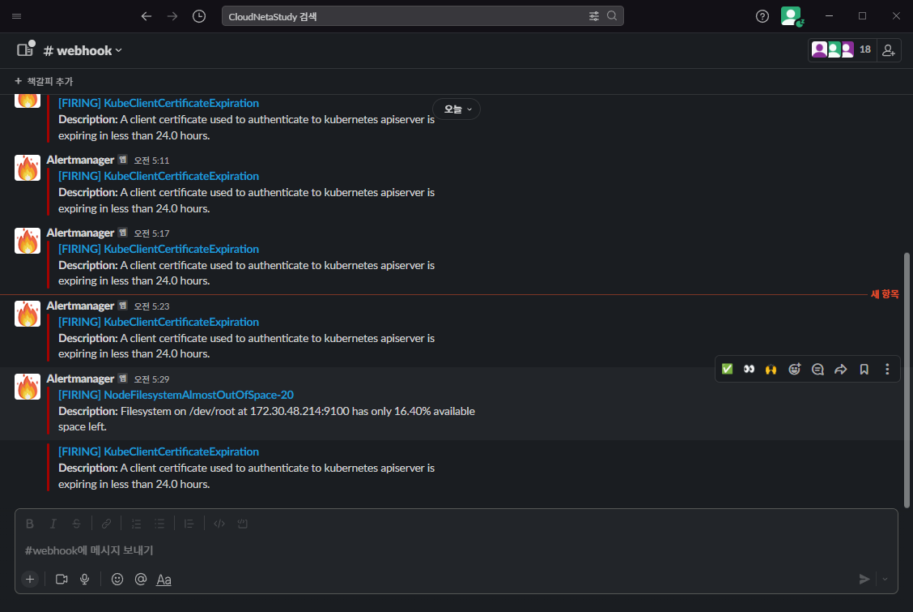
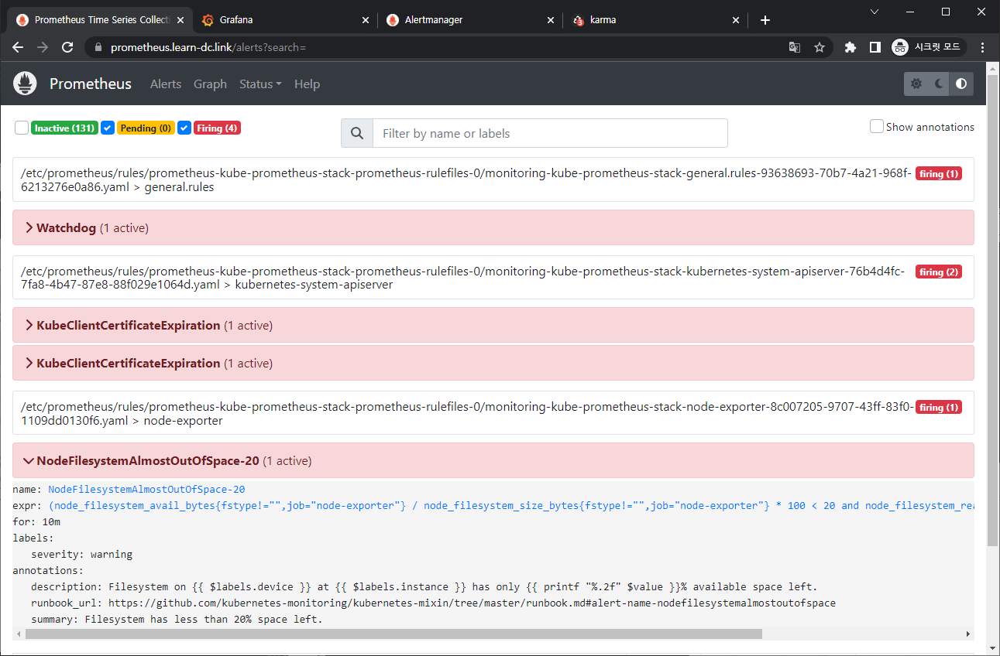
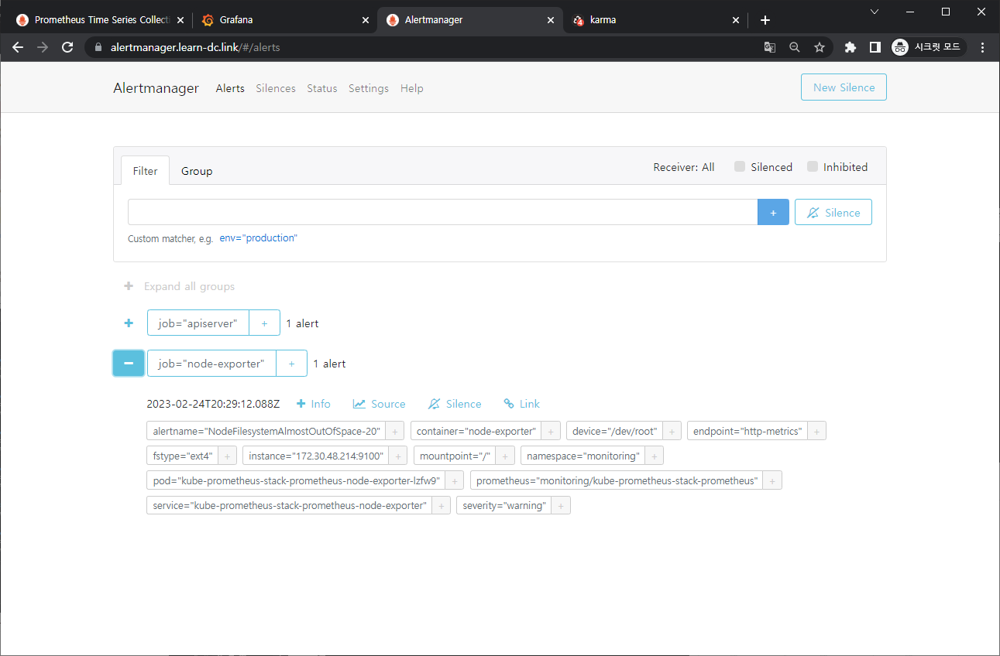
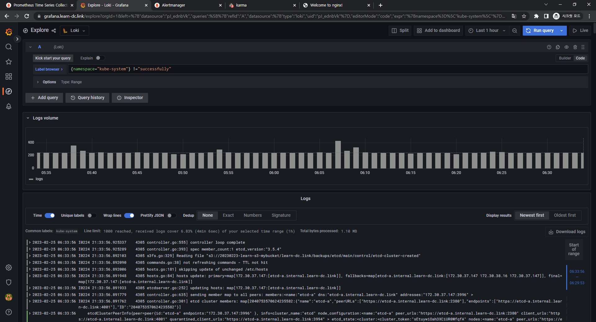
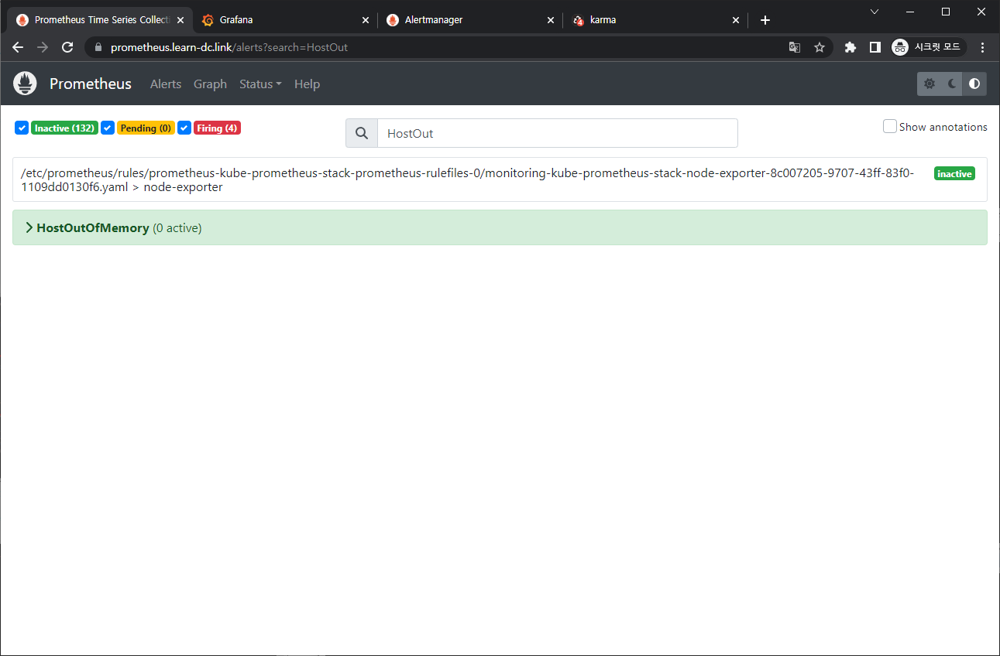

### 과제 수행결과

- 과제 수행과정은 본문에 자세히 기술했습니다.

#### 과제1

- 목표 : 책 367~372페이지 - 사용자 정의 prometheusrules 정책 설정 : 파일 시스템 사용률 80% 초과 시 시스템 경고 발생시키기 ⇒ 직접 실습 후 관련 스샷을 올려주세요
- 수행결과
  - 
  - 
  - 
  - 
  - 

#### 과제2

- 목표 : 책 386~389페이지 - LogQL 사용법 익히기 ⇒ 직접 실습 후 관련 스샷을 올려주세요

- 수행결과

  - 로키에서 네임스페이스 로그 검색
    - {namespace="kube-system"}
      - 

  - 특정 문자열을 포함하는 정규 표현식 활용
    - {namespace="kube-system"} |~"(?i)successfully"
      - 

  - 특정 문자열을 제외한 로그 검색
    - {namespace="kube-system"} !="DEBUG"
      - 

#### 과제3

- 목표 : 아래 1,2 과제 중 하나를 해주시면 됩니다
  1. [Awesome Prometheus alerts](https://awesome-prometheus-alerts.grep.to/) 를 참고해서 스터디에서 배우지 않은 **Alert Rule** 생성 및 적용 후 관련 스샷을 올려주세요
  2. ~~**그라파나**에서 **그래프 이미지**를 포함한 **알람**을 **슬랙**에 전달하게 설정 후 관련 스샷을 올려주세요~~
- 수행결과
  - 

