[PKOS 1주차 - 회고(4L)](../pkos_w1_4l)

[PKOS - Production Kubernetes Online Study 포스팅을 시작하며](../pkos_intro)

[PKOS 1주차 - AWS kOps 설치 및 기본 사용](../pkos_w1_hands-on)

[PKOS 2주차 - 회고(4L)](../pkos_w2_4l)

[PKOS 2주차 - 쿠버네티스 네트워크](../pkos_w2_hands-on)

[PKOS 3주차 - 회고(4L)](../pkos_w3_4l)

[PKOS 3주차 - Ingress & Storage](../pkos_w3_hands-on)

[PKOS 4주차 - 회고(4L)](../pkos_w4_4l)

[PKOS 4주차 - Harbor & Gitlab & ArgoCD](../pkos_w4_hands-on)

[PKOS 5주차 - 회고(4L)](../pkos_w5_4l)

[PKOS 5주차 - Prometheus & Grafana](../pkos_w5_hands-on)

[PKOS 6주차 - 회고(4L)](../pkos_w6_4l)

[PKOS 6주차 - Alert Manager & Logging System](../pkos_w6_hands-on)

---

왜 그런지 모르겠는데 이미지 위아래로 여백이 생깁니다.

에디터에서는 안그러는데 왜 그런지 좀 찾아봐야겠습니다.

본 글은 초안이기에 다듬는 과정에서 내용이 수정될 수 있습니다. 

---

# PKOS 6주차


## 들어가기전에

본 내용은 `CloudNet@` 팀에서 진행하는 `쿠버네티스 실무 실습` 스터디를 기반으로 작성된 내용입니다.

또한 개념 설명에서 사용된 이미지의 출처는 스터디 학습 자료에서 가져온 것을 밝힙니다.

- 참조: https://www.notion.so/AWS-EKS-VPC-CNI-1-POD-f89e3e5967b24f8c9aa5bfaab1a82ceb
- 참조: ‘[24단계 실습으로 정복하는 쿠버네티스 - 이정훈 저](https://product.kyobobook.co.kr/detail/S000200152893)’ 책을 기준하여 정리

6주차에는 쿠버네티스 환경에서 얼럿 매니저 및 로깅 시스템과 관련된 실습을 진행했습니다.


### 과제 수행결과

- 과제 수행과정은 본문에 자세히 기술했습니다.

#### 과제1

- 목표 : 책 367~372페이지 - 사용자 정의 prometheusrules 정책 설정 : 파일 시스템 사용률 80% 초과 시 시스템 경고 발생시키기 ⇒ 직접 실습 후 관련 스샷을 올려주세요
- 수행결과
  - 
  - 
  - 
  - 
  - 

#### 과제2

- 목표 : 책 386~389페이지 - LogQL 사용법 익히기 ⇒ 직접 실습 후 관련 스샷을 올려주세요

- 수행결과

  - 로키에서 네임스페이스 로그 검색
    - {namespace="kube-system"}
      - 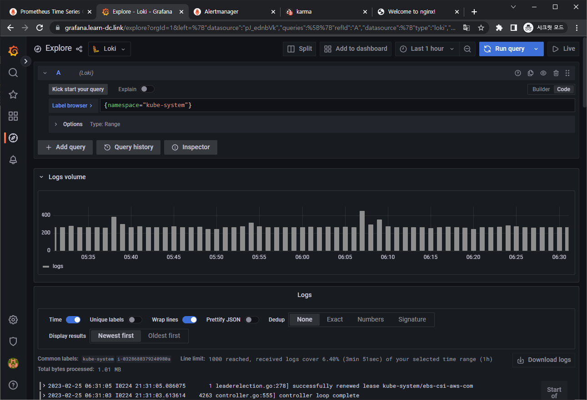

  - 특정 문자열을 포함하는 정규 표현식 활용
    - {namespace="kube-system"} |~"(?i)successfully"
      - 

  - 특정 문자열을 제외한 로그 검색
    - {namespace="kube-system"} !="DEBUG"
      - 


#### 과제3

- 목표 : 아래 1,2 과제 중 하나를 해주시면 됩니다
  1. [Awesome Prometheus alerts](https://awesome-prometheus-alerts.grep.to/) 를 참고해서 스터디에서 배우지 않은 **Alert Rule** 생성 및 적용 후 관련 스샷을 올려주세요
  2. ~~**그라파나**에서 **그래프 이미지**를 포함한 **알람**을 **슬랙**에 전달하게 설정 후 관련 스샷을 올려주세요~~
- 수행결과
  - 


## 1. 실습 환경 세팅

### 1.1 구성 환경

- 사전 준비
  - AWS 계정, SSH 키 페어, IAM 계정 생성 후 키, S3 버킷
- 전체 구성도
  - 기본 구성 환경은 1주차 내용과 동일
- 실습 환경 내용
  - CloudFormation 스택 실행 시 파라미터를 기입하면, 해당 정보가 반영되어 배포됩니다.
  - VPC는 kOps 배포를 위한 EC2가 위치할 MyVPC 1개와 실제 kOps 가 배포되어 구동되는 VPC 1개로 총 2개가 생성됩니다.
  - CloudFormation 에 EC2의 UserData 부분(Script 실행)으로 AWS kOps 설치를 진행합니다.
  - 마스터 노드 1대, 워커 노드는 기본은 2대로 구성됩니다.
  - 실습 환경은 지난 주차와 다르게 노드 사양은 c5.2xlarge(vCPU 8, Memory 16GiB) 으로 진행 됩니다.


### 1.2 실습 환경

- 본 실습은 **미국 동부(버지니아 북부) `us-east-1`** 에서 진행됩니다.

#### 1.2.1 S3 버킷 생성

1. S3 URL 접속
   - https://s3.console.aws.amazon.com/s3/buckets?region=us-east-1
2. 버킷 만들기 버튼 클릭
   - 
3. 버킷 만들기
   - 버킷 이름 설정 후 기본 설정 그대로 버킷 만들기 버튼 클릭
     - 버킷 이름 : 20230223-learn-s3-mybucket
   - 


#### 1.2.2 Cloud Formation을 이용한 kOps 생성(이하 배포)

1. Cloud Formation URL 접속 및 스택 생성 버튼 클릭

   - https://us-east-1.console.aws.amazon.com/cloudformation/home?region=us-east-1#/stacks
   - 

2. 스택 생성 - 1단계 스택 생성

   - 템플릿 소스 URL 입력 - Amazon S3 URL
     - https://s3.ap-northeast-2.amazonaws.com/cloudformation.cloudneta.net/K8S/kops-oneclick.yaml
   - 

3. 스택 생성 - 2단계 스택 세부 정보 지정

   - 스택 이름

     - 스택 이름 : mkops
     - 

   - 파라미터

     - <<<<< Deploy EC2 : kops-ec2 >>>>>

       - 설정 설명
         - KeyName : kops-ec2에 SSH 접속을 위한 SSH 키페어 선택 *<- 미리 SSH 키 생성 해두자!*
         - MyIamUserAccessKeyID : 관리자 수준의 권한을 가진 IAM User의 액세스 키ID 입력
         - MyIamUserSecretAccessKey : 관리자 수준의 권한을 가진 IAM User의 시크릿 키ID 입력 <- 노출되지 않게 보안 주의
         - SgIngressSshCidr : kops-ec2에 SSH 접속 가능한 IP 입력 (집 공인IP/32 입력), 보안그룹 인바운드 규칙에 반영됨
         - LatestAmiId : kops-ec2에 사용할 AMI는 아마존리눅스2 최신 버전 사용, 기본값 그대로 사용
       - 설정 내용
         - 사용자 설정 입력
       - 

     - <<<<< AWS kOps Config >>>>>

       - 설정 설명

         - KubernetesVersion : 쿠버네티스 설치 버전 (기본 v1.24.9) ⇒ 변경 가능

         - ClusterBaseName : kOps 클러스터 이름이며, 사용하게될 도메인 이름이다. ‘퍼블릭 도메인’ or ‘프라이빗 도메인’ or ‘Gossip DNS’ 가능

         - S3StateStore : kOps 클러스터의 설정/상태 정보가 저장될 S3 버킷의 이름을 지정 *← 미리 S3 버킷을 생성 해두자!*

         - MasterNodeInstanceType & WorkerNodeInstanceType: 마스터(기본 t3.medium) & 워커 노드 EC2 인스턴스의 타입 (기본 t3.medium) ⇒ 변경 가능

         - WorkerNodeCount : 워커노드의 갯수를 입력 ⇒ 변경 가능

         - VpcBlock : kOps 배포되고 동작할 VPC 네트워크 대역, 기본값 그대로 사용

       - 설정 내용

         - 다음 설정 외 기본 설정 사용
           - ClusterBaseName
             - learn-dc.link
           - S3StateStore : 위에 생성한 버킷 명칭 입력
             - 20230223-learn-s3-mybucket
           - MasterNodeInstanceType & WorkerNodeInstanceType
             - c5.2xlarge

       - 

     - <<<<< Region AZ >>>>>

       - 설정 설명
         - TargetRegion : kOps를 배포할 리전
         - AvailabliltyZone1 : kOps를 배포할 리전의 가용 영역
         - AvailabliltyZone2 : kOps를 배포할 리전의 가용 영역
       - 설정 내용
         - TargetRegion : us-east-1
         - AvailabliltyZone1 : us-east-1a
         - AvailabliltyZone2 : us-east-1c
       - 

   - 다음 버튼 클릭

     - 

4. 스택 생성 - 3단계 스택 옵션

   - 기본 설정 그대로 다음 버튼 클릭
     - 

5. 스택 생성 - 4단계 mkops 검토

   - 스택 파라미터 설정 확인
     - 
   - 기본 설정 그대로 전송 버튼 클릭
     - 

6. 스택 생성 확인 및 접속 IP 확인

   - 스택 생성 확인
     - 
   - 접속 IP 확인
     - KOPSEC2IP : 54.92.205.50
     - 


#### 1.2.3 kOps 배포 확인

##### 1. 접속 후 기본 설정

- 마스터노드 SSH 접속 - Putty

  - 

- default NS 진입

  - ```bash
    kubectl ns default
    ```

    - 


### 1.3 기타 설정 및 배포 - 약 9분 정도 소요

#### 1.3.1 EC2 instance profiles 설정

- EC2 instance profiles 에 IAM Policy 추가(attach)

  - ```bash
    aws iam attach-role-policy --policy-arn arn:aws:iam::$ACCOUNT_ID:policy/AWSLoadBalancerControllerIAMPolicy --role-name masters.$KOPS_CLUSTER_NAME
    aws iam attach-role-policy --policy-arn arn:aws:iam::$ACCOUNT_ID:policy/AWSLoadBalancerControllerIAMPolicy --role-name nodes.$KOPS_CLUSTER_NAME
    aws iam attach-role-policy --policy-arn arn:aws:iam::$ACCOUNT_ID:policy/AllowExternalDNSUpdates --role-name masters.$KOPS_CLUSTER_NAME
    aws iam attach-role-policy --policy-arn arn:aws:iam::$ACCOUNT_ID:policy/AllowExternalDNSUpdates --role-name nodes.$KOPS_CLUSTER_NAME
    ```

    - 


#### 1.3.2 AWS LoadBalancer 배포 & ExternalDNS & Metrics-server 설치 및 배포

- kOps 클러스터 편집 : 아래 내용 추가

  - ```bash
    kops edit cluster
    # ...
    # spec:
    #   certManager:
    #     enabled: true
    #   awsLoadBalancerController:
    #     enabled: true
    #   externalDns:
    #     provider: external-dns
    #   metricsServer:
    #     enabled: true
    #   kubeProxy:
    #     metricsBindAddress: 0.0.0.0
    # ...
    ```

    - 

- 업데이트 적용 : 모든 노드 롤링업데이트 필요 >> 마스터 EC2인스턴스 삭제 후 재생성 후 정상 확인 후, 워커노드 EC2인스턴스 생성 후 Join 후 삭제 과정 진행됨

  - ```bash
    kops update cluster --yes && echo && sleep 3 && kops rolling-update cluster --yes
    ```

    - 
    - 

- EC2 인스턴스 모니터링

  - ```bash
    while true; do aws ec2 describe-instances --query "Reservations[*].Instances[*].{PublicIPAdd:PublicIpAddress,InstanceName:Tags[?Key=='Name']|[0].Value,Status:State.Name}" --output text | sort; echo "------------------------------" ;date; sleep 1; done
    ```

    - 


### 1.4 Metrics-server 확인

- 메트릭 서버 확인 : 메트릭은 15초 간격으로 cAdvisor를 통하여 가져옴

  - ```bash
    kubectl get pod -n kube-system -l k8s-app=metrics-server
    kubectl top node
    kubectl top pod -A
    ```

    - 


### 1.5 프로메테우스-스택 설치 및 웹 접속

- 모니터링에 필요한 여러 요소를 단일 차트(스택)으로 제공 ← 시각화(그라파나), 이벤트 메시지 정책(경고 임계값, 경고 수준) 등 - [Helm](https://artifacthub.io/packages/helm/prometheus-community/kube-prometheus-stack)

- 사용 리전의 인증서 ARN 확인

  - ```bash
    CERT_ARN=`aws acm list-certificates --query 'CertificateSummaryList[].CertificateArn[]' --output text`
    echo $CERT_ARN
    ```

    - 

- 설치

  - ```bash
    kubectl create ns monitoring
    helm repo add prometheus-community https://prometheus-community.github.io/helm-charts
    ```

    - 

- 파라미터 파일 생성

  - ```bash
    cat <<EOT > ~/monitor-values.yaml
    
    alertmanager:
      ingress:
        enabled: true
        ingressClassName: alb
    
        annotations:
          alb.ingress.kubernetes.io/scheme: internet-facing
          alb.ingress.kubernetes.io/target-type: ip
          alb.ingress.kubernetes.io/listen-ports: '[{"HTTPS":443}, {"HTTP":80}]'
          alb.ingress.kubernetes.io/certificate-arn: $CERT_ARN
          alb.ingress.kubernetes.io/success-codes: 200-399
          alb.ingress.kubernetes.io/group.name: "monitoring"
    
        hosts:
          - alertmanager.$KOPS_CLUSTER_NAME
    
        paths:
          - /*
    
    
    grafana:
      defaultDashboardsTimezone: Asia/Seoul
      adminPassword: prom-operator
    
      ingress:
        enabled: true
        ingressClassName: alb
    
        annotations:
          alb.ingress.kubernetes.io/scheme: internet-facing
          alb.ingress.kubernetes.io/target-type: ip
          alb.ingress.kubernetes.io/listen-ports: '[{"HTTPS":443}, {"HTTP":80}]'
          alb.ingress.kubernetes.io/certificate-arn: $CERT_ARN
          alb.ingress.kubernetes.io/success-codes: 200-399
          alb.ingress.kubernetes.io/group.name: "monitoring"
    
        hosts:
          - grafana.$KOPS_CLUSTER_NAME
    
        paths:
          - /*
    
    prometheus:
      ingress:
        enabled: true
        ingressClassName: alb
    
        annotations:
          alb.ingress.kubernetes.io/scheme: internet-facing
          alb.ingress.kubernetes.io/target-type: ip
          alb.ingress.kubernetes.io/listen-ports: '[{"HTTPS":443}, {"HTTP":80}]'
          alb.ingress.kubernetes.io/certificate-arn: $CERT_ARN
          alb.ingress.kubernetes.io/success-codes: 200-399
          alb.ingress.kubernetes.io/group.name: "monitoring"
    
        hosts:
          - prometheus.$KOPS_CLUSTER_NAME
    
        paths:
          - /*
    
      prometheusSpec:
        serviceMonitorSelectorNilUsesHelmValues: false
        retention: 5d
        retentionSize: "10GiB"
    EOT
    ```

    - 
    - 

- 배포

  - ```bash
    helm install kube-prometheus-stack prometheus-community/kube-prometheus-stack --version 45.0.0 -f monitor-values.yaml --namespace monitoring
    ```

    - 

- 확인

  - alertmanager-0 : 사전에 정의한 정책 기반(예: 노드 다운, 파드 Pending 등)으로 시스템 경고 메시지를 생성 후 경보 채널(슬랙 등)로 전송

  - ```bash
    helm list -n monitoring
    kubectl get-all -n monitoring
    kubectl get prometheus,alertmanager -n monitoring
    kubectl get prometheusrule -n monitoring
    kubectl get servicemonitors -n monitoring
    ```

    - 
    - 
    - 

- 프로메테우스 기본 사용 : 모니터링 그래프 → 경고 Alert 클릭 확인

  - 프로메테우스 ingress 도메인으로 웹 접속

    - ```bash
      echo -e "Prometheus Web URL = https://prometheus.$KOPS_CLUSTER_NAME"
      ```

      - 
      - 

  - 웹 상단 주요 메뉴 설명

    1. 경고(Alert) : 사전에 정의한 시스템 경고 정책(Prometheus Rules)에 대한 상황
    2. 그래프(Graph) : 프로메테우스 자체 검색 언어 PromQL을 이용하여 메트릭 정보를 조회 -> 단순한 그래프 형태 조회
    3. 상태(Status) : 경고 메시지 정책(Rules), 모니터링 대상(Targets) 등 다양한 프로메테우스 설정 내역을 확인
    4. 도움말(Help)

### 1.6 워커 노드 3번 추가

- https://kops.sigs.k8s.io/tutorial/working-with-instancegroups/

- EC2 인스턴스 모니터링

  - ```bash
    while true; do aws ec2 describe-instances --query "Reservations[*].Instances[*].{PublicIPAdd:PublicIpAddress,InstanceName:Tags[?Key=='Name']|[0].Value,Status:State.Name}" --output text | sort; echo "------------------------------" ;date; sleep 1; done
    ```

    - 

- 인스턴스그룹 정보 확인

  - ```bash
    kops get ig
    ```

    - 

- 노드 추가

  - ```bash
    kops edit ig nodes-us-east-1a --set spec.minSize=2 --set spec.maxSize=2
    ```

    - 

- 적용

  - ```bash
    kops update cluster --yes && echo && sleep 3 && kops rolling-update cluster
    ```

    - 

- 워커노드 증가 확인

  - ```bash
    while true; do kubectl get node; echo "------------------------------" ;date; sleep 1; done
    ```

    - 
    - 


### 1.7 그라파나 웹 접속 및 대시보드 추가

- TSDB 데이터를 시각화, 다양한 데이터 형식 지원(메트릭, 로그, 트레이스 등) - [링크](https://grafana.com/docs/grafana/latest/introduction/)

- 접속 정보 확인 및 로그인 : 기본 계정 - **admin / prom-operator**

  - ```bash
    # ingress 도메인으로 웹 접속
    echo -e "Grafana Web URL = https://grafana.$KOPS_CLUSTER_NAME"
    ```

    - 
    - 
    - 

- **대시보드 사용** : 기본 대시보드 사용

  `기본 대시보드`

  - 스택을 통해서 설치된 기본 대시보드 확인 : Dashboards → Browse
  - (대략) 분류 : 자원 사용량 - Cluster/POD Resources, 노드 자원 사용량 - Node Exporter, 주요 애플리케이션 - CoreDNS 등
    - 확인해보자 - K8S / CR / Cluster, Node Exporter / Use Method / Cluster

  `공식 대시보드 가져오기` - [링크](https://grafana.com/grafana/dashboards/?pg=docs-grafana-latest-dashboards)

  - [**1 Kubernetes All-in-one Cluster Monitoring KR**] Dashboard → Import → **13770** 입력 후 Load ⇒ 데이터소스(Prometheus 선택) 후 **Import** 클릭
  - [**Node Exporter Full**] Dashboard → Import → **1860** 입력 후 Load ⇒ 데이터소스(Prometheus 선택) 후 **Import** 클릭


### 1.8 얼럿매니저 웹 접속 & 얼럿매니저 대시보드 karma 사용

- https://github.com/prymitive/karma

- 얼럿매니저 웹 접속

  - ingress 도메인으로 웹 접속

    - ```bash
      echo -e "Alertmanager Web URL = https://alertmanager.$KOPS_CLUSTER_NAME"
      ```

      - 
      - 

  1. Alerts 경고: 시스템 문제 시 프로메테우스가 전달한 경고 메시지 목록을 확인
  2. Silences 일시 중지 : 계획 된 장애 작업 시 일정 기간 동안 경고 메시지를 받지 않을 때, 메시지별로 경고 메시지를 일시 중단 설정
  3. Statue 상태 : 얼럿매니저 상세 설정 확인

- [kops-ec2] 얼럿매니저 대시보드 karma 컨테이너로 실행 - [링크](https://github.com/prymitive/karma)

  - 실행

    - ```bash
      docker run -d -p 80:8080 -e ALERTMANAGER_URI=https://alertmanager.$KOPS_CLUSTER_NAME ghcr.io/prymitive/karma:latest
      ```

      - 

  - 확인

    - ```bash
      docker ps
      ```

      - 

- [자신의 PC] 얼럿매니저 대시보드 karma 웹 접속 주소 확인

  - ```bash
    echo -e "karma Web URL = http://$(aws cloudformation describe-stacks --stack-name mkops --query 'Stacks[*].Outputs[0].OutputValue' --output text)"
    ```

    - 
    - 


## 2. Alerting 얼럿매니저

### 2.1 개요

- `소개` : 프로메테우스의 임곗값 도달 시 경고 메시지를 얼럿매니저에 푸시 이벤트로 전달하고, 얼럿매지저는 이를 가공후 이메일/슬랙 등에 전달 - [링크](https://prometheus.io/docs/alerting/latest/alertmanager/)
  - 
    - 출처: https://www.oreilly.com/library/view/prometheus-up/9781492034131/ch18.html
- Alerting rules in **Prometheus** servers send alerts to an **Alertmanager**.
- The Alertmanager then manages those alerts, including silencing, inhibition, aggregation and sending out notifications via methods such as email, on-call notification systems, and chat platforms.
  - The Alertmanager handles alerts sent by client applications such as the Prometheus server.
  - It takes care of deduplicating, grouping, and routing them to the correct receiver integration such as email, PagerDuty, or OpsGenie.
  - It also takes care of silencing and inhibition of **alerts**.
  - 
    - 출처: https://prometheus.io/docs/introduction/overview/


### 2.2 실습

#### 2.2.1 프로메테우스 웹 Alert & 얼럿매니저 웹 karma

- 프로메테우스 웹 접속 후 상단 Alert 메뉴 확인 : 시스템 경고 정책은 prometheusrules CRD로 관리

  - **Inactive** 비활성화 : prometheusrules 중 경고가 활성화되지 않은 **정상**적인 상태
  - **Pending** 지연 : 설정한 **임곗값**을 초과해 경고 상황이지만 경고 메시지를 전달하기까지 **임곗값 시간**을 초과하지 않은 상태, 이를 통해 오탐과 자동 복구된 에러 메시지를 처리
  - **Firing** 경보 : 임곗값과 임곗값 시간을 초과해서 **경보**가 발생한 메시지. 해당 메시지는 **얼럿매니저**에 **전달**되어 얼럿매지저를 통해 **전파**됨

- 프로메테우스 룰 확인

  - ```bash
    kubectl get prometheusrules -n monitoring
    kubectl get prometheusrules -n monitoring kube-prometheus-stack-kubernetes-system-controller-manager -o json | jq
    ```

    - 
    - 

- 룰 전체 확인

  - ```bash
    kubectl get prometheusrules -n monitoring -o json | more
    ```

    - 

- 메트릭 이름 확인

  - ```bash
    kubectl get prometheusrules -n monitoring -o json | grep '"record":' | sed 's/^ *//'
    kubectl get prometheusrules -n monitoring -o json | grep '"record":' | sed 's/^ *//' | wc -l
    ```

    - 
    - 

- 얼럿 이름 확인

  - ```bash
    kubectl get prometheusrules -n monitoring -o json | grep '"alert":' | sed 's/^ *//'
    ```

    - 

- 얼럿 갯수 확인

  - ```bash
    kubectl get prometheusrules -n monitoring -o json | grep '"alert":' | sed 's/^ *//' | wc -l
    ```

    - 

- Inactive 클릭으로 체크해제해서 확인

  - 

- 얼럿매니저 **대시보드 karma** 웹 접속 확인 : 동일하게 3개의 얼럿 갯수 확인됨

  - 


#### 2.2.2 슬랙 채널 및 **웹훅 URL** 생성 및 **얼럿매니저 설정 적용**

- 책 350~360페이지, 참고 - [링크](https://prometheus.io/docs/alerting/latest/notification_examples/)

- 웹훅 URL 정보 : 스터디 슬랙 워크스페이스 → **#webhook** 채널

  - 웹훅 URL 정보

    - ```bash
      WEBHOOK='https://hooks.slack.com/services/{개인정보}'
      echo $WEBHOOK
      ```

      - 

  - 샘플 메시지 보내기

    - ```bash
      curl -X POST --data-urlencode "payload={\"channel\": \"#webhook\", \"username\": \"pkosbot\", \"text\": \"$KOPS_CLUSTER_NAME 다음주 종강! - 봇 제공\"}" $WEBHOOK
      curl -X POST --data-urlencode "payload={\"channel\": \"#webhook\", \"username\": \"pkosbot\", \"text\": \"$KOPS_CLUSTER_NAME 다음주 종강! - 봇 제공\", \"icon_emoji\": \":ghost:\"}" $WEBHOOK
      ```

      - 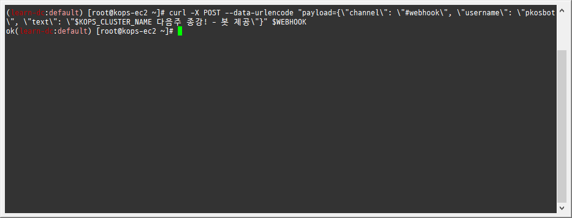
      - 
      - 

- 얼럿매니저에 웹훅 URL 정보 반영 - [링크](https://prometheus.io/docs/alerting/latest/notification_examples/)

  - 

    - ```bash
      cat <<EOT > ~/alertmanager-slack.yaml
      alertmanager:
        config:
          global:
            resolve_timeout: 5m
            slack_api_url: 'https://hooks.slack.com/services/<개인정보>'
          route:
            group_by: ['job']  # namespace
            group_wait: 10s
            group_interval: 1m
            repeat_interval: 5m
            receiver: 'slack-notifications'
            routes:
            - receiver: 'slack-notifications'
              matchers:
                - alertname =~ "InfoInhibitor|Watchdog"
          receivers:
          - name: 'slack-notifications'
            slack_configs:
            - channel: '#webhook'
              send_resolved: true
              title: '[{{.Status | toUpper}}] {{ .CommonLabels.alertname }}'
              text: |
                *Description:* {{ .CommonAnnotations.description }}
      EOT
      ```

      - 

    - helm 업그레이드로 얼럿매니저에 웹훅 URL 정보 반영

      - ```bash
        helm upgrade kube-prometheus-stack prometheus-community/kube-prometheus-stack --version 45.0.0 --reuse-values -f alertmanager-slack.yaml --namespace monitoring
        ```

        - 

    - 반영 확인 : 얼럿매니저 설정 파일에 반영(config reload)

      - ```bash
        kubectl describe pod -n monitoring alertmanager-kube-prometheus-stack-alertmanager-0
        kubectl exec -it -n monitoring alertmanager-kube-prometheus-stack-alertmanager-0 -- ls /etc/alertmanager/config
        ```

        - 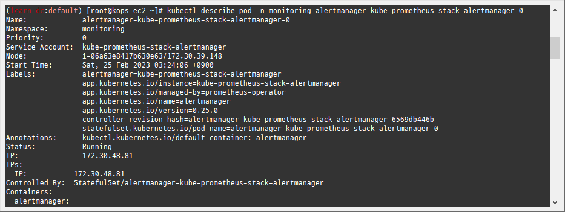
        - 
        - 

  

  - 얼럿매니저 웹 → Status : 아래 config 부분에 위 슬랙 정보, 타이머 정보 확인
    - 
    - 


#### 2.2.3 얼럿매니저 웹에서 일시 중지 **Silence** 기능 사용

- repeat_interval 5분 설정으로 경고 알람 미조치 시 5분 마다 반복 발생

  - 웹 확인 : 프로메테우스 Alert, 얼럿매니지 웹, karma 웹

  - **KubeClientCertificateExpiration**(버그로 보임) → Silence 클릭 후 설정 기간(Duration), 작성자(admin) 입력 후 아래 Create 선택 ⇒ 해당 기간 동안 알람 발생하지 않음

  - **Watchdog**(탐지견, 얼럿매니저 정상 동작 여부 확인 용도) → Silence 클릭 후 설정 기간(Duration), 작성자(admin) 입력 후 아래 Create 선택
    - 
    - 
    - 

#### 2.2.4 현재 **2개의 장애(경보)** 이슈 해결

- kube-controller-manager, kube-scheduler

- 프로메테우스 웹 → Status → Targets 확인 : kube-controller-manager, kube-scheduler 없음 확인

  - 레이블 셀렉터 Selector 정보 확인!

    - ```bash
      kubectl get svc,ep -n kube-system kube-prometheus-stack-kube-controller-manager
      kubectl describe svc -n kube-system kube-prometheus-stack-kube-controller-manager
      ```

      - 

  - kube-controller-manager 파드의 레이블 확인

    - ```bash
      kubectl get pod -n kube-system --show-labels | grep kube-controller-manager
      ```

      - 

  - 레이블 셀렉터 Selector 정보 확인!

    - ```bash
      kubectl get svc,ep -n kube-system kube-prometheus-stack-kube-scheduler
      kubectl describe svc -n kube-system kube-prometheus-stack-kube-scheduler
      ```

      - 

  - 파드의 레이블 확인

    - ```bash
      kubectl get pod -n kube-system --show-labels | grep kube-scheduler
      ```

      - 

  - 해결 : 방안1(파드에 레이블 추가), 방안2(프로메테우스-스택 배포 때 파리미터에 기입)

- **방안1** : 파드에 레이블 추가

  - 추가

    - ```bash
      kubectl label $(kubectl get pod -n kube-system -l k8s-app=kube-controller-manager -oname) -n kube-system component=kube-controller-manager
      ```

      - 

  - 확인

    - ```bash
      kubectl get svc,ep -n kube-system kube-prometheus-stack-kube-controller-manager
      ```

      - 

  - 추가

    - ```bash
      kubectl label $(kubectl get pod -n kube-system -l k8s-app=kube-scheduler -oname) -n kube-system component=kube-scheduler
      ```

      - 

  - 확인

    - ```bash
      kubectl get svc,ep -n kube-system kube-prometheus-stack-kube-scheduler
      ```

      - 

  

  - 프로메테우스 웹 Status → Targets 확인
    - 

  - 프로메테우스 웹 Alerts 확인
    - 
    - 
    - 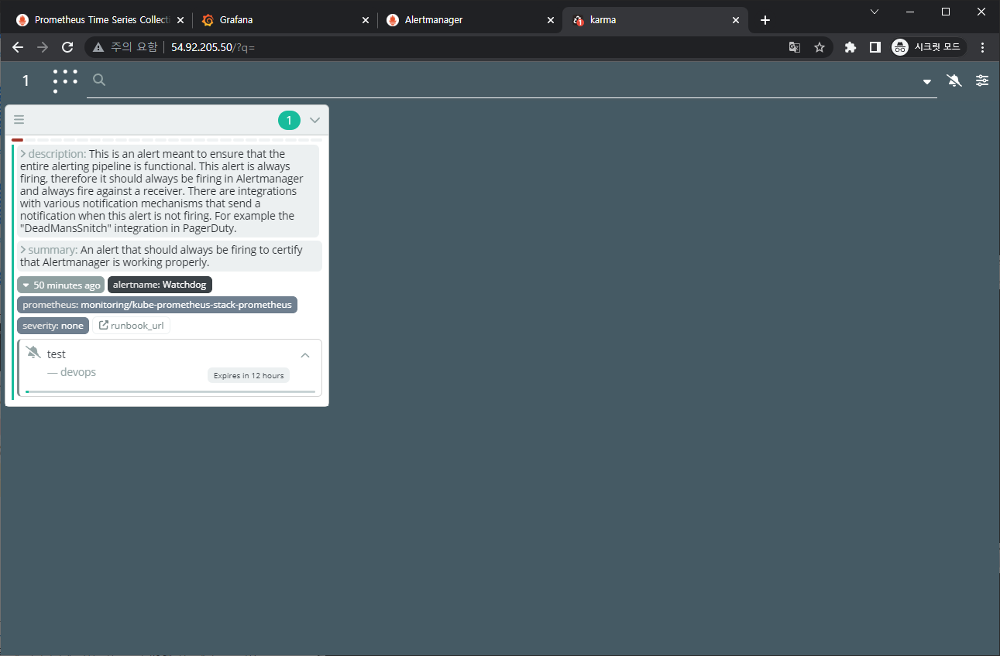
    - 

  - (참고) 그라파나 대시보드에서 ‘스케줄러, 컨트롤러 매니저’ 확인

- (참고) 방안2 : **프로메테우스-스택** helm 배포 때 파리미터에 기입 혹은 스택 helm 업그레이드로 적용 - [Helm](https://artifacthub.io/packages/helm/prometheus-community/kube-prometheus-stack)

  - ```bash
    # ...
    kubeControllerManager:
        enabled: true
    
        service:
          enabled: true
          selector:
            k8s-app: kube-controller-manager
    # ...
    kubeScheduler:
        enabled: true
    
        service:
          enabled: true
          selector:
            k8s-app: kube-controller-manager
    # ...
    ```

- **[장애 재현] 워커 노드 3번 kubelet down** → 얼럿매니저 기능 검증 : **워커 노드 3번 다운 감지**(TargetDown → Kube…)

  - 모니터링

    - ```bash
      while true; do kubectl get node; echo "------------------------------" ;date; sleep 1; done
      ```

      - 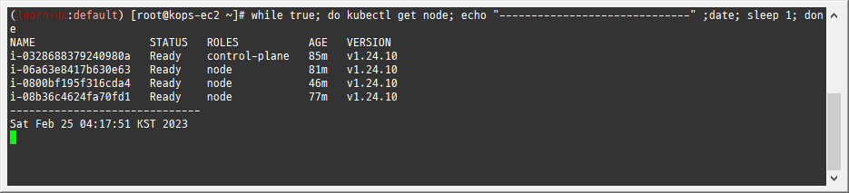

  - 

    - ```bash
      # WNODE3=<자신의 워커노드 3번 퍼블릭 IP>
      WNODE3=44.211.147.233
      echo $WNODE3
      ssh -i ~/.ssh/id_rsa ubuntu@$WNODE3 hostname
      ```

      - 

  - 워커노드 3번 kubelet 강제 stop

    - ```bash
      ssh -i ~/.ssh/id_rsa ubuntu@$WNODE3 sudo systemctl stop kubelet
      ssh -i ~/.ssh/id_rsa ubuntu@$WNODE3 sudo systemctl status kubelet
      ```

      - 

  

  - 프로메테우스 Alerts(Pending 도 체크) vs 얼럿매니저 웹 상태 변화를 잘 관찰해보자!
    - 
    - 

  - 슬랙 채널 알람 확인 → 프로메테우스 Alerts , 얼럿매니저 웹, karma 에서 확인

    - TargetDown 은 10분간 Pending 상태에 있다가 지속시 Firing 으로 변경 -> 이후 얼럿매니저를 통해서 슬랙 알람 발생

      - ```bash
        kubectl get prometheusrules -n monitoring -o json | grep TargetDown -B1 -A11
        ```

        - 
        - 
        - 
        - 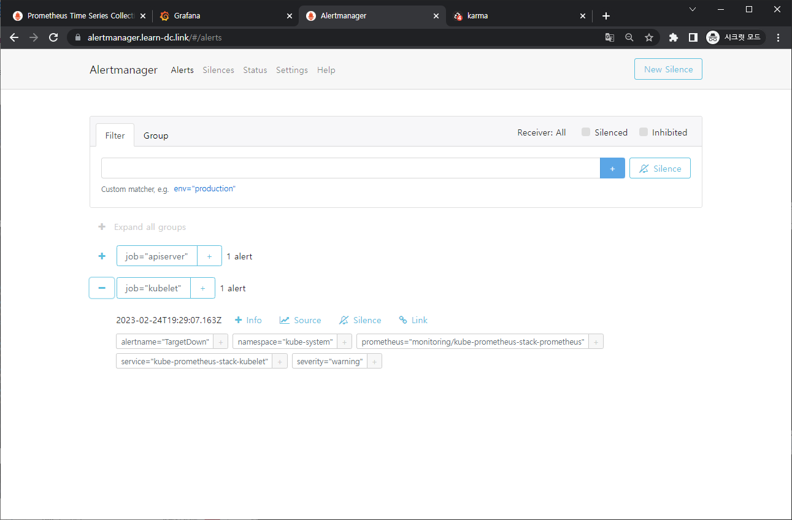
        - 

  - 얼럿매니저 웹에서 일시 중지 Silence 기능 설정

    - 10분 후 TargetDown 경보 알람 → Silence 클릭 후 설정 기간(Duration), 작성자(admin) 입력 후 아래 Create 선택 ⇒ 해당 기간 동안 알람 발생하지 않음

  - 장애 정보 확인 후 워커 노드 3번 kubelet 다시 start ⇒ Silence Expire 로 제거

    - 워커노드 3번 kubelet start

      - ```bash
        ssh -i ~/.ssh/id_rsa ubuntu@$WNODE3 sudo systemctl start kubelet
        ssh -i ~/.ssh/id_rsa ubuntu@$WNODE3 sudo systemctl status kubelet
        ```

        - 
        - 
        - 
        - 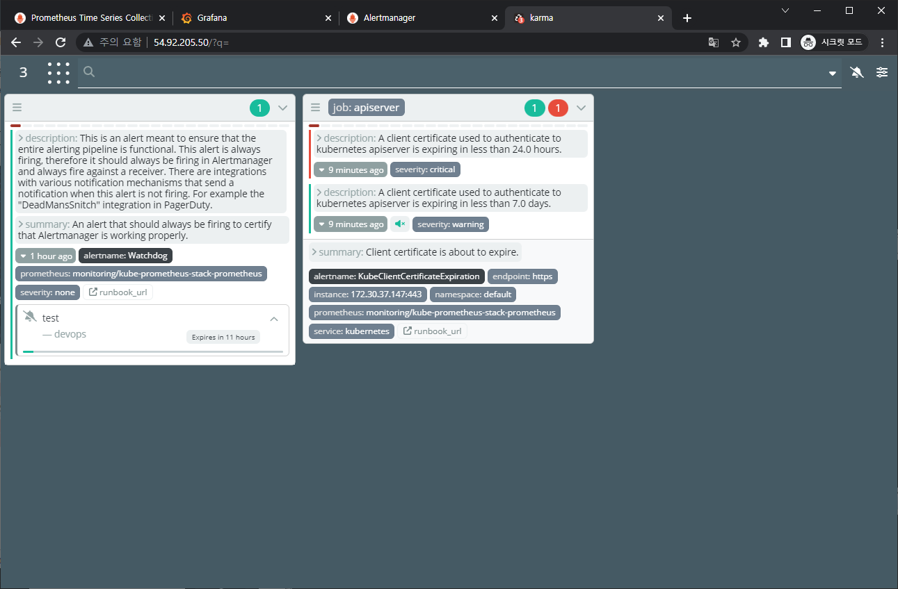
        - 

#### 2.2.5 (참고) 그라파나 얼럿 Docs

- https://grafana.com/docs/grafana/latest/alerting/
- 
  - 출처: 

https://grafana.com/docs/grafana/latest/alerting/

- Grafana - **Image** Render Plugin & Slack Alert 연동 - [링크](https://aws-diary.tistory.com/118)
- 그라파나 이미지를 포함한 슬랙 알럿 설정 - [링크](https://lcc3108.github.io/articles/2021-03/grafana-slack-alert)


### 2.3 과제1

- 목표: 책 367~372페이지 - 사용자 정의 prometheusrules 정책 설정 : 파일 시스템 사용률 80% 초과 시 시스템 경고 발생시키기 ⇒ 직접 실습 후 관련 스샷을 올려주세요

- 수행결과 및 과정

  - 참고: https://somaz.tistory.com/171

  - 교재 참고자료 clone

    - ```bash
      git clone https://github.com/wikibook/kubepractice.git
      ```

      - 

  - 디렉터리 구분을 위해 ch19로 이동

    - ```bash
      cd ~/kubepractice/ch19
      kubectl krew install neat
      k ns monitoring
      k get prometheusrules.monitoring.coreos.com |grep node-exporter
      ```

      - 
      - 
      - 
      - 

  - 'prometheus-kube-prometheus-node-exporter'를 YAML 파일로 익스포트

    - ```bash
      k get prometheusrules.monitoring.coreos.com kube-prometheus-stack-node-exporter -o yaml|k neat > node-exporter-prometheusrules.yaml
      ```

      - 

  - node-exporter-prometheusrules.yaml 수정

    - ```bash
      vim node-exporter-prometheusrules.yaml
      
      # ...
      #     - alert: NodeFilesystemAlmostOutOfSpace-20
      #       annotations:
      #         description: Filesystem on {{ $labels.device }} at {{ $labels.instance }}
      #           has only {{ printf "%.2f" $value }}% available space left.
      #         runbook_url: https://github.com/kubernetes-monitoring/kubernetes-mixin/tree/master/runbook.md#alert-name-nodefilesystemalmostoutofspace
      #         summary: Filesystem has less than 20% space left.
      #       expr: |-
      #         (
      ### 여유 공간이 20% 미만이면 경고 발생
      #           node_filesystem_avail_bytes{job="node-exporter",fstype!=""} / node_filesystem_size_bytes{job="node-exporter",fstype!=""} * 100 < 20
      #         and
      #           node_filesystem_readonly{job="node-exporter",fstype!=""} == 0
      #         )
      ### 10분 동안 동일한 상태이면 경고 발생
      #       for: 10m
      #       labels:
      #         severity: warning
      # ...
      ```

      - 

  - 수정한 YAML 파일을 적용해 새로운 prometheusrules 경고 정책을 추가

    - ```bash
      alias ka='kubectl apply --recursive -f'
      ka node-exporter-prometheusrules.yaml
      ```

      - 
      - 

  - 노드에 접속 후 임의의 큰 파일 생성

    - ```bash
      # WNODE3=<자신의 워커노드 3번 퍼블릭 IP>
      WNODE3=44.211.147.233
      echo $WNODE3
      ssh -i ~/.ssh/id_rsa ubuntu@$WNODE3
      df -h
      ```

      - 
      - 

    - ```bash
      sudo fallocate /var/100g -l 100g
      df -h
      ```

      - 

  - 확인

    - 
    - 
    - 
    - 
    - 


### 2.4 과제3

- 목표: [Awesome Prometheus alerts](https://awesome-prometheus-alerts.grep.to/) 를 참고해서 스터디에서 배우지 않은 Alert Rule 생성 및 적용 후 관련 스샷을 올려주세요

- 수행결과 및 과정

  - 과제1 수행간 수정한 node-exporter-prometheusrules.yaml 수정

    - ```bash
      vim node-exporter-prometheusrules.yaml
      
      # ...
      #     - alert: HostOutOfMemory
      #       expr: node_memory_MemAvailable_bytes / node_memory_MemTotal_bytes * 100 < 10
      #       for: 2m
      #       labels:
      #         severity: warning
      #       annotations:
      #         summary: Host out of memory (instance {{ $labels.instance }})
      #         description: "Node memory is filling up (< 10% left)\n  VALUE = {{ $value }}\n  LABELS = {{ $labels }}"
      # ...
      ```

      - 

  - 정한 YAML 파일을 적용해 새로운 prometheusrules 경고 정책을 추가

    - ```bash
      ka node-exporter-prometheusrules.yaml
      ```

      - 

  - 확인

    - 


## 3. PLG 스택

### 3.1 개요

- PLG Stack 소개 : Promtail + Loki + Grafana 여러 파드의 로그들을 중앙 서버에 저장하고 이를 조회- [링크](https://grafana.com/docs/loki/latest/)
  - 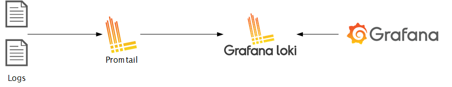
    - 출처: https://www.infracloud.io/blogs/logging-in-kubernetes-efk-vs-plg-stack/
- **Loki**에 저장한 로그는 LogQL(PromQL과 유사)을 이용해 조회 할 수 있으며, 그라파나 웹이나 logcli를 이용해 조회 가능 - [링크](https://grafana.com/docs/loki/latest/fundamentals/architecture/)
  - 전체 로그 기반 인덱스를 생성하지 않고, 메타데이터를 기준으로 인덱스를 생성하여 자원 사용량이 현저히 적음
  - 
    - 출처: https://grafana.com/docs/loki/latest/fundamentals/architecture/components/
- Promtail은 데몬셋으로 실행되며 각 로그에 로그를 중앙 로키 서버에 전달, Promtail 외에도 도커, FluentD 등 다른 로그수집 에이전트 사용 할 수 있다


### 3.2 실습

#### 3.2.1 NGINX 웹서버 배포

- 

  - ```bash
    helm repo add bitnami https://charts.bitnami.com/bitnami
    ```

    - 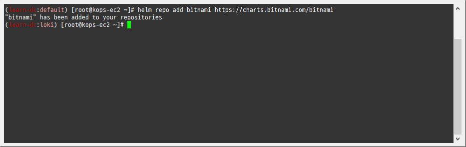

- 파라미터 파일 생성 : 서비스 모니터 방식으로 nginx 모니터링 대상을 등록하고, export 는 9113 포트 사용, nginx 웹서버 노출은 AWS CLB 기본 사용

  - ```bash
    cat <<EOT > ~/nginx-values.yaml
    metrics:
      enabled: true
    
      service:
        port: 9113
    
      serviceMonitor:
        enabled: true
        namespace: monitoring
        interval: 10s
    EOT
    ```

    - 

- 배포

  - ```bash
    helm install nginx bitnami/nginx --version 13.2.27 -f nginx-values.yaml
    ```

    - 

- CLB에 ExternanDNS 로 도메인 연결

  - ```bash
    kubectl annotate service nginx "external-dns.alpha.kubernetes.io/hostname=nginx.$KOPS_CLUSTER_NAME"
    ```

    - 

- 확인

  - ```bash
    kubectl get pod,svc,ep
    kubectl get servicemonitor -n monitoring nginx
    kubectl get servicemonitor -n monitoring nginx -o json | jq
    ```

    - 
    - 

- nginx 파드내에 컨테이너 갯수 확인

  - ```bash
    kubectl get pod -l app.kubernetes.io/instance=nginx
    kubectl describe pod -l app.kubernetes.io/instance=nginx
    ```

    - 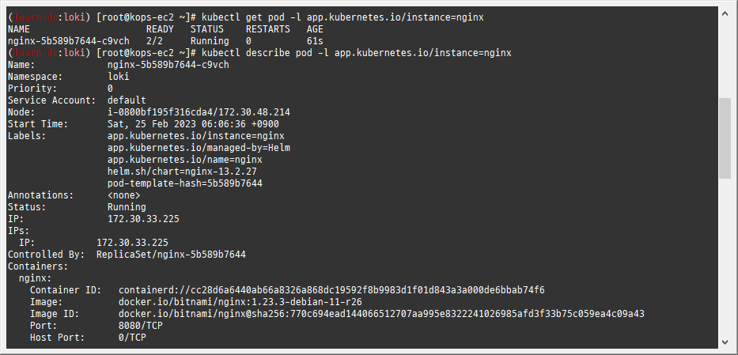

- 접속 주소 확인 및 접속

  - ```bash
    echo -e "Nginx WebServer URL = http://nginx.$KOPS_CLUSTER_NAME"
    curl -s http://nginx.$KOPS_CLUSTER_NAME
    kubectl logs deploy/nginx -f
    ```

    - 
    - 
    - 
    - 

- 반복 접속

  - ```bash
    while true; do curl -s http://nginx.$KOPS_CLUSTER_NAME -I | head -n 1; date; sleep 1; done
    ```

    - 

- (참고) 삭제 시

  - ```bash
    helm uninstall nginx
    ```

#### 3.2.2 컨테이너 로그 표준 출력

- 컨테이너 로그 환경의 로그는 표준 출력 stdout과 표준 에러 stderr로 보내는 것을 권고 - [링크](https://docs.docker.com/config/containers/logging/)

  - 해당 권고에 따라 작성된 컨테이너 애플리케이션의 로그는 해당 파드 안으로 접속하지 않아도 사용자는 외부에서 kubectl logs 명령어로 애플리케이션 종류에 상관없이, 애플리케이션마다 로그 파일 위치에 상관없이, 단일 명령어로 조회 가능

  - 로그 모니터링

    - ```bash
      kubectl logs deploy/nginx -c nginx -f
      ```

      - 

  - nginx 웹 접속 시도

  - 컨테이너 로그 파일 위치 확인

    - ```bash
      kubectl exec -it deploy/nginx -c nginx -- ls -l /opt/bitnami/nginx/logs/
      ```

      - 

- (참고) nginx docker log collector 예시 - [링크](https://github.com/bitnami/containers/blob/main/bitnami/nginx/1.23/debian-11/Dockerfile#L42-L43) [링크](https://github.com/nginxinc/docker-nginx/blob/8921999083def7ba43a06fabd5f80e4406651353/mainline/jessie/Dockerfile#L21-L23)

  - 

    - ```bash
      RUN ln -sf /dev/stdout /opt/bitnami/nginx/logs/access.log
      RUN ln -sf /dev/stderr /opt/bitnami/nginx/logs/error.log
      ```

      - 

  - forward request and error logs to docker log collector

    - ```bash
      RUN ln -sf /dev/stdout /var/log/nginx/access.log \
       && ln -sf /dev/stderr /var/log/nginx/error.log
      ```

      - 

- 또한 종료된 파드의 로그는 kubectl logs로 조회 할 수 없다

- kubelet 기본 설정은 로그 파일의 최대 크기가 10Mi로 10Mi를 초과하는 로그는 전체 로그 조회가 불가능함

#### 3.2.1 Loki & Promtail 헬름 차트로 설치 - [Helm](https://artifacthub.io/packages/helm/grafana/loki) [Single](https://grafana.com/docs/loki/latest/installation/helm/install-monolithic/) & [Helm](https://artifacthub.io/packages/helm/grafana/promtail)

- Loki 설치

  - 모니터링

    - ```bash
      kubectl create ns loki
      watch kubectl get pod,pvc,svc,ingress -n loki
      ```

      - 
      - 

  - Repo 추가

    - ```bash
      helm repo add grafana https://grafana.github.io/helm-charts
      ```

      - 

  - 파라미터 설정 파일 생성

    - ```bash
      cat <<EOT > ~/loki-values.yaml
      persistence:
        enabled: true
        size: 20Gi
      
      serviceMonitor:
        enabled: true
      EOT
      ```

      - 

  - 배포

    - ```bash
      helm install loki grafana/loki --version 2.16.0 -f loki-values.yaml --namespace loki
      ```

      - 
      - 

  - 설치 확인 : 데몬셋, 스테이트풀셋, PVC 확인

    - ```bash
      helm list -n loki
      kubectl get pod,pvc,svc,ds,sts -n loki
      kubectl get-all -n loki
      kubectl get servicemonitor -n loki
      kubectl krew install df-pv && kubectl df-pv
      ```

      - 
      - 
      - 

  - curl 테스트 용 파드 생성

    - ```bash
      kubectl apply -f ~/pkos/2/netshoot-2pods.yaml
      ```

      - 

  - 로키 gateway 접속 확인

    - ```bash
      kubectl exec -it pod-1 -- curl -s http://loki.loki.svc:3100/api/prom/label
      ```

      - 

  - (참고) 삭제 시

    - ```bash
      helm uninstall loki -n loki
      kubectl delete pvc -n loki --all
      ```

- Promtail 설치

  - 파라미터 설정 파일 생성

    - ```bash
      cat <<EOT > ~/promtail-values.yaml
      serviceMonitor:
        enabled: true
      config:
        serverPort: 3101
        clients:
          - url: http://loki-headless:3100/loki/api/v1/push
      #defaultVolumes:
      #  - name: pods
      #    hostPath:
      #      path: /var/log/pods
      EOT
      ```

      - 

  - 배포

    - ```bash
      helm install promtail grafana/promtail --version 6.0.0 -f promtail-values.yaml --namespace loki
      ```

      - 
      - 

  - (참고) 파드 로그는 /var/log/pods에 저장

    - ```bash
      ssh -i ~/.ssh/id_rsa ubuntu@api.$KOPS_CLUSTER_NAME ls /var/log/pods
      ```

      - 

  - 설치 확인 : 데몬셋, 스테이트풀셋, PVC 확인

    - ```bash
      helm list -n loki
      kubectl get pod,pvc,svc,ds,sts,servicemonitor -n loki
      kubectl get-all -n loki
      ```

      - 
      - 
      - 

  - (참고) 삭제 시

    - ```bash
      helm uninstall promtail -n loki
      ```


#### 3.2.2 그라파나에서 로그 확인

- 그라파나 → Configuration → Data Source : 데이터 소스 추가 ⇒ Loki 클릭

  - HTTP URL : http://loki-headless.loki:3100 ⇒ Save & Test
    - 

- nginx 반복 접속

  - 접속 주소 확인 및 접속

    - ```bash
      kubectl logs deploy/nginx -f
      ```

      - 

  - 반복 접속

    - ```bash
      while true; do curl -s http://nginx.$KOPS_CLUSTER_NAME -I | head -n 1; date; sleep 1; done
      ```

      - 

  

- 그라파나 → Explore : 상단 데이터 소스 Loki 선택

  - Logfilters : Job → default/nginx 값 선택 ⇒ 우측 상단 Run query 클릭
    - 

  - 임의의 로그 클릭 : 상세 정보 확인 - 파드 레이블, 네임스페이스, 잡 등 전체 로그 레이블 확인 가능
    - 

  - Logfilters : node_name → 아무 노드 선택 ⇒ 우측 상단 Run query 클릭
    - 


### 3.3 과제2

- 목표: 책 386~389페이지 - LogQL 사용법 익히기 ⇒ 직접 실습 후 관련 스샷을 올려주세요
- 수행결과 및 과정
  - 로키에서 네임스페이스 로그 검색
    - {namespace="kube-system"}
      - 
  - 특정 문자열을 포함하는 정규 표현식 활용
    - {namespace="kube-system"} |~"(?i)successfully"
      - 
  - 특정 문자열을 제외한 로그 검색
    - {namespace="kube-system"} !="DEBUG"
      - 


## 4. 실습 완료 후 자원 삭제

### 4.1 헬름 차트 삭제

- nginx 삭제

  - ```bash
    helm uninstall nginx
    ```

    - 

- promtail 삭제

  - ```bash
    helm uninstall promtail -n loki
    ```

- loki 삭제

  - ```bash
    helm uninstall loki -n loki
    kubectl delete pvc -n loki --all
    ```

- 프로메테우스 스택 삭제

  - ```bash
    helm uninstall -n monitoring kube-prometheus-stack
    ```

    - 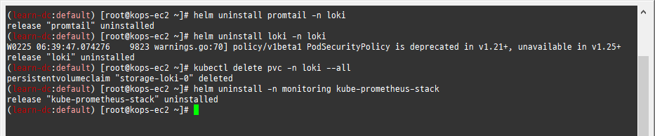

### 4.2 kOps 클러스터 삭제 & AWS CloudFormation 스택 삭제

- ```bash
  kops delete cluster --yes && aws cloudformation delete-stack --stack-name mykops
  ```

  - 
  - 
