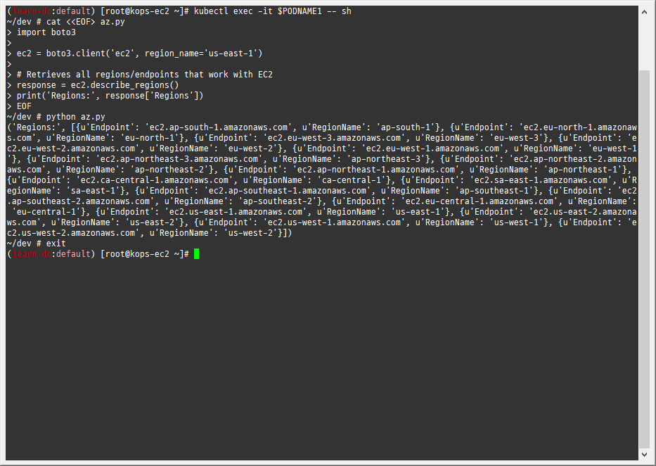
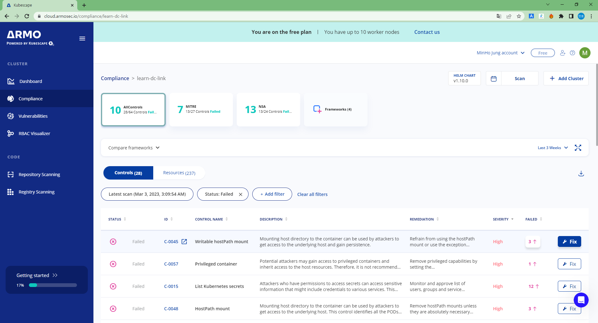

# PKOS 7주차

### 과제 수행결과

- 과제 수행과정은 블로그 본문에 자세히 기술했습니다.

#### 과제1

- 목표 : 파드에서 EC2 메타데이터의 IAM Role 토큰 정보를 활용하여(boto3), 스터디에서 소개한 것 이외의 다른 AWS 서비스(혹은 Action)를 사용 후 코드나 스샷을 올려주세요

- 수행결과
  - 

#### 과제2

- 목표 : 책 398~400페이지 - kubescape armo 웹 사용 후 관련 스샷을 올려주세요

- 수행결과
  - 

#### 과제3

- 목표 : polaris 관련 실습(아무거나) 후 관련 스샷을 올려주세요

- 수행결과
  - 

#### 과제4

- 목표 : 신규 서비스 어카운트(SA) 생성 후 '클러스터 수준(모든 네임스페이스 포함)에서 읽기 전용'의 권한을 주고 테스트 후 코드나 스샷을 올려주세요

- 수행결과
  - 
