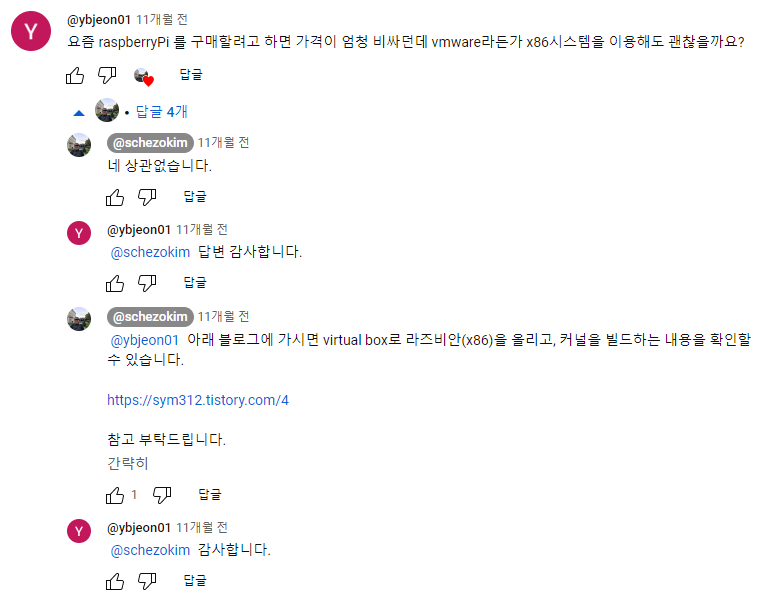
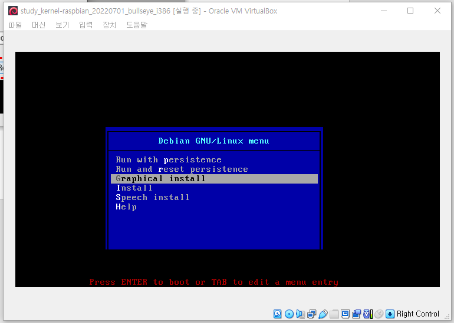
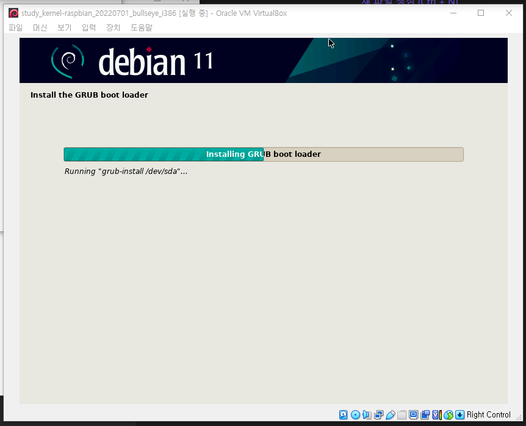
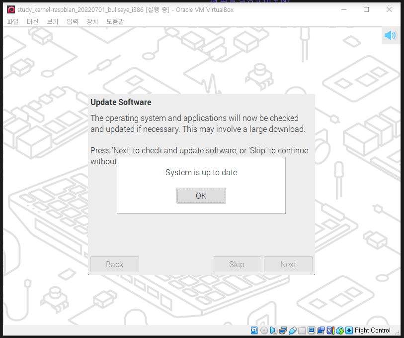

---

# 리눅스 커널 분석 환경 구축

## 1. 구축환경

### 1.1. 개요

저는 현재 VitualBox를 이용해 Ubuntu LTS 22.04 와 라즈베리파이3B 보드를 이용해 Rasbian 두 환경에서 리눅스 커널 분석 환경 구축을 완료했습니다. 이 글을 작성하는 이유는 어떤 누군가가 리눅스 커널 분석 환경을 구축함에 있어 조금이나마 시행착오를 덜 겪길 바라는 마음에 작성하게 되었습니다.

리눅스 커널 분석 환경을 두가지로 구축해보려고 하는데, 그 이유는 커널 스터디에서는 Ubuntu 환경으로 진행하고 제가 참고하는 도서에선 라즈베리파이3B를 이용하기 때문입니다.

1. Ubuntu - LTS 22.04.02
   - https://www.kernel.bz/boardPost/137459/2
2. Raspbian - 2022-07-01-raspios-bullseye-i386
   - http://rousalome.egloos.com/10008229

그리고 김동현 저자님께서 Virtual Box를 이용해도 괜찮냐는 질문에 상관없다는 답변을 해주시기도 했습니다.  그러시곤 한 블로그를 소개해 주셨는데 저도 그 블로그 참고해 Raspbian을 설치할 예정입니다.

- 
  - Virtual Box(버추얼 박스)에 리눅스(라즈비안)를 올려보자: https://sym312.tistory.com/1
  - 라즈비안 커널 소스 다운 & 빌드(raspbian kernel source download & build): https://sym312.tistory.com/4

마지막으로 본 글에서 구축되는 PC 환경 정보는 다음과 같습니다.

- 시스템 정보

  - 
    - OS: Windows 10, 21H2
    - CPU: Intel(R) Core(TM) i7-6700 CPU @ 3.40GHz   3.40 GHz
    - RAM: 48 GB
    - HDD: 2 TB
    - ETC: 64비트 운영 체제, x64 기반 프로세서

### 1.2 공통 사항

- VitualBox
  - VitualBox 7.0.6: https://www.virtualbox.org/wiki/Downloads
    - VitualBox platform packages 및 Extension Pack 다운로드 및 설치
      - 
    - VitualBox platform packages 설치간 Visual C++ 2019 에러 발생시 다음 링크에서 x64 아키텍처 다운로드
      - 참고: 
        - https://olppaemmit.tistory.com/216
        - https://devmango.tistory.com/176
      - https://learn.microsoft.com/ko-kr/cpp/windows/latest-supported-vc-redist?view=msvc-170
        - https://aka.ms/vs/17/release/vc_redist.x64.exe
        - 

- 파일관리
  - VitualBox에서 사용되는 커널 코드 및 기타 파일은 공유폴더를 이용해 관리할 계획입니다.
    - 

### 1.3 Ubuntu - LTS 22.04

#### 1.3.1 준비사항

- Ubunutu

  - LTS 22.04: https://ubuntu.com/download/desktop
    - 
    - 
      - 잠시 기다리면 다운로드 됩니다.

  

#### 1.3.2 VitualBox에 Ubuntu 설치

- Name and Operationg System
  - 설정정보 이미지
    - 
  - 설정정보
    - 이름: 
      - study_kernel-ubuntu_LTS22.04_x64
    - Folder: 
      - G:\virtual_machine\VirtualBox VMs
    - ISO Image: 
      - C:\Users\\{user_name\}\Downloads\ubuntu-22.04.2-desktop-amd64.iso
    - Edition: 
      - n/a
    - 종류: 
      - Linux
    - 버전: 
      - ubuntu (64-bit)
- Unattended Install
  - 설정정보 이미지
    - 
  - 설정정보
    - Username and Password
      - Username: 
        - study
      - Password: 
        - RvAgEV~xL^
      - Repeat Password: 
        - RvAgEV~xL^
    - Additional Options
      - Hostname: 
        - study
      - Domain Name: 
        - kernel.study.org
    - Guest Addtions
      - Guest Addtions ISO: 
        - C:\Users\\{user_name\}\Downloads\ubuntu-22.04.2-desktop-amd64.iso

- Hardware
  - 설정정보 이미지
    - 
  - 설정정보: 
    저는 자원이 넉넉해서 충분한 크기를 주었습니다. 사용자의 환경에 맞게 조절해주세요.
    - 기본 메모리:
      - 8192 MB (1024 MB * 8)
    - Processors: 
      - 4
- Hard Disk
  - 설정정보 이미지
    - 
  - 설정정보
    - Create a Vitual Hard Disk Now
      - Hard Disk File Location and Size:
        - 80 GB 
          - 선행 구축한 환경에서 사용된 용량이 60 GB여서 80GB로 여유있게 잡았습니다. 선행 환경에서 시행착오를 겪으며 불필요한 용량이 쌓여있을 수 있습니다.
      - Hard Disk File Type and Variant:
        - VDI(VirtualBox 디스크 이미지)

- 가상 머신 만들기
  - Finish 버튼을 눌러 작업 진행합니다. 최근 Vitual Box 에선 Unattended Install 에서 작성한 정보를 바탕으로 Install 을 자동으로 진행해주기에 매우 편리해졌습니다.
    - 
    - 
    - 
  - 다음 설정을 위해 시스템을 종료합니다.
    - 

### 1.4. Rasbian

#### 1.4.1 준비사항

- Rasbian
  - 도서 저자분께서 최신 라즈비안 커널 소스를 내려받아도 실습하는데 거의 지장이 없다고 하셔서 최신버전으로 진행해보려고 합니다.
    - 
  - https://www.raspberrypi.com/software/raspberry-pi-desktop/
    - https://downloads.raspberrypi.org/rpd_x86/images/rpd_x86-2022-07-04/
  - 

#### 1.4.2 VitualBox에 Raspbian 설치

- Name and Operationg System
  - 설정정보 이미지
    - 
  - 설정정보
    - 이름: 
      - study_kernel-raspbian_20220701_bullseye_i386
    - Folder: 
      - G:\virtual_machine\VirtualBox VMs
    - ISO Image: 
      - C:\Users\\{user_name\}\Downloads\2022-07-01-raspios-bullseye-i386.iso
    - Edition: 
      - n/a
    - 종류: 
      - Linux
    - 버전: 
      - Debian 11 Bullseye (32-bit)
- Unattended Install
  - 설정정보 이미지
    - 
  - 설정정보
    - Username and Password
      - Username: 
        - study
      - Password: 
        - RvAgEV~xL^
      - Repeat Password: 
        - RvAgEV~xL^
    - Additional Options
      - Hostname: 
        - study
      - Domain Name: 
        - kernel.study.org

- Hardware
  - 설정정보 이미지
    - 
  - 설정정보: 
    저는 자원이 넉넉해서 충분한 크기를 주었습니다. 사용자의 환경에 맞게 조절해주세요.
    - 기본 메모리:
      - 8192 MB (1024 MB * 8)
    - Processors: 
      - 4
- Hard Disk
  - 설정정보 이미지
    - 
  - 설정정보
    - Create a Vitual Hard Disk Now
      - Hard Disk File Location and Size:
        - 50 GB 
          - 선행 구축한 환경에서 사용된 용량이 19 GB여서 50GB로 다소 여유 있게 잡았습니다.
      - Hard Disk File Type and Variant:
        - VDI(VirtualBox 디스크 이미지)

- 가상 머신 만들기

  - Finish 버튼을 눌러 작업 진행합니다. 
    - 
  - 자동으로 실행되지 않네요. 시작 버튼을 눌러 진행합니다.
    - 
  - 다음과 같은 경고창이 뜨면 설치 파일을 다시 선택 합니다.
    - 
    - 
  - 'Graphical install' 을 선택합니다.
    - 
  - Configure the keyboard 설정 화면에서 'Korean' 을 선택합니다.
    - 
    - 
  - Partition disks/Partitioning method 설정화면에서 'Guided - use entire disk' 를 선택합니다.
    - 
  - Partition disks/Select disk ti partition 설정화면에서 'SCSI3 (0,0,0) (sda) - 53.7 GB ATA VBOX HARDDISK' 를 선택합니다.
    - 
  - Partition disks/Partitioning scheme 설정화면에서 'All files in one partition (recommended for new users)' 를 선택합니다.
    - 
  - Partition disks 설정화면에서 설정된 정보를 확인 한 후 Continue 진행합니다.
    - 
  - Partition disks/Write the changes to disks? 설정화면에서 'Yes' 를 선택합니다.
    - 
    - 

  - Install the GRUB boot loader/Install the GRUB boot loader to your primary drive? 설정화면에서 'yes' 를 선택합니다.
    - 

  - Install the GRUB boot loader/Device for boot loader installation 설정화면에서 '/dev/sda (ata-VBOX_HARDDISK_VB478c6ae9-614a128a)' 를 선택합니다.
    - 
    - 
  - Finish the installation 화면에서 Continue 를 선택해 설치를 마무리 합니다.
    - 
    - 
  - 설치가 완료되고 부팅되면 Next를 선택해 진행합니다.
    - 
  - Set Country 설정화면에서 다음과 같이 설정합니다.
    - 
      - Country: United Kingdom
      - Language: British English
      - Timezone: London
      - Use US keyboard: Check

  - Create User 설정화면에서 다음과 같이 입력합니다.
    - 
      - Enter username: pi
      - Enter password: {사용자입력}
      - Confirm password: {사용자입력}
  - Update Software 설정 화면에서 Next를 선택합니다.
    - 
    - 
    - 
  - Setup Complete 화면에서 'Restart' 를 선택해 재부팅합니다.
    - 
    - 
  - 다음 설정을 위해 시스템을 종료합니다.
    - 
    - 

끝.
