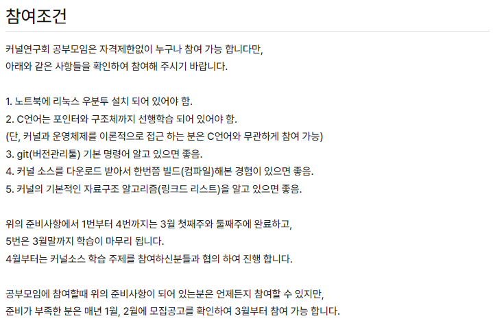

# 커널분석 LAB

## 아니 이게되네?
학부 때 관심 있었지만 차마 발을 들여놓지 못했던 커널(kernel)에 대한 스터디를 모두의연구소에서 발견하게 됐습니다.
- 모두의연구소: https://modulabs.co.kr/
- 커널연구회 커널분석 LAB: https://modulabs.co.kr/product/lab-10459-2023-02-23-081122/
  - 


학부 때 하지 못했던 분야에 대한 미련과 아쉬움, 그리고 호기심에 모집중인 커널연구회 LAB 공고를 클릭했습니다.

모집 공고문에 적힌 문구들은 저를 매료 시키기에 충분했습니다.

- 


LAB에 대한 소개나 활동계획, 연구목표에 대한 부분에서 꾸준한 활동으로 함께 성장하며 논문작성이나 도서집필, 오픈소스구현등이 있었습니다. 막연하지만 나도 혹시 가능하지 않을까 하는 기대감을 품게 했습니다. 

하지만 우선 LAB에 소속되어야 한다는 것인데, 참여조건이 크게 5가지가 있지만 아주 높은 수준을 요구하고 있진 않았습니다.

- 

```
1. 노트북에 리눅스 우분투 설치 되어 있어야 함.
	> 이 부분은 VM(Virtual Machine)을 이용해 해결할 수 있습니다.

2. C언어는 포인터와 구조체까지 선행학습 되어 있어야 함.
	> 이 부분은 제 학부 전공이 컴퓨터공학부(전산공학과)입니다. 이때 C언어를 이용해 알고리즘 문제 푸는 것을 좋아했고 자료구조의 내용을 밤을 지새우며 구현해본 경험도 있기 때문에 아마도 충분하지 않을까 생각했습니다.

3. git(버전관리툴) 기본 명령어 알고 있으면 좋음.
	> 이 부분은 현업에서 git을 버전관리 도구로 사용하고 있기에 충분하다고 생각했습니다.

4. 커널 소스를 다운로드 받아서 한번쯤 빌드(컴파일)해본 경험이 있으면 좋음.
	> 이 부분은 지금은 다 잊어버렸지만 학부 때 리눅스 보드에 안드로이드를 포팅한 경험이 있어서 관련 경험을 지원서에 적었습니다.

5. 커널의 기본적인 자료구조 알고리즘(링크드 리스트)을 알고 있으면 좋음.
	> 이 부분은 2번 항목과 더불어 실제 C언어를 이용해 구현까지 해봤기 때문에 이해하는데 무리 없다고 생각했습니다.
```


우선 혹시나 하는 마음에 지원서를 정성스레 작성 후 제출했습니다.  지원서를 제출하고 초초한 마음으로 한 주가 흘렀을까요? 랩짱님에게 지원이 승인되었다는 메일을 받았습니다(오잉..? 왜..?). 지난 가시다님이 공고한 쿠버네티스 스터디와 마찬가지로 이번에도 혹시나 하는 마음으로 지원했는데 운이 좋게 합격하게 됐습니다.

- 
- 


LAB 활동 기간에 대한 안내는 없었는데 특별한 사유가 없는한 당분간 매주 토요일 오후는 커널분석 LAB 모임을 지속할 예정입니다.

- 


## 스터디 시작하기전

랩짱님께서 스터디 참여하기 전 커널 작업 환경 구축을 요청하셨습니다. 커널 작업 환경은 우분투 LTS 18.04 또는 LTS 22.04 버전으로 구축을 권고하셨습니다.

이에 저는 Oracle VM VirtualBox를 이용해 ubuntu LTS 22.04 환경 구축하고, 별도로 라즈베리파이 3B 버전을 이용해 라즈비안 환경도 구축할 예정입니다.


라즈비안 환경을 구축하는 이유는 스터디 참여 전 미리 학습을 해볼까 하던 차에 리눅스 커널 분석 도서를 발견 했습니다. 이 도서에서 커널 분석 실습을 라즈베리파이 3B를 이용해 진행하며, Austin Kim(김동현) 님이 집필한 도서로 youtube에 강의와 저자 블로그를 통해 책관련 소통도 하고 있습니다.

- 디버깅을 통해 배우는 리눅스 커널의 구조와 원리 1: https://product.kyobobook.co.kr/detail/S000001766421
- 디버깅을 통해 배우는 리눅스 커널의 구조와 원리 2: https://product.kyobobook.co.kr/detail/S000001766422
- '디버깅을 통해 배우는 리눅스 커널의 구조와 원리' 책 강의 동영상: https://www.youtube.com/playlist?list=PLRrUisvYoUw9-cTYgkbTbr9f9CpbGdq4F
- '디버깅을 통해 배우는 리눅스 커널의 구조와 원리' 저자 블로그 : https://rousalome.egloos.com/category/Question_Announcement/
- 


## 마치며

사실 이 스터디에 참여하면서 과정이나 진행 내용에 대해 블로깅을 할까 말까 고민을 많이 했습니다. 근데 이전 쿠버네티스 스터디를 진행하신 가시다(서종호)님이 가끔씩 멤버분들 블로그를 방문하고 있으니, 기술 정리글을 올려주시면 좋겠다고 하셨습니다. 그래서 커널 스터디 과정이나 학습 내용에 대해 블로깅을 진행 꾸준히 진행하려고 합니다.


그리고 스터디를 진행하는 동안 개인적인 목표는 OS가 동작하는 커널 소스를 분석해 OS 개발하는 것과 커널 관련 주제로 논문을 작성하는 것입니다. 

박사 진학을 고민하고 있었지만 연구할 흥미 있는 주제를 찾지 못하고 있었습니다. 그러던 와중에 커널 스터디에 참여하게 됐는데, 커널 분석 활동을 통해 박사 과정까지 갈 수 있으면 더할 나위 없이 좋을 것 같습니다.


끝.